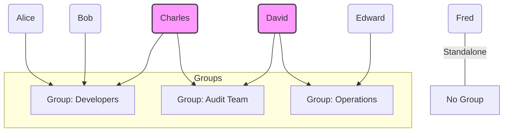
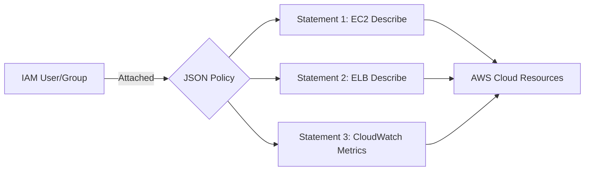

### Core AWS IAM Concepts: Users & Groups

**What is IAM?**

IAM stands for **Identity and Access Management**. It is a **Global Service**, meaning you don't select a specific region (like us-east-1) to manage it. Your users, groups, and roles are available across all AWS regions globally.

 

**The Root Account**

- **Definition:** This is the identity created when you first set up your AWS account. It has complete administrative control over everything in the account.
- **Best Practice:** **Never use the Root account for daily tasks**. Even for developers, the best practice is to create an IAM User with specific permissions and use that instead.

 

**IAM Users**

- **Definition:** Represents a person (or sometimes an application) within your organization.
- **Key Property:** A user is a long-term credential. In an interview context, remember that **Users** are typically for humans, while Roles are for machines/applications.

 

**IAM Groups**

- **Definition:** A collection of IAM users.
- **Rules of Groups:**
  - **Flat Structure:** Groups cannot contain other groups (no nesting).
  - **Flexibility:** A user can belong to multiple groups (e.g., Charles is in both 'Developers' and 'Audit Team').
  - **Independence:** A user does not have to be in a group (e.g., Fred is a standalone user).

 

**Visualizing the IAM Hierarchy**

- Note how Charles and David bridge two groups, inheriting permissions from both. This is the **Principle of Least Privilege** in action: you give users only the groups they need to perform their job.

 

### Core AWS IAM Concepts: Permissions & Policies

**What is an IAM Policy?**

- **JSON Documents:** Permissions are not checkboxes; they are defined using JSON (JavaScript Object Notation) documents.
- **Assignment:** These documents are attached to Users or Groups (and also Roles).
- **Purpose:** They define exactly which actions are allowed or denied on specific AWS resources.

 

**The Principle of Least Privilege**

This is a fundamental security concept in AWS.

- **Definition:** You should only grant the minimum permissions required for a user to perform their job.
- **Example:** If a developer only needs to read logs, don't give them "AdministratorAccess." Give them a policy that only allows `cloudwatch:GetLogEvents`.

 

**Deep Dive into the JSON Structure**

Based on the example in the slide, a policy consists of a `Version` and a `Statement` array. Each statement typically includes:

- Effect: Either `"Allow"` or `"Deny"`. (By default, everything is denied).
- Action: The specific API calls being permitted (e.g., `ec2:Describe*`). The `*` is a wildcard, meaning "all actions starting with Describe."
- Resource: The specific AWS resources the actions apply to. `"*"` means "all resources."

 

**Visualizing Policy Application**

