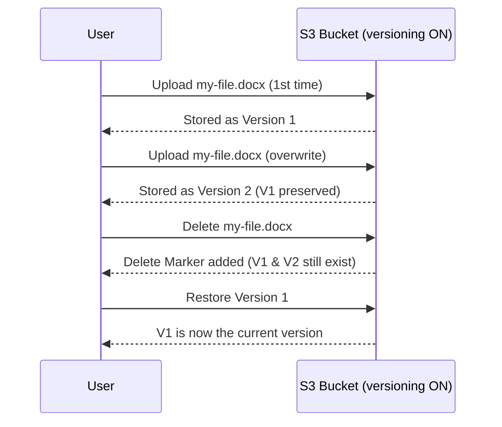
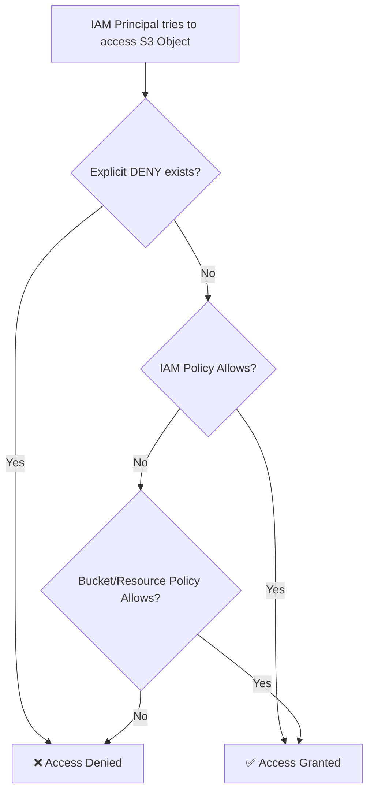
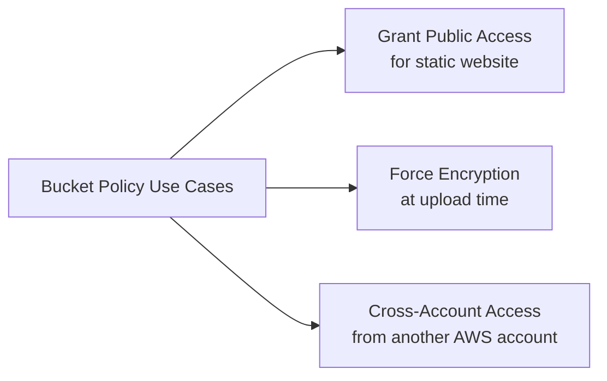
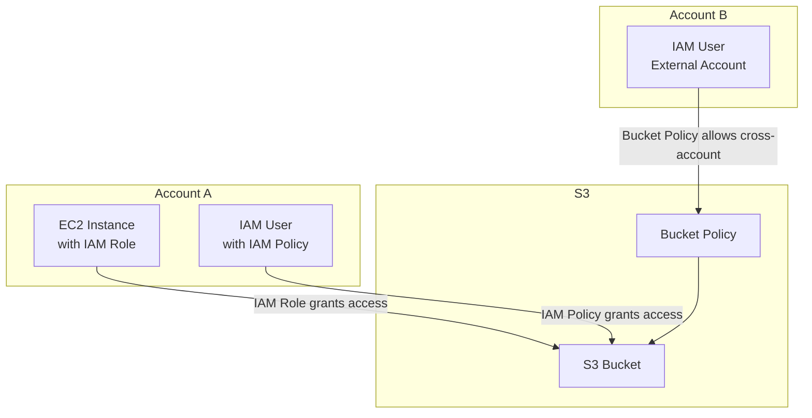
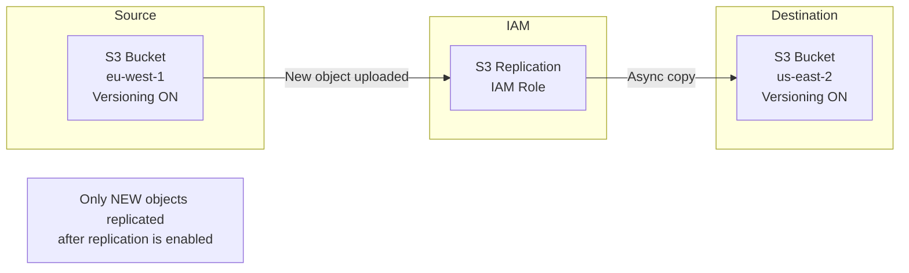
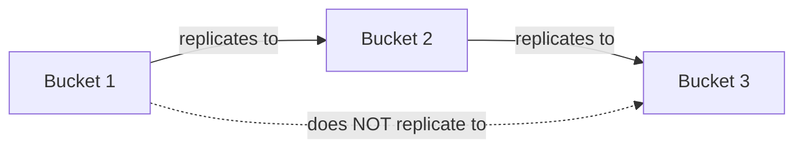

## 1. What is Amazon S3?

- **S3 = Simple Storage Service** — one of the oldest and most foundational AWS services.
- Marketed as **"infinitely scalable"** object storage — you never run out of space.
- Many websites use it as a backbone (static assets, uploads, backups).
- Many AWS services internally integrate with S3 (e.g., Lambda, Glue, CloudTrail, EMR).

---

## 2. S3 Core Concepts — Buckets & Objects

### Buckets
- A **bucket** is like a top-level container (think of it as a "directory" in the cloud).
- Buckets are **defined at the region level** — even though the S3 console looks global, the actual bucket lives in one region.
- Two namespace types:
  - **Shared Global Namespace** — bucket name must be globally unique across all AWS accounts and all regions.
  - **Account Regional Namespace** — allows reuse of the same bucket name within your own account across regions (newer feature).

#### Bucket Naming Rules (exam-important)
| Rule | Detail |
|------|--------|
| No uppercase letters | `My-Bucket` ❌ → `my-bucket` ✅ |
| No underscores | `my_bucket` ❌ |
| Not an IP address | `192.168.1.1` ❌ |
| Must start with lowercase letter or number | `3mybucket` ✅ |
| Must NOT start with `xn--` | reserved prefix |
| Must NOT end with `-s3alias` | reserved suffix |

---

### Objects
- An **object** is any file stored inside a bucket.
- Every object has a **Key** — the key is the **FULL path** from the bucket root.

```
s3://my-bucket/my_file.txt                          → key = my_file.txt
s3://my-bucket/my_folder1/another_folder/my_file.txt → key = my_folder1/another_folder/my_file.txt
```

- Key = **prefix** (folder path) + **object name** (filename)
- **Important:** There are NO real directories inside S3. The UI fakes it. Internally, it's just a flat key-value store where keys happen to contain slashes (`/`).

#### Object Properties
| Property | Detail |
|----------|--------|
| **Value** | The actual file content (body) |
| **Max size** | 50 TB per object |
| **Multi-part upload** | Required if file > 5 GB |
| **Metadata** | Key-value pairs (text) — system or user-defined |
| **Tags** | Unicode key-value pairs, up to 10 — used for security/lifecycle rules |
| **Version ID** | Present only if versioning is enabled on the bucket |

---

## 3. S3 Use Cases

| Use Case | Description |
|----------|-------------|
| Backup & Storage | General file backup |
| Disaster Recovery | Cross-region replication for DR |
| Archive | Long-term cold storage (S3 Glacier) |
| Hybrid Cloud Storage | On-premise + AWS storage bridge |
| Application Hosting | Store app assets / binaries |
| Media Hosting | Images, videos, audio |
| Data Lakes & Analytics | Big data pipelines (e.g., Athena, EMR) |
| Software Delivery | Distribute software packages |
| Static Website | Host frontend HTML/CSS/JS |

> **Real example:** Nasdaq stores 7 years of financial data in S3 Glacier. Sysco runs business analytics directly on S3 data.

---

## 4. S3 Versioning

- Versioning is enabled **at the bucket level** (not object level).
- When you upload the same key (filename) again, instead of overwriting, S3 creates a new version: `1 → 2 → 3…`
- Protects against **accidental deletes** — you can restore a previous version.
- Allows **easy rollbacks**.

#### Important Edge Cases
- Files uploaded **before** versioning was enabled will have version = `"null"`.
- **Suspending versioning does NOT delete existing versions** — they stay, new uploads just won't be versioned.



**Key points from diagram:**
- S3 never truly overwrites — it stacks versions.
- A "delete" on a versioned bucket only adds a Delete Marker, not a real deletion.
- You can restore any older version at any time.

---

## 5. S3 Security

Security in S3 has two main layers: **User-Based** and **Resource-Based**.

### 5.1 User-Based Security — IAM Policies
- Attached to an **IAM User, Group, or Role**.
- Controls which S3 API calls that user is allowed to make.
- Example: Allow `s3:GetObject` on a specific bucket.

### 5.2 Resource-Based Security
Three types:

| Type | Scope | Notes |
|------|-------|-------|
| **Bucket Policy** | Bucket-wide | JSON policy set from S3 console. Supports cross-account access. Most commonly used. |
| **Object ACL** | Per-object | Fine-grained. Can be disabled. |
| **Bucket ACL** | Per-bucket | Less common. Can be disabled. |

### Access Decision Rule
> An IAM principal (user/role) can access an S3 object **IF**:
> - The user's IAM policy ALLOWS it **OR** the bucket/resource policy ALLOWS it
> - **AND** there is no explicit DENY anywhere



**Key points from diagram:**
- Explicit DENY always wins — no matter what else says Allow.
- Access is granted if EITHER the IAM policy OR the resource policy allows it (not both required).
- This is the fundamental access evaluation logic for all AWS resource policies.

---

## 6. S3 Bucket Policies (Deep Dive)

Bucket policies are **JSON documents** attached directly to the bucket. They are the most powerful and commonly used way to control access.

### Structure of a Bucket Policy

```json
{
  "Version": "2012-10-17",
  "Statement": [
    {
      "Sid": "PublicRead",
      "Effect": "Allow",
      "Principal": "*",
      "Action": ["s3:GetObject"],
      "Resource": ["arn:aws:s3:::examplebucket/*"]
    }
  ]
}
```

| JSON Key | What it means |
|----------|--------------|
| `Version` | Policy language version. Always use `"2012-10-17"`. |
| `Statement` | Array of permission rules. Each element is one rule. |
| `Sid` | Statement ID — just a human-readable label/name for the rule. |
| `Effect` | Either `"Allow"` or `"Deny"`. |
| `Principal` | **Who** this rule applies to. `"*"` = everyone (public). Can be an IAM ARN for specific users. |
| `Action` | **What** API operations are allowed/denied. e.g., `s3:GetObject`, `s3:PutObject`. |
| `Resource` | **Which** bucket/objects this applies to. `arn:aws:s3:::examplebucket/*` = all objects in bucket. |

### Common Use Cases for Bucket Policies



**Key points from diagram:**
- Public access: set `Principal: "*"` with `Effect: Allow` and `Action: s3:GetObject`.
- Forced encryption: add a DENY rule for uploads that don't include encryption headers.
- Cross-account: specify the external account's ARN in `Principal`.

---

## 7. Access Patterns — Illustrated

### Pattern 1: Public Access via Bucket Policy
Anonymous internet users can read objects when a bucket policy explicitly allows it.

### Pattern 2: IAM User Access
An IAM user inside the **same AWS account** accesses S3 via IAM policies attached to their user/group.

### Pattern 3: EC2 Instance Access via IAM Role
- **Never** hard-code AWS credentials on an EC2 instance.
- Attach an **IAM Role** to the EC2 instance with the required S3 permissions.
- EC2 automatically uses the role credentials via the instance metadata service.

### Pattern 4: Cross-Account Access via Bucket Policy
- An IAM user from a **different AWS account** can access your bucket.
- The bucket policy must explicitly allow the external account's ARN as the Principal.



**Key points from diagram:**
- Same-account users → IAM Policy is enough.
- EC2 → always use IAM Roles, never access keys.
- Cross-account → must use Bucket Policy with the external account's ARN.

---

## 8. Block Public Access Settings

- AWS provides a safety net called **Block Public Access** — 4 granular settings.
- All 4 are **ON by default** when you create a new bucket.
- They override any bucket policy or ACL that would grant public access.
- Can be set at both the **bucket level** and the **AWS account level**.

> If your bucket should never be public (backend storage, internal data), leave all Block Public Access settings ON. This prevents accidental misconfiguration.

---

## 9. Static Website Hosting

- S3 can serve a static website (HTML, CSS, JS — no server-side code).
- URL format:
  - `http://bucket-name.s3-website-aws-region.amazonaws.com`
  - OR `http://bucket-name.s3-website.aws-region.amazonaws.com`
- **403 Forbidden?** → The bucket policy is not allowing public reads. Fix: add a public `s3:GetObject` allow policy and turn off Block Public Access.

---

## 10. Durability vs Availability — Know the Difference
 
This is one of the **most commonly confused pairs** in AWS interviews. Get this clear first.
 
| Concept | What it means | Value in S3 |
|---------|--------------|-------------|
| **Durability** | Will S3 **lose** your data? | 99.999999999% (11 nines) — same for ALL storage classes |
| **Availability** | Can you **access** your data right now? | Varies by storage class (99.99% to 99.5%) |
 
### Simple way to remember:
- **Durability** = data safety (will it exist?) → Always 11 nines, AWS's promise.
- **Availability** = uptime (can I reach it?) → Changes per storage class, affects SLA.
### Real numbers to quote in interviews:
- 11 nines durability → if you store 10 million objects, you'd lose 1 object once every **10,000 years**.
- S3 Standard: 99.99% availability = can be **unavailable ~53 minutes per year**.
---

## 11. S3 Replication (CRR & SRR)
 
Replication lets you automatically copy objects from one bucket to another — either across regions or within the same region.
 
### Two Types
 
| Type | Full Name | Use Cases |
|------|-----------|-----------|
| **CRR** | Cross-Region Replication | Compliance (data must exist in region X), lower latency for global users, cross-account replication |
| **SRR** | Same-Region Replication | Log aggregation into one bucket, prod-to-test sync within same region |
 
### Prerequisites & Rules
- **Versioning must be enabled** on BOTH source and destination buckets — this is a hard requirement.
- Copying happens **asynchronously** (not real-time, but very fast).
- Source and destination can be in **different AWS accounts**.
- You must give S3 proper **IAM permissions** to read from source and write to destination.

 
**Key points:**
- Versioning is non-negotiable — both buckets must have it ON.
- Replication is asynchronous — there's a small delay, not instant.
- IAM role must grant S3 permission to read source and write destination.
---
 
## 12. Replication — Critical Edge Cases (Exam & Interview Traps)
 
### 12.1 Only New Objects are Replicated
- Enabling replication does NOT replicate existing objects.
- To replicate existing objects → use **S3 Batch Replication** (also handles previously failed replications).
### 12.2 DELETE Behavior
| Delete Type | Replicated? | Why |
|-------------|-------------|-----|
| Delete Marker (soft delete) | Optional — configurable | You can choose to replicate or not |
| Permanent delete (by version ID) | **Never replicated** | Protects destination from malicious mass-deletes |
 
> This is a very commonly asked interview trap. Permanent deletes with a version ID are deliberately NOT replicated to prevent an attacker from deleting data in source and having it cascade to backup.
 
### 12.3 No Chaining of Replication
 

 
**Key points:**
- If Bucket 1 → Bucket 2 → Bucket 3, objects from Bucket 1 reach Bucket 2 but do **NOT** automatically flow to Bucket 3.
- No transitive/chain replication exists in S3.
- Each replication rule is independent — if you need Bucket 1 → Bucket 3, you must set up a separate replication rule.
---

## 13. Spring Boot Integration with S3

In your Insurance Policy project (and real-world backend), S3 is used for file storage (policy documents, claim evidence files, etc.).

### 13.1 Dependency

```xml
<!-- AWS SDK v2 (recommended) -->
<dependency>
    <groupId>software.amazon.awssdk</groupId>
    <artifactId>s3</artifactId>
    <version>2.25.0</version>
</dependency>

<!-- Or via Spring Cloud AWS (cleaner abstraction) -->
<dependency>
    <groupId>io.awspring.cloud</groupId>
    <artifactId>spring-cloud-aws-starter-s3</artifactId>
    <version>3.1.0</version>
</dependency>
```

### 13.2 Configuration (`application.yml`)

```yaml
spring:
  cloud:
    aws:
      region:
        static: ap-south-1
      credentials:
        access-key: ${AWS_ACCESS_KEY}      # use SSM Parameter Store in prod
        secret-key: ${AWS_SECRET_KEY}
      s3:
        bucket: my-insurance-docs-bucket
```

> In production on EC2, **never put access keys in config**. Attach an IAM Role to EC2 → SDK picks up credentials automatically.

### 13.3 S3 Service in Spring Boot

```java
@Service
@RequiredArgsConstructor
public class S3StorageService {

    private final S3Client s3Client;

    @Value("${spring.cloud.aws.s3.bucket}")
    private String bucketName;

    // Upload a file (e.g., policy document PDF)
    public String uploadFile(String key, MultipartFile file) throws IOException {
        PutObjectRequest request = PutObjectRequest.builder()
                .bucket(bucketName)
                .key(key)  // e.g., "claims/2024/claim-101/evidence.pdf"
                .contentType(file.getContentType())
                .build();

        s3Client.putObject(request,
                RequestBody.fromInputStream(file.getInputStream(), file.getSize()));

        return "s3://" + bucketName + "/" + key;
    }

    // Generate a pre-signed URL for secure temporary access
    public String generatePresignedUrl(String key, Duration expiry) {
        try (S3Presigner presigner = S3Presigner.create()) {
            GetObjectPresignRequest presignRequest = GetObjectPresignRequest.builder()
                    .signatureDuration(expiry)
                    .getObjectRequest(r -> r.bucket(bucketName).key(key))
                    .build();
            return presigner.presignGetObject(presignRequest).url().toString();
        }
    }

    // Delete a file
    public void deleteFile(String key) {
        s3Client.deleteObject(DeleteObjectRequest.builder()
                .bucket(bucketName)
                .key(key)
                .build());
    }
}
```

### 13.4 Key Design Patterns in Spring Boot + S3

| Pattern | How |
|---------|-----|
| **Store file, save URL in DB** | Upload to S3, save the S3 key in PostgreSQL, generate pre-signed URL on demand |
| **Versioning for audit** | Enable versioning on bucket, store version ID in DB for compliance |
| **IAM Role (no keys)** | EC2 with IAM Role → `DefaultCredentialsProvider` picks it up automatically |
| **Pre-signed URLs** | Generate time-limited URLs (e.g., 15 min) for secure client-side downloads |
| **Multipart upload** | For files > 5 GB (e.g., large video evidence), use `S3TransferManager` |

---

## 14. Interview Questions & Answers

### Q1. What is the difference between a Bucket Policy and an IAM Policy for S3?

**Answer:**
- **IAM Policy** is attached to an **identity** (user, group, role) and controls what that identity can do across AWS services including S3. Works within the same account.
- **Bucket Policy** is attached to the **S3 bucket itself** (resource-based). It can grant access to anyone — same account, other AWS accounts, or even anonymous users. This is why bucket policies are used for cross-account access and public website hosting.
- Key rule: access is granted if EITHER allows it, but an explicit DENY from either side always wins.

---

### Q2. Your EC2 application needs to write files to S3. What's the best way to configure credentials?

**Answer:**
- **Never** hard-code access keys in application.properties or environment variables on EC2.
- Create an **IAM Role** with the required S3 permissions (e.g., `s3:PutObject`, `s3:GetObject`).
- **Attach the role** to the EC2 instance.
- The AWS SDK automatically uses the **Instance Metadata Service (IMDS)** to fetch temporary credentials from the role. No configuration needed in the app.
- This is both the **most secure** and **easiest** approach (no key rotation, no secret management).

---

### Q3. A user deleted an important file from S3. How do you recover it?

**Answer:**
- If **versioning was enabled** on the bucket:
  - The "delete" only added a **Delete Marker** on top of the existing versions.
  - You can recover by deleting the Delete Marker — the previous version becomes the current version again.
  - Or you can explicitly restore a specific older version.
- If versioning was **not enabled**: the file is permanently gone. This is why enabling versioning is a best practice.
- Pro tip: even suspending versioning doesn't delete existing versions — old versions survive.

---

### Q4. What is a Pre-signed URL and when would you use it?

**Answer:**
- A **pre-signed URL** is a time-limited URL that grants temporary access to a private S3 object without making the bucket public.
- The URL embeds AWS credentials (signed with your IAM credentials) and an expiry time.
- **Use cases:**
  - Allow a customer to download their invoice/document for 15 minutes.
  - Allow a browser to upload directly to S3 (pre-signed PUT URL) without routing through your backend server.
- In Spring Boot: use `S3Presigner` from AWS SDK v2 to generate these.

---

### Q5. What is the maximum object size in S3, and what happens if you need to upload a very large file?

**Answer:**
- Max object size is **5 TB** (50,000 GB).
- However, a **single PUT request** can only upload up to **5 GB**.
- For files larger than 5 GB (recommended from 100 MB+), you must use **Multipart Upload**:
  - File is split into parts (minimum 5 MB each, except the last).
  - Parts are uploaded in parallel → faster and resumable.
  - S3 assembles the parts into the final object.
- In Spring Boot, use `S3TransferManager` (AWS SDK v2) which handles multipart automatically.

---

### Q6. What is the difference between Durability and Availability in S3?
 
**Answer:**
- **Durability** = will S3 ever **lose** your data? S3 guarantees 11 nines (99.999999999%) durability — same for ALL storage classes. This is achieved by replicating data across multiple AZs within a region.
- **Availability** = can you **access** your data right now? This varies by storage class — S3 Standard is 99.99% (53 min downtime/year), One Zone-IA is 99.5%.
- Simple memory trick: Durability is about **data existing**, Availability is about **data being reachable**.
---

### Q7. What are CRR and SRR? When would you use each?
 
**Answer:**
- **CRR (Cross-Region Replication):** Copies objects from a bucket in one region to a bucket in a different region. Use when you need compliance (data must reside in a specific region), lower latency for users in another geography, or backup in a separate region for DR.
- **SRR (Same-Region Replication):** Copies within the same region. Use for aggregating logs from multiple buckets into one, or syncing production and test environment buckets.
- Key prerequisite: **Versioning must be ON** in both source and destination buckets. Replication is **asynchronous**.
---

### Q8. If I enable replication today, will my existing 10,000 objects get replicated?
 
**Answer:**
- **No.** By default, S3 replication only applies to **new objects uploaded after replication is enabled**.
- To replicate existing objects, you must use **S3 Batch Replication** — a separate job that processes existing objects and also retries any previously failed replications.
- This is a very common interview trap — candidates assume replication is retroactive.
---

### Q9. Bucket 1 replicates to Bucket 2, and Bucket 2 replicates to Bucket 3. Does an object from Bucket 1 reach Bucket 3?
 
**Answer:**
- **No.** S3 replication does NOT chain. An object uploaded to Bucket 1 gets replicated to Bucket 2 (direct rule). But the replicated copy in Bucket 2 does NOT trigger Bucket 2's rule toward Bucket 3.
- If you need Bucket 1 → Bucket 3, you must set up a separate explicit replication rule from Bucket 1 to Bucket 3.
---

### Q10. How would you handle a scenario where an attacker gains access and deletes all objects in your source S3 bucket — will CRR save you?
 
**Answer:**
- If versioning is enabled, a "delete" only adds a Delete Marker — the versions still exist. You can restore by removing the delete marker.
- CRR does NOT replicate permanent deletes (by version ID) — this is a deliberate safety design. So even if the attacker permanently deletes a specific version in the source, that permanent delete does not cascade to the destination bucket.
- However, Delete Markers CAN be optionally replicated — if you enabled that setting, the destination would also appear deleted (though versions still exist there too).
- Best practice: Enable versioning + Object Lock on the destination bucket so it's truly immutable, and the source can't affect it.
---