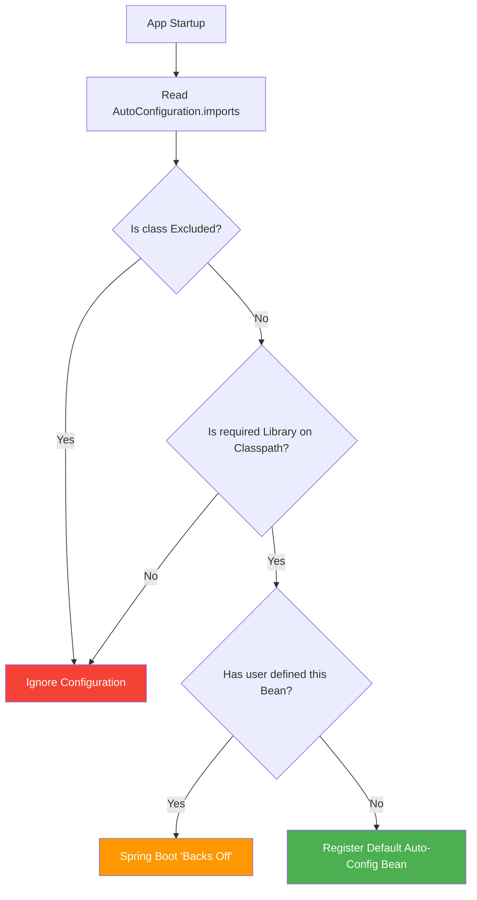

**Why will you choose Spring Boot over Spring Framework?**

- **Dependency Resolution**
  - **The Problem:** In old Spring, if you wanted to use Hibernate, you had to manually find a version of Hibernate that worked with your version of Spring. If you got it wrong, the app wouldn't even start.
  - **The Solution:** Spring Boot "Starters." You just ask for a "Web Starter," and it brings 30+ perfectly compatible libraries.
  ```xml
  <dependency>
    <groupId>org.springframework.boot</groupId>
    <artifactId>spring-boot-starter-web</artifactId>
  </dependency>
  ```
- **Avoid Additional Configuration**
  - **The Problem:** You used to spend hours writing XML files just to tell Spring "I have a Database" or "I want to use JSON."
  - **The Solution: Auto-configuration.** Spring Boot looks at your code. If it sees a Database driver in your project, it automatically sets up the connection for you.
  ```mermaid
  graph TD
    A[Start App] --> B{Is H2 DB on Classpath?}
    B -- Yes --> C[Auto-Create Database Bean]
    B -- No --> D[Skip DB Setup]
    C --> E[App Ready]
    D --> E
  ```
- **Embed Tomcat**
  - **The Problem:** Traditionally, you had to install a separate software called Tomcat on your server, package your code as a `.war` file, and "upload" it there.
  - **The Solution:** The server is now inside your application. You run your app like a simple Java program (`public static void main`), and the server starts automatically.
- **Production-Ready Features**
  - **The Problem:** After deploying an app, how do you know if it's running out of memory or if the database is down? Usually, you'd have to write custom code for this.
  - **The Solution:** Actuator. By adding one library, Spring Boot gives you "secret" URLs (endpoints) that tell you exactly how the app is performing.
    - `.../health`: "Is the DB alive?"
    - `.../metrics`: "How much CPU am I using?"

<br><br>

**What all spring boot starter you have used or what all module you have worked on?**

1. **Web & Web Services**
   - Web: Used to build REST APIs. It includes Tomcat and Spring MVC.
   - Web Services: Specifically for SOAP-based services (using XML).
2. **Data JPA (Java Persistence API)**
   
   This is the bridge between your Java code and your Database. It eliminates the need to write complex SQL for basic CRUD operations.

   ```java
   // Just define an interface; Spring provides the implementation!
    public interface UserRepository extends JpaRepository<User, Long> {
        List<User> findByLastName(String lastName); 
    }
   ```
3. **AOP (Aspect Oriented Programming)**
   - Used for "Cross-cutting concerns" - things you want to happen across many methods without repeating code, like **Logging** or **Security checks**.
     - Analogy: A security guard standing at the door of every room. You don't build a guard into every room; you just "apply" the guard to the doors.
4. **Security**
   - Handles Authentication (Who are you?) and Authorization (What can you do?). It provides the login forms and protects your API endpoints from unauthorized access.
  ```mermaid
  graph LR
    A[Request] --> B{Spring Security Filter}
    B -->|Valid Token| C[Controller]
    B -->|Invalid| D[403 Forbidden]
    style B fill:#f96
  ```
5. **Apache Kafka & Spring Cloud**
   - **Kafka:** Used for Messaging. If Service A needs to tell Service B something without waiting for a response, it drops a message in Kafka.
   - **Spring Cloud:** A collection of tools for **Microservices** (Config management, Service Discovery, etc.).
6. **Thymeleaf**
   - A "Server-side Template Engine." It’s used to build web pages where the HTML is generated on the server (like the old JSF or JSP days, but much cleaner).
 

<br><br>

**How will you run your Spring Boot application?**

- **Execution via the Main Method:** Every Spring Boot project has a class containing a standard Java `public static void main` method. When executed, it calls `SpringApplication.run()`, which triggers the bootstrapping process: starting the JVM, launching the Spring IoC container, and initializing the embedded web server.
- **The "Fat JAR" Architecture:** In professional production environments (Docker/Kubernetes), we package the app as a "Fat JAR" using the `spring-boot-maven-plugin`. Unlike a traditional JAR, this contains your compiled code and every dependency JAR (like Hibernate or Tomcat) nested inside it. You run it using the command `java -jar appname.jar`.
- **The Role of JarLauncher:** When you run that JAR, Spring Boot doesn't use the standard Java ClassLoader. It uses a custom `JarLauncher` that knows how to read classes from those nested JARs. This is why a single file is all you need to deploy a complex microservice.
- **CLI and Build Tools:** You can also run the app using mvn `spring-boot:run`. This is common in local development because it integrates with Spring Boot DevTools, allowing for "Hot Swapping" (restarting the context automatically when you save a file) without manual rebuilds.


<br><br>

**What is the purpose of `@SpringBootApplication`?**

This is a Meta-Annotation a single shortcut that bundles three powerful engines. Understanding these is the difference between a junior and a senior developer:

- **`@Configuration` (The Bean Blueprint):** This tells Spring that the class is a source of bean definitions. It replaces the thousands of lines of XML we used to write in legacy Spring. Any method inside this class marked with `@Bean` will be managed by the Spring container.
- **`@ComponentScan` (The Discovery Engine):** This tells Spring where to look for your code. It scans the package of the main class and all its sub-packages for classes marked with `@Component`, `@Service`, `@Repository`, or `@RestController`. Interview Catch: If your Controller is in a package that is not a sub-package of the main class, Spring will never find it, and you will get a 404 error.
- **`@EnableAutoConfiguration` (The SPI Magic):** This is the "brain" of Spring Boot. It looks at your Classpath. If it finds `h2.jar`, it automatically creates an in-memory database bean. If it finds `spring-boot-starter-web`, it automatically configures Tomcat and Jackson (for JSON). It does this by reading a file named `spring.factories` (or `org.springframework.boot.autoconfigure.AutoConfiguration.imports` in newer versions) which lists every possible configuration Spring knows how to handle.


<br><br>

**Can I use these 3 annotations separately instead of `@SpringBootApplication`?**

- **The Direct Answer:** Yes, you can. If you replace `@SpringBootApplication` with those three specific annotations manually, the application will work exactly the same way. The combined annotation is simply a "convenience" provided by the developers.
- **Practical Reason - Selective Exclusion:** In high-scale product-based environments, we sometimes use them separately to exclude certain auto-configurations. For example, if you have a Database dependency but want to run a specific test or module without a database connection, you can use `@EnableAutoConfiguration(exclude = {DataSourceAutoConfiguration.class})`.
- **Architectural Control:** Sometimes you want your `@ComponentScan` to point to a completely different package structure than where your main class resides. Using them separately gives you the "fine-grained" control to tell Spring exactly where to scan and what to ignore, which can slightly improve startup performance in massive monolithic projects.
- **The Senior Perspective:** While 99% of projects use the shorthand, knowing they are separate allows you to troubleshoot "Bean Conflict" issues. If two different "Starters" are trying to configure the same bean, you break them apart to manually resolve the conflict.


<br><br>

**What is Auto-configuration in Spring Boot?**

- Auto-configuration is a runtime mechanism where Spring Boot automatically defines and registers beans in the ApplicationContext based on the dependencies present in your classpath. It follows the Convention over Configuration philosophy, assuming sensible defaults so you don't have to write boilerplate code.
- In Spring Boot 3.x, the framework uses the Service Provider Interface (SPI) pattern. It looks for a specific file: `META-INF/spring/org.springframework.boot.autoconfigure.AutoConfiguration.imports`. This file contains a list of full-qualified names of configuration classes.
- Auto-configuration is not "blind" loading. It uses Conditional Annotations (like `@ConditionalOnClass`, `@ConditionalOnMissingBean`, and `@ConditionalOnProperty`). For example, if the `DataSource` class is on the classpath, the `DataSourceAutoConfiguration` class get triggers. However, if you have already defined your own `DataSource` bean, the `@ConditionalOnMissingBean` check fails, and Spring Boot steps back, letting your custom bean take priority.
- If you add `spring-boot-starter-web`, Spring Boot detects the embedded Tomcat classes and automatically configures a DispatcherServlet, a ViewResolver, and starts the server on port 8080 - all without a single line of XML or Java config.

<br><br>

**How can you disable a specific auto-configuration class in Spring Boot?**

- **Via the `@SpringBootApplication` Annotation:** The most common way is using the `exclude` attribute. This is useful when an auto-configuration is interfering with your custom logic or causing startup failures (like JPA trying to connect to a non-existent DB).
  ```java
  @SpringBootApplication(exclude = {DataSourceAutoConfiguration.class})
  ```
- **Via Property Files:** In production environments, you might want to disable a configuration without changing and recompiling the code. You can use the `spring.autoconfigure.exclude` property in your `application.properties` or `application.yml`.
  ```properties
  spring.autoconfigure.exclude=org.springframework.boot.autoconfigure.jdbc.DataSourceAutoConfiguration 
  ```
- **Selective Exclusion for Testing:** If you are running an Integration Test and want to disable Security or Cloud-specific configs, you can use the `@TestPropertySource` or `@EnableAutoConfiguration(exclude = ...)` specifically on your test class to keep the test environment lightweight.
- When you exclude a class, Spring Boot's `AutoConfigurationImportSelector` filters it out of the list of candidate configurations fetched from the .imports file, ensuring that the `@Conditional` checks for that specific class are never even evaluated.

<br><br>

**How can you customize the default configuration in Spring Boot?**

- **Externalized Configuration (Properties/YAML):** This is the "First Line of Defense." Spring Boot exposes thousands of properties. If you want to change the server port or DB connection string, you don't write code; you simply override the property in `application.properties`.
  ```yaml
  server:
    port: 9090
  ```
- **Providing a Custom Bean:** Spring Boot’s auto-configuration classes almost always use `@ConditionalOnMissingBean`. If you define your own Bean of the same type in a `@Configuration` class, Spring Boot will see your bean first and "back off," disabling its own default bean. This is the most professional way to swap out a component (like using a custom `RestTemplate` or `SecurityFilterChain`).


<br><br>

**Architectural Decision Flow**



<br><br>

**How Spring boot run() method works internally ?**

- **Step 1: Initializer & Listener Setup:** When you call `SpringApplication.run()`, it first creates a new `SpringApplication` instance. Internally, it identifies "Initializers" and "Listeners" from the `META-INF/spring.factories` (or `.imports` in Boot 3) to prepare the ground for the environment.
- **Step 2: Starting the StopWatch:** It starts a `StopWatch` to measure the startup time (which you see in the console logs). It then triggers the `SpringApplicationRunListeners` to announce that the app is starting.
- **Step 3: Environment Preparation:** It prepares the `ConfigurableEnvironment`. This involves loading your `application.properties`, system variables, and command-line arguments. This is where the framework decides which Spring Profiles are active.
- **Step 4: Create ApplicationContext:** Based on your classpath, it decides which context to create. For a web app, it creates an `AnnotationConfigServletWebServerApplicationContext`. This is the "brain" that will hold all your beans.
- **Step 5: Bean Registration & Refresh:** This is the heaviest part. The context performs the Component Scan, discovers your `@Service` and `@Controller` classes, and registers them as `BeanDefinitions`. Then comes the `refresh()` phase, where all beans are instantiated, wired together (Dependency Injection), and post-processors are executed.
- **Step 6: Kick-starting the Embedded Server:** Unlike traditional Spring, the embedded server (Tomcat/Jetty) is started during the `refresh()` phase. The context creates a `WebServer` bean, which triggers the server to start on the configured port (default 8080).


<br><br>

**What is Command Line Runner in Spring Boot?**

- CommandLineRunner is a functional interface used to run a specific block of code exactly once after the ApplicationContext is fully initialized but before the run() method finishes execution.
- In banking or product environments, it’s often used for "Warm-up" tasks: seeding master data into a cache, verifying database connections, or running one-time migration scripts.
- It provides access to the raw string array of command-line arguments passed to the application.
  ```java
  @Component
  public class DataInitializer implements CommandLineRunner {
      @Override
      public void run(String... args) throws Exception {
          System.out.println("App started with: " + Arrays.toString(args));
          // Logic to seed database
      }
  }
  ```
- While `CommandLineRunner` gives you raw strings, `ApplicationRunner` gives you `ApplicationArguments`, which is a more sophisticated object that parses arguments into keys and values (e.g., `--port=8080`).
- If you have multiple runners, you can use the `@Order` annotation to specify the sequence of execution. This is critical if one initialization task depends on another being finished first.
- Internal Flow Visualized
  ```mermaid
  sequenceDiagram
    participant M as Main Method
    participant SA as SpringApplication
    participant E as Environment
    participant AC as ApplicationContext
    participant TS as Tomcat/Server
    participant CR as CommandLineRunner

    M->>SA: run(MyClass.class, args)
    SA->>E: Prepare Environment (Properties/Profiles)
    SA->>AC: Create Context
    AC->>AC: Component Scan & Bean Registration
    AC->>TS: Start Embedded Server
    AC->>AC: Complete Refresh
    SA->>CR: Execute run() methods
    SA-->>M: App Started Successfully
  ```


 