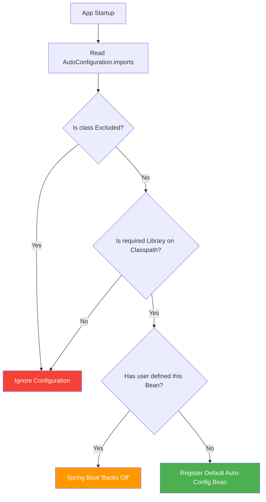
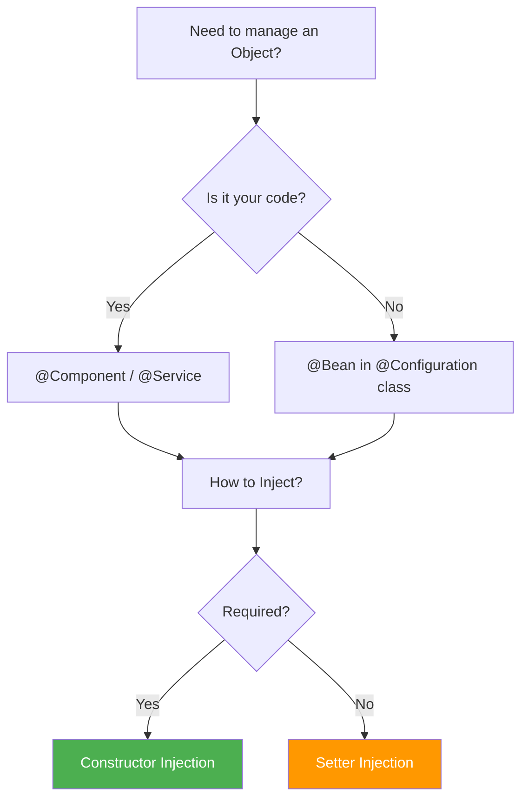

**Why will you choose Spring Boot over Spring Framework?**

- **Dependency Resolution**
  - **The Problem:** In old Spring, if you wanted to use Hibernate, you had to manually find a version of Hibernate that worked with your version of Spring. If you got it wrong, the app wouldn't even start.
  - **The Solution:** Spring Boot "Starters." You just ask for a "Web Starter," and it brings 30+ perfectly compatible libraries.
  ```xml
  <dependency>
    <groupId>org.springframework.boot</groupId>
    <artifactId>spring-boot-starter-web</artifactId>
  </dependency>
  ```
- **Avoid Additional Configuration**
  - **The Problem:** You used to spend hours writing XML files just to tell Spring "I have a Database" or "I want to use JSON."
  - **The Solution: Auto-configuration.** Spring Boot looks at your code. If it sees a Database driver in your project, it automatically sets up the connection for you.
  ```mermaid
  graph TD
    A[Start App] --> B{Is H2 DB on Classpath?}
    B -- Yes --> C[Auto-Create Database Bean]
    B -- No --> D[Skip DB Setup]
    C --> E[App Ready]
    D --> E
  ```
- **Embed Tomcat**
  - **The Problem:** Traditionally, you had to install a separate software called Tomcat on your server, package your code as a `.war` file, and "upload" it there.
  - **The Solution:** The server is now inside your application. You run your app like a simple Java program (`public static void main`), and the server starts automatically.
- **Production-Ready Features**
  - **The Problem:** After deploying an app, how do you know if it's running out of memory or if the database is down? Usually, you'd have to write custom code for this.
  - **The Solution:** Actuator. By adding one library, Spring Boot gives you "secret" URLs (endpoints) that tell you exactly how the app is performing.
    - `.../health`: "Is the DB alive?"
    - `.../metrics`: "How much CPU am I using?"

<br><br>

**What all spring boot starter you have used or what all module you have worked on?**

1. **Web & Web Services**
   - Web: Used to build REST APIs. It includes Tomcat and Spring MVC.
   - Web Services: Specifically for SOAP-based services (using XML).
2. **Data JPA (Java Persistence API)**
   
   This is the bridge between your Java code and your Database. It eliminates the need to write complex SQL for basic CRUD operations.

   ```java
   // Just define an interface; Spring provides the implementation!
    public interface UserRepository extends JpaRepository<User, Long> {
        List<User> findByLastName(String lastName); 
    }
   ```
3. **AOP (Aspect Oriented Programming)**
   - Used for "Cross-cutting concerns" - things you want to happen across many methods without repeating code, like **Logging** or **Security checks**.
     - Analogy: A security guard standing at the door of every room. You don't build a guard into every room; you just "apply" the guard to the doors.
4. **Security**
   - Handles Authentication (Who are you?) and Authorization (What can you do?). It provides the login forms and protects your API endpoints from unauthorized access.
  ```mermaid
  graph LR
    A[Request] --> B{Spring Security Filter}
    B -->|Valid Token| C[Controller]
    B -->|Invalid| D[403 Forbidden]
    style B fill:#f96
  ```
5. **Apache Kafka & Spring Cloud**
   - **Kafka:** Used for Messaging. If Service A needs to tell Service B something without waiting for a response, it drops a message in Kafka.
   - **Spring Cloud:** A collection of tools for **Microservices** (Config management, Service Discovery, etc.).
6. **Thymeleaf**
   - A "Server-side Template Engine." It’s used to build web pages where the HTML is generated on the server (like the old JSF or JSP days, but much cleaner).
 

<br><br>

**How will you run your Spring Boot application?**

- **Execution via the Main Method:** Every Spring Boot project has a class containing a standard Java `public static void main` method. When executed, it calls `SpringApplication.run()`, which triggers the bootstrapping process: starting the JVM, launching the Spring IoC container, and initializing the embedded web server.
- **The "Fat JAR" Architecture:** In professional production environments (Docker/Kubernetes), we package the app as a "Fat JAR" using the `spring-boot-maven-plugin`. Unlike a traditional JAR, this contains your compiled code and every dependency JAR (like Hibernate or Tomcat) nested inside it. You run it using the command `java -jar appname.jar`.
- **The Role of JarLauncher:** When you run that JAR, Spring Boot doesn't use the standard Java ClassLoader. It uses a custom `JarLauncher` that knows how to read classes from those nested JARs. This is why a single file is all you need to deploy a complex microservice.
- **CLI and Build Tools:** You can also run the app using mvn `spring-boot:run`. This is common in local development because it integrates with Spring Boot DevTools, allowing for "Hot Swapping" (restarting the context automatically when you save a file) without manual rebuilds.


<br><br>

**What is the purpose of `@SpringBootApplication`?**

In Spring 6+, this is a composite annotation that acts as the entry point for the framework’s high-level automation. It comprises:

- **`@Configuration` (Bean Definition):** It identifies the class as a source of bean definitions. In Spring 6, this works with CGLIB proxying by default to ensure that if you call a `@Bean` method multiple times, you always get the same singleton instance from the container (this is known as "ProxyBeanMethods").
- **`@ComponentScan` (The Discovery Mechanism):** It recursively scans for classes annotated with `@Component`, `@Service`, `@Repository`, or `@RestController`. The Practical Trap: It starts from the package of the main class. If your project structure is messy and your beans are in a parallel package (e.g., `com.hr.app` vs `com.finance.app`), Spring will fail to find them unless you explicitly define `scanBasePackages`.
- **`@EnableAutoConfiguration` (The SPI Mechanism):** This is where the version matters. Traditionally, this used `spring.factories`. However, in Spring Boot 3 / Spring 6, the mechanism shifted to a new file: `META-INF/spring/org.springframework.boot.autoconfigure.AutoConfiguration.imports`. This file lists the configuration classes that Spring should "conditionally" load based on your classpath.


<br><br>

**Can I use these 3 annotations separately instead of `@SpringBootApplication`?**

- **The Direct Logic:** Yes, you can. Replacing the single meta-annotation with the three individual ones is perfectly valid. The framework treats them exactly the same way during the context refresh phase.
- **The Performance Reason (AOT Compatibility):** In the Spring 6 era, using annotations separately can sometimes help in AOT (Ahead-of-Time) processing. If you want to optimize your app for GraalVM, being explicit about where you scan and what you auto-configure helps the Spring AOT engine generate more efficient code.
- **Advanced Exclusion for Microservices:** In product-based companies, we often have a "common" library that pulls in many dependencies. If you have the `spring-boot-starter-data-jpa` but your specific microservice only needs to be a simple REST proxy without a DB, the app will crash because it can't find a `DataSource`. You can use `@EnableAutoConfiguration(exclude = {DataSourceAutoConfiguration.class})` to bypass the "magic" for that specific module.
- **Granular Scanning in Large Monoliths:** If you are working on a massive banking application with 5000+ classes, a full `@ComponentScan` can make startup painfully slow. By using the annotations separately, you can strictly limit the scan to only the necessary modules, significantly reducing the "Time to First Request."


<br><br>

**What is Auto-configuration in Spring Boot?**

- Auto-configuration is a runtime mechanism where Spring Boot automatically defines and registers beans in the ApplicationContext based on the dependencies present in your classpath. It follows the Convention over Configuration philosophy, assuming sensible defaults so you don't have to write boilerplate code.
- In Spring Boot 3.x, the framework uses the Service Provider Interface (SPI) pattern. It looks for a specific file: `META-INF/spring/org.springframework.boot.autoconfigure.AutoConfiguration.imports`. This file contains a list of full-qualified names of configuration classes.
- Auto-configuration is not "blind" loading. It uses Conditional Annotations (like `@ConditionalOnClass`, `@ConditionalOnMissingBean`, and `@ConditionalOnProperty`). For example, if the `DataSource` class is on the classpath, the `DataSourceAutoConfiguration` class get triggers. However, if you have already defined your own `DataSource` bean, the `@ConditionalOnMissingBean` check fails, and Spring Boot steps back, letting your custom bean take priority.
- If you add `spring-boot-starter-web`, Spring Boot detects the embedded Tomcat classes and automatically configures a DispatcherServlet, a ViewResolver, and starts the server on port 8080 - all without a single line of XML or Java config.

<br><br>

**How can you disable a specific auto-configuration class in Spring Boot?**

- **Via the `@SpringBootApplication` Annotation:** The most common way is using the `exclude` attribute. This is useful when an auto-configuration is interfering with your custom logic or causing startup failures (like JPA trying to connect to a non-existent DB).
  ```java
  @SpringBootApplication(exclude = {DataSourceAutoConfiguration.class})
  ```
- **Via Property Files:** In production environments, you might want to disable a configuration without changing and recompiling the code. You can use the `spring.autoconfigure.exclude` property in your `application.properties` or `application.yml`.
  ```properties
  spring.autoconfigure.exclude=org.springframework.boot.autoconfigure.jdbc.DataSourceAutoConfiguration 
  ```
- **Selective Exclusion for Testing:** If you are running an Integration Test and want to disable Security or Cloud-specific configs, you can use the `@TestPropertySource` or `@EnableAutoConfiguration(exclude = ...)` specifically on your test class to keep the test environment lightweight.
- When you exclude a class, Spring Boot's `AutoConfigurationImportSelector` filters it out of the list of candidate configurations fetched from the .imports file, ensuring that the `@Conditional` checks for that specific class are never even evaluated.

<br><br>

**How can you customize the default configuration in Spring Boot?**

- **Externalized Configuration (Properties/YAML):** This is the "First Line of Defense." Spring Boot exposes thousands of properties. If you want to change the server port or DB connection string, you don't write code; you simply override the property in `application.properties`.
  ```yaml
  server:
    port: 9090
  ```
- **Providing a Custom Bean:** Spring Boot’s auto-configuration classes almost always use `@ConditionalOnMissingBean`. If you define your own Bean of the same type in a `@Configuration` class, Spring Boot will see your bean first and "back off," disabling its own default bean. This is the most professional way to swap out a component (like using a custom `RestTemplate` or `SecurityFilterChain`).


<br><br>

**Architectural Decision Flow**



<br><br>

**How Spring boot run() method works internally ?**

- **Step 1: Initializer & Listener Setup:** When you call `SpringApplication.run()`, it first creates a new `SpringApplication` instance. Internally, it identifies "Initializers" and "Listeners" from the `META-INF/spring.factories` (or `.imports` in Boot 3) to prepare the ground for the environment.
- **Step 2: Starting the StopWatch:** It starts a `StopWatch` to measure the startup time (which you see in the console logs). It then triggers the `SpringApplicationRunListeners` to announce that the app is starting.
- **Step 3: Environment Preparation:** It prepares the `ConfigurableEnvironment`. This involves loading your `application.properties`, system variables, and command-line arguments. This is where the framework decides which Spring Profiles are active.
- **Step 4: Create ApplicationContext:** Based on your classpath, it decides which context to create. For a web app, it creates an `AnnotationConfigServletWebServerApplicationContext`. This is the "brain" that will hold all your beans.
- **Step 5: Bean Registration & Refresh:** This is the heaviest part. The context performs the Component Scan, discovers your `@Service` and `@Controller` classes, and registers them as `BeanDefinitions`. Then comes the `refresh()` phase, where all beans are instantiated, wired together (Dependency Injection), and post-processors are executed.
- **Step 6: Kick-starting the Embedded Server:** Unlike traditional Spring, the embedded server (Tomcat/Jetty) is started during the `refresh()` phase. The context creates a `WebServer` bean, which triggers the server to start on the configured port (default 8080).


<br><br>

**What is Command Line Runner in Spring Boot?**

- CommandLineRunner is a functional interface used to run a specific block of code exactly once after the ApplicationContext is fully initialized but before the run() method finishes execution.
- In banking or product environments, it’s often used for "Warm-up" tasks: seeding master data into a cache, verifying database connections, or running one-time migration scripts.
- It provides access to the raw string array of command-line arguments passed to the application.
  ```java
  @Component
  public class DataInitializer implements CommandLineRunner {
      @Override
      public void run(String... args) throws Exception {
          System.out.println("App started with: " + Arrays.toString(args));
          // Logic to seed database
      }
  }
  ```
- While `CommandLineRunner` gives you raw strings, `ApplicationRunner` gives you `ApplicationArguments`, which is a more sophisticated object that parses arguments into keys and values (e.g., `--port=8080`).
- If you have multiple runners, you can use the `@Order` annotation to specify the sequence of execution. This is critical if one initialization task depends on another being finished first.
- Internal Flow Visualized
  ```mermaid
  sequenceDiagram
    participant M as Main Method
    participant SA as SpringApplication
    participant E as Environment
    participant AC as ApplicationContext
    participant TS as Tomcat/Server
    participant CR as CommandLineRunner

    M->>SA: run(MyClass.class, args)
    SA->>E: Prepare Environment (Properties/Profiles)
    SA->>AC: Create Context
    AC->>AC: Component Scan & Bean Registration
    AC->>TS: Start Embedded Server
    AC->>AC: Complete Refresh
    SA->>CR: Execute run() methods
    SA-->>M: App Started Successfully
  ```


<br><br>

**Can you explain the purpose of Stereotype annotations in the Spring Framework?**

- Stereotype annotations are markers that tell Spring, "This class has a specific role in the application architecture." They allow Spring's Component Scan to automatically discover classes and register them as Beans in the ApplicationContext.
- While `@Component` is the generic parent, we use specialized stereotypes for clarity and to enable specific framework behaviors:
  - **`@Controller` / `@RestController`:** Marks the class as a web entry point. It handles HTTP requests and enables Spring MVC features.
  - **`@Service`:** Marks the class for Business Logic. While it functions like `@Component`, using `@Service` clearly identifies where the core "meat" of the application resides.
  - **`@Repository`:** Marks the Data Access Layer. Crucially, it also enables automatic Persistence Exception Translation, converting low-level SQL/JPA exceptions into Spring’s readable DataAccessException hierarchy.
- Using specific stereotypes improves code readability (Domain-Driven Design) and allows you to apply AOP (Aspect-Oriented Programming) pointcuts to specific layers (e.g., "log all methods in classes marked with `@Service`").


<br><br>

**How can you define a Bean in Spring Framework?**

There are three primary ways to define a bean, and knowing which to use is a sign of experience:

- **Stereotype Annotations (Implicit):** You mark a class with `@Component`, `@Service`, etc. Spring finds it during the scan and manages its lifecycle. This is the go-to for your own internal code.
- **Java-Based Configuration (Explicit):** You use a `@Configuration` class and define methods with the `@Bean` annotation. This is used when you need to configure Third-Party Libraries (like a `ModelMapper` or `BCryptPasswordEncoder`) where you cannot modify the source code to add `@Component`.
  ```java
  @Configuration
  public class AppConfig {
      @Bean
      public RestTemplate restTemplate() {
          return new RestTemplate();
      }
  }
  ```
- **XML Configuration (Legacy):** While rare in Spring 6, you may encounter it in older banking systems. You define beans in a `beans.xml` file. It is largely replaced by Java Config for better type safety and refactoring support.


<br><br>

**What is Dependency Injection (DI)?**

- DI is a design pattern where an object does not create its own dependencies. Instead, those dependencies are "injected" into it by an external entity (the Spring IoC Container).
- DI is a specific implementation of IoC. Instead of the developer controlling the object lifecycle (`new MyService()`), the control is "inverted" to the framework.
- The primary goal is Decoupling. By injecting dependencies (usually interfaces), you make your code modular and highly Testable. You can easily swap a real `DatabaseService` with a `MockDatabaseService` during unit testing without changing the dependent class.


<br><br>

**How many ways can we perform Dependency Injection in Spring?**

There are three main types, but only one is the "Industry Gold Standard":

- **Constructor Injection:** Dependencies are provided through the class constructor.
  - **Why it's preferred:** It ensures the bean is Immutable (once the object is created, we won't be able to modify it) and prevents the object from ever being in an "incomplete" state (null dependencies). It also makes it clear which dependencies are required.
  ```java
  private final MyRepository repository;
  public MyService(MyRepository repository) { this.repository = repository; }
  ```
- **Setter Injection:** Dependencies are provided via setter methods. This is used for Optional Dependencies that can be changed or injected later. It allows for circular dependencies, though these are generally considered a "code smell."
- **Field Injection (The "Avoid" Way):** Using `@Autowired` directly on the variable.
  - **The Catch:** It is heavily discouraged in Spring 6. It makes unit testing harder (requires Reflection to mock) and hides dependencies from the constructor. Top product companies will flag this during code reviews.

 
<br><br>

**Architectural Perspective (Decision Flow)**




<br><br>

**Where you would choose Setter Injection over Constructor Injection, and vice versa?**

1. **Constructor Injection (The Mandatory Choice)**
   - Dependencies are provided at the moment of object creation. In Spring 6, if your class has only one constructor, the `@Autowired` annotation is optional.
   - It ensures the bean is Immutable (using final fields). It also prevents a "partially initialized" object; the bean simply won't start if a required dependency is missing. This makes unit testing easier because you can't instantiate the class without providing the mocks.
    ```java
    @Service
    public class TradeService {
        // Final ensures the dependency cannot be changed after initialization
        private final TradeRepository repository;

        // Standard for Spring 6: Constructor Injection
        public TradeService(TradeRepository repository) {
            this.repository = repository;
        }
        
        public void executeTrade() {
            repository.save(new Trade());
        }
    }
    ```
2. **Setter Injection (The Optional Choice)**
   - Dependencies are injected via public setter methods after the bean instance is created.
   - Use this for Optional Dependencies. If your service can function with a "default" behavior and only needs a specific bean to override that behavior occasionally, setters are appropriate.
   - If `ServiceA` needs `ServiceB` and vice-versa, Constructor Injection will fail (App crash). Setter injection allows Spring to create the "raw" objects first and link them later, breaking the cycle.
    ```java
    @Service
    public class NotificationService {
        private EmailClient emailClient;

        // Setter Injection for an optional dependency
        @Autowired
        public void setEmailClient(EmailClient emailClient) {
            this.emailClient = emailClient;
        }

        public void notifyUser() {
            if (emailClient != null) {
                emailClient.send("Hello!");
            } else {
                System.out.println("No email client configured, skipping...");
            }
        }
    }
    ```

<br><br>

**What is Circular Dependency?**

It occurs when Bean A depends on Bean B, and Bean B depends on Bean A. This creates a "Chicken and Egg" problem.

1. **Constructor Injection (The Failure)**
   - This is the most "strict" scenario. When Spring tries to create `ServiceA`, it sees it needs `ServiceB`. It pauses to create `ServiceB`, but then sees it needs `ServiceA`. Since neither can be fully instantiated, the application fails at startup with a `BeanCurrentlyInCreationException`.
    ```java
    @Service
    public class ServiceA {
        private final ServiceB serviceB;
        // Spring starts here, but can't find a finished ServiceB
        public ServiceA(ServiceB serviceB) {
            this.serviceB = serviceB;
        }
    }

    @Service
    public class ServiceB {
        private final ServiceA serviceA;
        // Spring pauses here, needing ServiceA
        public ServiceB(ServiceA serviceA) {
            this.serviceA = serviceA;
        }
    }
    ```
2. **Setter/Field Injection (The Workaround)**
   - Spring handles circular dependencies via Setter Injection or Field Injection using a "three-stage cache" mechanism.
     - Spring creates the "raw" instance of `ServiceA` (using the default constructor).
     - It stores this uninitialized instance in a temporary cache.
     - It then injects the dependencies. Because the "raw" object already exists in memory, the circle is technically broken.
    ```java
    @Service
    public class ServiceA {
        @Autowired
        private ServiceB serviceB; // Injected after ServiceA is created
    }

    @Service
    public class ServiceB {
        @Autowired
        private ServiceA serviceA; // Injected after ServiceB is created
    }
    ```
3. **The Best Practice Solution: `@Lazy`**
   - If you are forced to use Constructor Injection but have a circular dependency, you can use the `@Lazy` annotation. This tells Spring: "Don't inject the actual bean yet; inject a Proxy instead." The real bean is only initialized the first time a method is called on it.
    ```java
    @Service
    public class ServiceA {
        private final ServiceB serviceB;

        public ServiceA(@Lazy ServiceB serviceB) {
            this.serviceB = serviceB;
        }
    }
    ```

<br><br>

**Real-world use case where `@PostConstruct` is particularly useful?**

- `@PostConstruct` is a lifecycle callback. It tells Spring to execute a method after the bean has been fully initialized and all dependencies have been injected.
- You cannot perform certain logic in the constructor if that logic depends on `@Autowired` fields or `@Value` properties, because those aren't populated when the constructor runs.
- **Real-World Example (Banking/Product):** Imagine a `CurrencyExchangeService`.
  - The class is created (Constructor).
  - The API Key is injected from properties (DI).
  - `@PostConstruct` triggers a one-time call to an external API to fetch and cache the initial exchange rates so the service is "warm" and ready before the first user request hits.
  ```java
  @Service
  public class CacheWarmer {
      @Autowired private CacheManager cache;

      @PostConstruct
      public void init() {
          // Logic to load master data into Redis or local cache
          cache.loadInitialData(); 
      }
  }
  ```

<br><br>

**How can we dynamically load values in a Spring Boot application? (`@Value`)**

1. **Using the `@Value` Annotation**
  - This is a field-level injection method. It uses **SpEL (Spring Expression Language)** to pull values from your `application.properties`, YAML files, or environment variables.
  - A common requirement in banking apps is "Fail-Safe" configurations. You can use the `:` syntax to provide a default value if the key is missing, preventing the `BeanCreationException`.
  - Best for injecting single, standalone configuration points like a specific API timeout or a feature flag.
    ```java
    @Component
    public class PaymentGateway {

        // Pulls from application.properties; defaults to 3000 if not found
        @Value("${payment.timeout:3000}")
        private int timeout;

        // Supports SpEL for complex logic
        @Value("#{systemProperties['user.home']}")
        private String userHome;

        public void process() {
            System.out.println("Connecting with timeout: " + timeout);
        }
    }
    ```
2. **Using the `Environment` Class**
   - The `Environment` interface is a central part of the `ApplicationContext`. It represents the "entire world" of properties available to the app (System properties, Env variables, and Config files).
   - Unlike `@Value`, which is resolved when the bean is created (static), the `Environment` object can be queried at any time during the application's execution.
   - It provides built-in methods to check which Spring Profiles (e.g., `dev`, `prod`) are currently active, which is critical for banking apps that behave differently across environments.
   - It offers a `getProperty(key, targetType, defaultValue)` method, which handles the conversion from String to Integer/Boolean safely.
    ```java
    @Service
    public class NetworkConfig {

        private final Environment env;

        // Constructor Injection is preferred for Environment
        public NetworkConfig(Environment env) {
            this.env = env;
        }

        public void checkSecurity() {
            // Querying values dynamically
            String port = env.getProperty("server.port");
            
            // Checking Active Profiles
            if (env.acceptsProfiles(Profiles.of("prod"))) {
                System.out.println("Running in Production Mode");
            }
        }
    }
    ```

<br><br>

**Can you explain the key differences between YML and properties files, and in what scenarios you might prefer one format over the other?**

- **Syntax and Structure:** Properties files use a flat, key-value pair format (`a.b.c=value`). YAML (YAML Ain't Markup Language) is indentation-based and hierarchical, which visually represents the relationship between properties.
- **Hierarchy and Redundancy:** In Properties, you must repeat the prefix for every single line. YAML uses "nested" blocks, which significantly reduces boilerplate and makes the file smaller and easier to manage as the project grows.
- **Support for Lists and Arrays:** YAML has native support for lists and maps using simple bullet points or brackets. Properties files require cumbersome indexing (e.g., `app.servers[0]=xyz`), which is prone to manual errors when adding new items.
- **Complex Data Types:** YAML is a superset of JSON, meaning it can handle complex data structures and maps naturally. This is why it is the standard for Kubernetes, Docker, and Cloud-native Spring applications.
- **Readability:** YAML is designed to be human-readable. In a banking application with hundreds of security and database configs, a hierarchical YAML file allows a developer to see the "big picture" of a module at a single glance.
- **Comparison Code Snippet**
  - **`application.properties`**
    ```properties
    spring.datasource.url=jdbc:mysql://localhost:3306/db
    spring.datasource.username=root
    spring.datasource.password=secret

    # Lists are flat and repetitive
    app.allowed-origins[0]=https://bank.com
    app.allowed-origins[1]=https://api.bank.com
    ```
  - **`application.yml`**
    ```yaml
    spring:
        datasource:
            url: jdbc:mysql://localhost:3306/db
            username: root
            password: secret

        # Lists are intuitive and clean
        app:
        allowed-origins:
            - https://bank.com
            - https://api.bank.com
    ```


<br><br>

**What is the difference between `.yml` and `.yaml`?**

- There is zero functional difference. Both extensions represent the exact same file format and are treated identically by the YAML parser and the Spring Boot framework.
- The `.yml` extension became popular because of legacy Windows systems (which preferred 3-letter extensions like `.htm` or `.jpg`). The official YAML website and modern Linux/Unix standards generally prefer `.yaml`.
- Spring Boot’s `PropertySourcesLoader` will recognize both and treat them with the same priority. In a top-tier project, the key is consistency—pick one extension and stick with it across all microservices.


<br><br>

**If I will configure same values in both properties then which value will be load in spring boot or Who will load first properties or yml file?**

- If both `application.properties` and `application.yml` exist in the same location, `application.properties` takes precedence.
- This is determined by the order in which `PropertySourceLoaders` are processed. Spring Boot iterates through these loaders; the properties loader runs after the YAML loader. Since later sources added to the `MutablePropertySources` list override earlier ones for the same key, the properties file wins.
- **`PropertySourceLoader`:** This is the strategy interface used to load properties. Below are the implementation classes.
  - **`PropertiesPropertySourceLoader`:** Handles `.properties` and `.xml` files.
  - **`YamlPropertySourceLoader`:** Handles `.yml` and `.yaml` files.
- **Code Snippet:**
  ```java
    // How Spring internally loads these (Conceptual)
    public class PropertyLoader {
        // Spring Boot uses these implementations via SPI
        private List<PropertySourceLoader> loaders = List.of(
            new YamlPropertySourceLoader(), 
            new PropertiesPropertySourceLoader()
        );

        public void load() {
            // As it iterates, later values for the same key override previous ones
            for (PropertySourceLoader loader : loaders) {
                // Logic to add to Environment
            }
        }
    }
  ```


<br><br>

**How to load External Properties in Spring Boot (`spring.config.import`)**

- **`spring.config.import`:** Introduced in Spring Boot 2.4+ and refined in Boot 3, this property allows a configuration file to "reach out" and pull in other sources. It replaces the old bootstrap method.
- `ConfigDataLocationResolvers` and `ConfigDataLoader`. These classes decide how to interpret the string (is it a file? a URL? a vault path?) and how to load the bits.
- **Comprehensive Code Snippet:**
  ```yaml
    # application.yml - Primary config inside the JAR
    spring:
    config:
        import: 
        - "file:/etc/config/bank-api-secrets.properties" # External Linux path (High Priority)
        - "optional:file:./config/override.yml"         # Optional local file
        - "configserver:http://config-svc:8888"        # Integration with Spring Cloud Config
  ```
  ```java
    # Usage in a Service
    @Service
    public class SecretService {
        @Value("${bank.api.key}")
        private String apiKey; // This would be loaded from the external file above
    }
  ```


<br><br>

**How to map or bind config properties to a Java Object?**

- Use `@ConfigurationProperties`. It provides type safety, validation, and hierarchical grouping.
- `ConfigurationPropertiesBindingPostProcessor` class. This is the specialized bean post-processor that intercepts your bean, reads the metadata, and performs the "Relaxed Binding."
- **Code Snippet:**
  ```java
    // 1. Define the POJO with Validation
    @Configuration
    @ConfigurationProperties(prefix = "bank.auth")
    @Validated // Required to trigger JSR-303 validation
    public class AuthProperties {

        @NotBlank(message = "JWT Secret cannot be empty")
        private String jwtSecret;

        @Min(value = 1800, message = "Session must be at least 30 mins")
        private int sessionTimeout;

        // Getters and Setters are MANDATORY for standard binding
        public String getJwtSecret() { return jwtSecret; }
        public void setJwtSecret(String jwtSecret) { this.jwtSecret = jwtSecret; }
        public int getSessionTimeout() { return sessionTimeout; }
        public void setSessionTimeout(int sessionTimeout) { this.sessionTimeout = sessionTimeout; }
    }

    // 2. Using the properties in a Security Filter
    @Component
    public class JwtFilter {
        private final AuthProperties authProperties;

        // Constructor Injection is best practice
        public JwtFilter(AuthProperties authProperties) {
            this.authProperties = authProperties;
        }

        public void validate() {
            System.out.println("Using Secret: " + authProperties.getJwtSecret());
        }
    }
  ```


