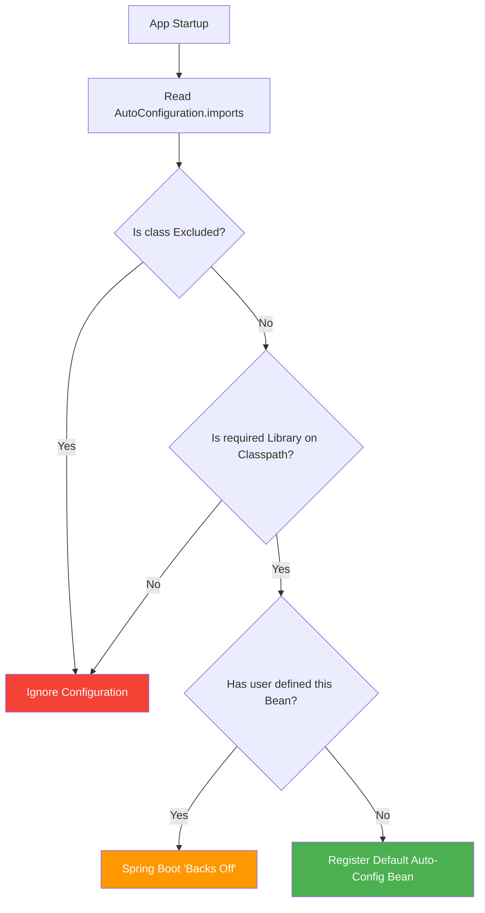
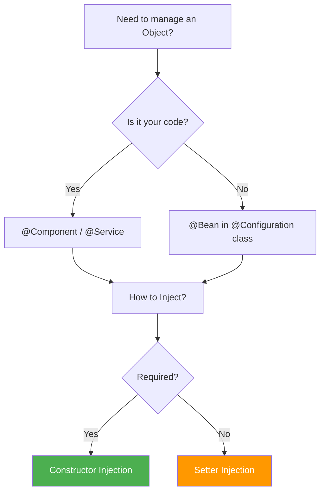
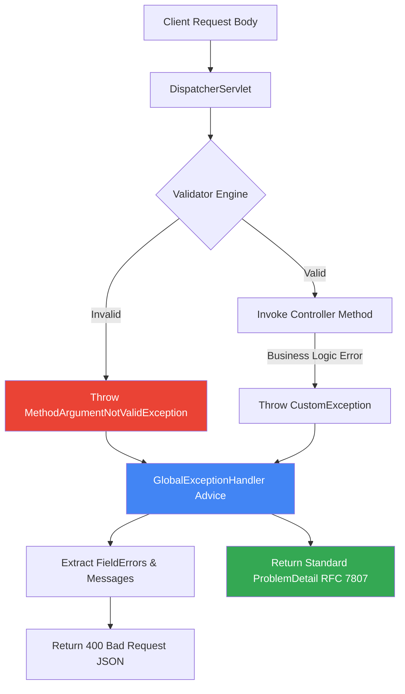
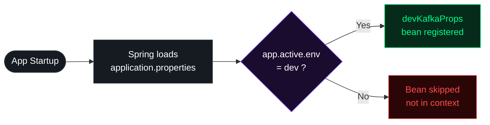
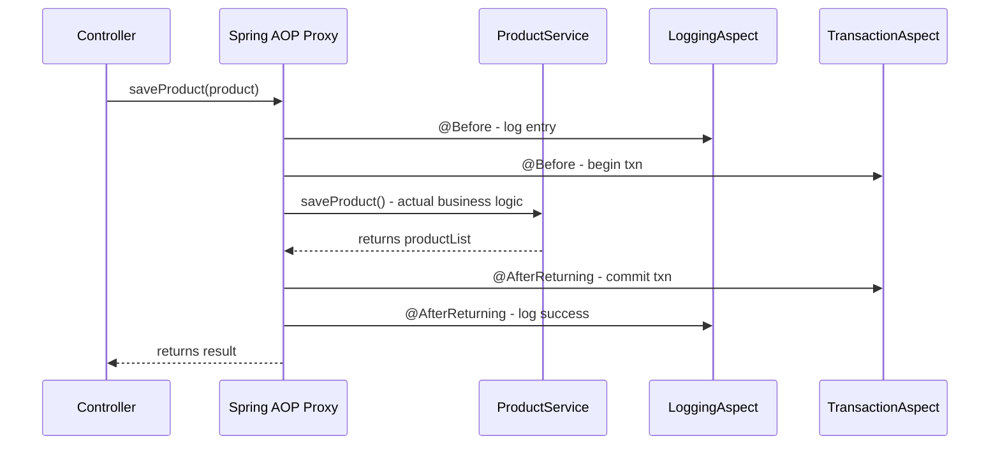
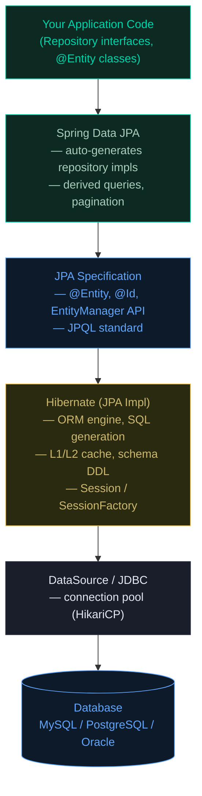

**Why will you choose Spring Boot over Spring Framework?**

- **Dependency Resolution**
  - **The Problem:** In old Spring, if you wanted to use Hibernate, you had to manually find a version of Hibernate that worked with your version of Spring. If you got it wrong, the app wouldn't even start.
  - **The Solution:** Spring Boot "Starters." You just ask for a "Web Starter," and it brings 30+ perfectly compatible libraries.
  ```xml
  <dependency>
    <groupId>org.springframework.boot</groupId>
    <artifactId>spring-boot-starter-web</artifactId>
  </dependency>
  ```
- **Avoid Additional Configuration**
  - **The Problem:** You used to spend hours writing XML files just to tell Spring "I have a Database" or "I want to use JSON."
  - **The Solution: Auto-configuration.** Spring Boot looks at your code. If it sees a Database driver in your project, it automatically sets up the connection for you.
  ```mermaid
  graph TD
    A[Start App] --> B{Is H2 DB on Classpath?}
    B -- Yes --> C[Auto-Create Database Bean]
    B -- No --> D[Skip DB Setup]
    C --> E[App Ready]
    D --> E
  ```
- **Embed Tomcat**
  - **The Problem:** Traditionally, you had to install a separate software called Tomcat on your server, package your code as a `.war` file, and "upload" it there.
  - **The Solution:** The server is now inside your application. You run your app like a simple Java program (`public static void main`), and the server starts automatically.
- **Production-Ready Features**
  - **The Problem:** After deploying an app, how do you know if it's running out of memory or if the database is down? Usually, you'd have to write custom code for this.
  - **The Solution:** Actuator. By adding one library, Spring Boot gives you "secret" URLs (endpoints) that tell you exactly how the app is performing.
    - `.../health`: "Is the DB alive?"
    - `.../metrics`: "How much CPU am I using?"

<br><br>

**What all spring boot starter you have used or what all module you have worked on?**

1. **Web & Web Services**
   - Web: Used to build REST APIs. It includes Tomcat and Spring MVC.
   - Web Services: Specifically for SOAP-based services (using XML).
2. **Data JPA (Java Persistence API)**
   
   This is the bridge between your Java code and your Database. It eliminates the need to write complex SQL for basic CRUD operations.

   ```java
   // Just define an interface; Spring provides the implementation!
    public interface UserRepository extends JpaRepository<User, Long> {
        List<User> findByLastName(String lastName); 
    }
   ```
3. **AOP (Aspect Oriented Programming)**
   - Used for "Cross-cutting concerns" - things you want to happen across many methods without repeating code, like **Logging** or **Security checks**.
     - Analogy: A security guard standing at the door of every room. You don't build a guard into every room; you just "apply" the guard to the doors.
4. **Security**
   - Handles Authentication (Who are you?) and Authorization (What can you do?). It provides the login forms and protects your API endpoints from unauthorized access.
  ```mermaid
  graph LR
    A[Request] --> B{Spring Security Filter}
    B -->|Valid Token| C[Controller]
    B -->|Invalid| D[403 Forbidden]
    style B fill:#f96
  ```
5. **Apache Kafka & Spring Cloud**
   - **Kafka:** Used for Messaging. If Service A needs to tell Service B something without waiting for a response, it drops a message in Kafka.
   - **Spring Cloud:** A collection of tools for **Microservices** (Config management, Service Discovery, etc.).
6. **Thymeleaf**
   - A "Server-side Template Engine." It’s used to build web pages where the HTML is generated on the server (like the old JSF or JSP days, but much cleaner).
 

<br><br>

**How will you run your Spring Boot application?**

- **Execution via the Main Method:** Every Spring Boot project has a class containing a standard Java `public static void main` method. When executed, it calls `SpringApplication.run()`, which triggers the bootstrapping process: starting the JVM, launching the Spring IoC container, and initializing the embedded web server.
- **The "Fat JAR" Architecture:** In professional production environments (Docker/Kubernetes), we package the app as a "Fat JAR" using the `spring-boot-maven-plugin`. Unlike a traditional JAR, this contains your compiled code and every dependency JAR (like Hibernate or Tomcat) nested inside it. You run it using the command `java -jar appname.jar`.
- **The Role of JarLauncher:** When you run that JAR, Spring Boot doesn't use the standard Java ClassLoader. It uses a custom `JarLauncher` that knows how to read classes from those nested JARs. This is why a single file is all you need to deploy a complex microservice.
- **CLI and Build Tools:** You can also run the app using mvn `spring-boot:run`. This is common in local development because it integrates with Spring Boot DevTools, allowing for "Hot Swapping" (restarting the context automatically when you save a file) without manual rebuilds.


<br><br>

**What is the purpose of `@SpringBootApplication`?**

In Spring 6+, this is a composite annotation that acts as the entry point for the framework’s high-level automation. It comprises:

- **`@Configuration` (Bean Definition):** It identifies the class as a source of bean definitions. In Spring 6, this works with CGLIB proxying by default to ensure that if you call a `@Bean` method multiple times, you always get the same singleton instance from the container (this is known as "ProxyBeanMethods").
- **`@ComponentScan` (The Discovery Mechanism):** It recursively scans for classes annotated with `@Component`, `@Service`, `@Repository`, or `@RestController`. The Practical Trap: It starts from the package of the main class. If your project structure is messy and your beans are in a parallel package (e.g., `com.hr.app` vs `com.finance.app`), Spring will fail to find them unless you explicitly define `scanBasePackages`.
- **`@EnableAutoConfiguration` (The SPI Mechanism):** This is where the version matters. Traditionally, this used `spring.factories`. However, in Spring Boot 3 / Spring 6, the mechanism shifted to a new file: `META-INF/spring/org.springframework.boot.autoconfigure.AutoConfiguration.imports`. This file lists the configuration classes that Spring should "conditionally" load based on your classpath.


<br><br>

**Can I use these 3 annotations separately instead of `@SpringBootApplication`?**

- **The Direct Logic:** Yes, you can. Replacing the single meta-annotation with the three individual ones is perfectly valid. The framework treats them exactly the same way during the context refresh phase.
- **The Performance Reason (AOT Compatibility):** In the Spring 6 era, using annotations separately can sometimes help in AOT (Ahead-of-Time) processing. If you want to optimize your app for GraalVM, being explicit about where you scan and what you auto-configure helps the Spring AOT engine generate more efficient code.
- **Advanced Exclusion for Microservices:** In product-based companies, we often have a "common" library that pulls in many dependencies. If you have the `spring-boot-starter-data-jpa` but your specific microservice only needs to be a simple REST proxy without a DB, the app will crash because it can't find a `DataSource`. You can use `@EnableAutoConfiguration(exclude = {DataSourceAutoConfiguration.class})` to bypass the "magic" for that specific module.
- **Granular Scanning in Large Monoliths:** If you are working on a massive banking application with 5000+ classes, a full `@ComponentScan` can make startup painfully slow. By using the annotations separately, you can strictly limit the scan to only the necessary modules, significantly reducing the "Time to First Request."


<br><br>

**What is Auto-configuration in Spring Boot?**

- Auto-configuration is a runtime mechanism where Spring Boot automatically defines and registers beans in the ApplicationContext based on the dependencies present in your classpath. It follows the Convention over Configuration philosophy, assuming sensible defaults so you don't have to write boilerplate code.
- In Spring Boot 3.x, the framework uses the Service Provider Interface (SPI) pattern. It looks for a specific file: `META-INF/spring/org.springframework.boot.autoconfigure.AutoConfiguration.imports`. This file contains a list of full-qualified names of configuration classes.
- Auto-configuration is not "blind" loading. It uses Conditional Annotations (like `@ConditionalOnClass`, `@ConditionalOnMissingBean`, and `@ConditionalOnProperty`). For example, if the `DataSource` class is on the classpath, the `DataSourceAutoConfiguration` class get triggers. However, if you have already defined your own `DataSource` bean, the `@ConditionalOnMissingBean` check fails, and Spring Boot steps back, letting your custom bean take priority.
- If you add `spring-boot-starter-web`, Spring Boot detects the embedded Tomcat classes and automatically configures a DispatcherServlet, a ViewResolver, and starts the server on port 8080 - all without a single line of XML or Java config.

<br><br>

**How can you disable a specific auto-configuration class in Spring Boot?**

- **Via the `@SpringBootApplication` Annotation:** The most common way is using the `exclude` attribute. This is useful when an auto-configuration is interfering with your custom logic or causing startup failures (like JPA trying to connect to a non-existent DB).
  ```java
  @SpringBootApplication(exclude = {DataSourceAutoConfiguration.class})
  ```
- **Via Property Files:** In production environments, you might want to disable a configuration without changing and recompiling the code. You can use the `spring.autoconfigure.exclude` property in your `application.properties` or `application.yml`.
  ```properties
  spring.autoconfigure.exclude=org.springframework.boot.autoconfigure.jdbc.DataSourceAutoConfiguration 
  ```
- **Selective Exclusion for Testing:** If you are running an Integration Test and want to disable Security or Cloud-specific configs, you can use the `@TestPropertySource` or `@EnableAutoConfiguration(exclude = ...)` specifically on your test class to keep the test environment lightweight.
- When you exclude a class, Spring Boot's `AutoConfigurationImportSelector` filters it out of the list of candidate configurations fetched from the .imports file, ensuring that the `@Conditional` checks for that specific class are never even evaluated.

<br><br>

**How can you customize the default configuration in Spring Boot?**

- **Externalized Configuration (Properties/YAML):** This is the "First Line of Defense." Spring Boot exposes thousands of properties. If you want to change the server port or DB connection string, you don't write code; you simply override the property in `application.properties`.
  ```yaml
  server:
    port: 9090
  ```
- **Providing a Custom Bean:** Spring Boot’s auto-configuration classes almost always use `@ConditionalOnMissingBean`. If you define your own Bean of the same type in a `@Configuration` class, Spring Boot will see your bean first and "back off," disabling its own default bean. This is the most professional way to swap out a component (like using a custom `RestTemplate` or `SecurityFilterChain`).


<br><br>

**Architectural Decision Flow**



<br><br>

**How Spring boot run() method works internally ?**

- **Step 1: Initializer & Listener Setup:** When you call `SpringApplication.run()`, it first creates a new `SpringApplication` instance. Internally, it identifies "Initializers" and "Listeners" from the `META-INF/spring.factories` (or `.imports` in Boot 3) to prepare the ground for the environment.
- **Step 2: Starting the StopWatch:** It starts a `StopWatch` to measure the startup time (which you see in the console logs). It then triggers the `SpringApplicationRunListeners` to announce that the app is starting.
- **Step 3: Environment Preparation:** It prepares the `ConfigurableEnvironment`. This involves loading your `application.properties`, system variables, and command-line arguments. This is where the framework decides which Spring Profiles are active.
- **Step 4: Create ApplicationContext:** Based on your classpath, it decides which context to create. For a web app, it creates an `AnnotationConfigServletWebServerApplicationContext`. This is the "brain" that will hold all your beans.
- **Step 5: Bean Registration & Refresh:** This is the heaviest part. The context performs the Component Scan, discovers your `@Service` and `@Controller` classes, and registers them as `BeanDefinitions`. Then comes the `refresh()` phase, where all beans are instantiated, wired together (Dependency Injection), and post-processors are executed.
- **Step 6: Kick-starting the Embedded Server:** Unlike traditional Spring, the embedded server (Tomcat/Jetty) is started during the `refresh()` phase. The context creates a `WebServer` bean, which triggers the server to start on the configured port (default 8080).


<br><br>

**What is Command Line Runner in Spring Boot?**

- CommandLineRunner is a functional interface used to run a specific block of code exactly once after the ApplicationContext is fully initialized but before the run() method finishes execution.
- In banking or product environments, it’s often used for "Warm-up" tasks: seeding master data into a cache, verifying database connections, or running one-time migration scripts.
- It provides access to the raw string array of command-line arguments passed to the application.
  ```java
  @Component
  public class DataInitializer implements CommandLineRunner {
      @Override
      public void run(String... args) throws Exception {
          System.out.println("App started with: " + Arrays.toString(args));
          // Logic to seed database
      }
  }
  ```
- While `CommandLineRunner` gives you raw strings, `ApplicationRunner` gives you `ApplicationArguments`, which is a more sophisticated object that parses arguments into keys and values (e.g., `--port=8080`).
- If you have multiple runners, you can use the `@Order` annotation to specify the sequence of execution. This is critical if one initialization task depends on another being finished first.
- Internal Flow Visualized
  ```mermaid
  sequenceDiagram
    participant M as Main Method
    participant SA as SpringApplication
    participant E as Environment
    participant AC as ApplicationContext
    participant TS as Tomcat/Server
    participant CR as CommandLineRunner

    M->>SA: run(MyClass.class, args)
    SA->>E: Prepare Environment (Properties/Profiles)
    SA->>AC: Create Context
    AC->>AC: Component Scan & Bean Registration
    AC->>TS: Start Embedded Server
    AC->>AC: Complete Refresh
    SA->>CR: Execute run() methods
    SA-->>M: App Started Successfully
  ```


<br><br>

**Can you explain the purpose of Stereotype annotations in the Spring Framework?**

- Stereotype annotations are markers that tell Spring, "This class has a specific role in the application architecture." They allow Spring's Component Scan to automatically discover classes and register them as Beans in the ApplicationContext.
- While `@Component` is the generic parent, we use specialized stereotypes for clarity and to enable specific framework behaviors:
  - **`@Controller` / `@RestController`:** Marks the class as a web entry point. It handles HTTP requests and enables Spring MVC features.
  - **`@Service`:** Marks the class for Business Logic. While it functions like `@Component`, using `@Service` clearly identifies where the core "meat" of the application resides.
  - **`@Repository`:** Marks the Data Access Layer. Crucially, it also enables automatic Persistence Exception Translation, converting low-level SQL/JPA exceptions into Spring’s readable DataAccessException hierarchy.
- Using specific stereotypes improves code readability (Domain-Driven Design) and allows you to apply AOP (Aspect-Oriented Programming) pointcuts to specific layers (e.g., "log all methods in classes marked with `@Service`").


<br><br>

**How can you define a Bean in Spring Framework?**

There are three primary ways to define a bean, and knowing which to use is a sign of experience:

- **Stereotype Annotations (Implicit):** You mark a class with `@Component`, `@Service`, etc. Spring finds it during the scan and manages its lifecycle. This is the go-to for your own internal code.
- **Java-Based Configuration (Explicit):** You use a `@Configuration` class and define methods with the `@Bean` annotation. This is used when you need to configure Third-Party Libraries (like a `ModelMapper` or `BCryptPasswordEncoder`) where you cannot modify the source code to add `@Component`.
  ```java
  @Configuration
  public class AppConfig {
      @Bean
      public RestTemplate restTemplate() {
          return new RestTemplate();
      }
  }
  ```
- **XML Configuration (Legacy):** While rare in Spring 6, you may encounter it in older banking systems. You define beans in a `beans.xml` file. It is largely replaced by Java Config for better type safety and refactoring support.


<br><br>

**What is Dependency Injection (DI)?**

- DI is a design pattern where an object does not create its own dependencies. Instead, those dependencies are "injected" into it by an external entity (the Spring IoC Container).
- DI is a specific implementation of IoC. Instead of the developer controlling the object lifecycle (`new MyService()`), the control is "inverted" to the framework.
- The primary goal is Decoupling. By injecting dependencies (usually interfaces), you make your code modular and highly Testable. You can easily swap a real `DatabaseService` with a `MockDatabaseService` during unit testing without changing the dependent class.


<br><br>

**How many ways can we perform Dependency Injection in Spring?**

There are three main types, but only one is the "Industry Gold Standard":

- **Constructor Injection:** Dependencies are provided through the class constructor.
  - **Why it's preferred:** It ensures the bean is Immutable (once the object is created, we won't be able to modify it) and prevents the object from ever being in an "incomplete" state (null dependencies). It also makes it clear which dependencies are required.
  ```java
  private final MyRepository repository;
  public MyService(MyRepository repository) { this.repository = repository; }
  ```
- **Setter Injection:** Dependencies are provided via setter methods. This is used for Optional Dependencies that can be changed or injected later. It allows for circular dependencies, though these are generally considered a "code smell."
- **Field Injection (The "Avoid" Way):** Using `@Autowired` directly on the variable.
  - **The Catch:** It is heavily discouraged in Spring 6. It makes unit testing harder (requires Reflection to mock) and hides dependencies from the constructor. Top product companies will flag this during code reviews.

 
<br><br>

**Architectural Perspective (Decision Flow)**




<br><br>

**Where you would choose Setter Injection over Constructor Injection, and vice versa?**

1. **Constructor Injection (The Mandatory Choice)**
   - Dependencies are provided at the moment of object creation. In Spring 6, if your class has only one constructor, the `@Autowired` annotation is optional.
   - It ensures the bean is Immutable (using final fields). It also prevents a "partially initialized" object; the bean simply won't start if a required dependency is missing. This makes unit testing easier because you can't instantiate the class without providing the mocks.
    ```java
    @Service
    public class TradeService {
        // Final ensures the dependency cannot be changed after initialization
        private final TradeRepository repository;

        // Standard for Spring 6: Constructor Injection
        public TradeService(TradeRepository repository) {
            this.repository = repository;
        }
        
        public void executeTrade() {
            repository.save(new Trade());
        }
    }
    ```
2. **Setter Injection (The Optional Choice)**
   - Dependencies are injected via public setter methods after the bean instance is created.
   - Use this for Optional Dependencies. If your service can function with a "default" behavior and only needs a specific bean to override that behavior occasionally, setters are appropriate.
   - If `ServiceA` needs `ServiceB` and vice-versa, Constructor Injection will fail (App crash). Setter injection allows Spring to create the "raw" objects first and link them later, breaking the cycle.
    ```java
    @Service
    public class NotificationService {
        private EmailClient emailClient;

        // Setter Injection for an optional dependency
        @Autowired
        public void setEmailClient(EmailClient emailClient) {
            this.emailClient = emailClient;
        }

        public void notifyUser() {
            if (emailClient != null) {
                emailClient.send("Hello!");
            } else {
                System.out.println("No email client configured, skipping...");
            }
        }
    }
    ```

<br><br>

**What is Circular Dependency?**

It occurs when Bean A depends on Bean B, and Bean B depends on Bean A. This creates a "Chicken and Egg" problem.

1. **Constructor Injection (The Failure)**
   - This is the most "strict" scenario. When Spring tries to create `ServiceA`, it sees it needs `ServiceB`. It pauses to create `ServiceB`, but then sees it needs `ServiceA`. Since neither can be fully instantiated, the application fails at startup with a `BeanCurrentlyInCreationException`.
    ```java
    @Service
    public class ServiceA {
        private final ServiceB serviceB;
        // Spring starts here, but can't find a finished ServiceB
        public ServiceA(ServiceB serviceB) {
            this.serviceB = serviceB;
        }
    }

    @Service
    public class ServiceB {
        private final ServiceA serviceA;
        // Spring pauses here, needing ServiceA
        public ServiceB(ServiceA serviceA) {
            this.serviceA = serviceA;
        }
    }
    ```
2. **Setter/Field Injection (The Workaround)**
   - Spring handles circular dependencies via Setter Injection or Field Injection using a "three-stage cache" mechanism.
     - Spring creates the "raw" instance of `ServiceA` (using the default constructor).
     - It stores this uninitialized instance in a temporary cache.
     - It then injects the dependencies. Because the "raw" object already exists in memory, the circle is technically broken.
    ```java
    @Service
    public class ServiceA {
        @Autowired
        private ServiceB serviceB; // Injected after ServiceA is created
    }

    @Service
    public class ServiceB {
        @Autowired
        private ServiceA serviceA; // Injected after ServiceB is created
    }
    ```
3. **The Best Practice Solution: `@Lazy`**
   - If you are forced to use Constructor Injection but have a circular dependency, you can use the `@Lazy` annotation. This tells Spring: "Don't inject the actual bean yet; inject a Proxy instead." The real bean is only initialized the first time a method is called on it.
    ```java
    @Service
    public class ServiceA {
        private final ServiceB serviceB;

        public ServiceA(@Lazy ServiceB serviceB) {
            this.serviceB = serviceB;
        }
    }
    ```

<br><br>

**Real-world use case where `@PostConstruct` is particularly useful?**

- `@PostConstruct` is a lifecycle callback. It tells Spring to execute a method after the bean has been fully initialized and all dependencies have been injected.
- You cannot perform certain logic in the constructor if that logic depends on `@Autowired` fields or `@Value` properties, because those aren't populated when the constructor runs.
- **Real-World Example (Banking/Product):** Imagine a `CurrencyExchangeService`.
  - The class is created (Constructor).
  - The API Key is injected from properties (DI).
  - `@PostConstruct` triggers a one-time call to an external API to fetch and cache the initial exchange rates so the service is "warm" and ready before the first user request hits.
  ```java
  @Service
  public class CacheWarmer {
      @Autowired private CacheManager cache;

      @PostConstruct
      public void init() {
          // Logic to load master data into Redis or local cache
          cache.loadInitialData(); 
      }
  }
  ```

<br><br>

**How can we dynamically load values in a Spring Boot application? (`@Value`)**

1. **Using the `@Value` Annotation**
  - This is a field-level injection method. It uses **SpEL (Spring Expression Language)** to pull values from your `application.properties`, YAML files, or environment variables.
  - A common requirement in banking apps is "Fail-Safe" configurations. You can use the `:` syntax to provide a default value if the key is missing, preventing the `BeanCreationException`.
  - Best for injecting single, standalone configuration points like a specific API timeout or a feature flag.
    ```java
    @Component
    public class PaymentGateway {

        // Pulls from application.properties; defaults to 3000 if not found
        @Value("${payment.timeout:3000}")
        private int timeout;

        // Supports SpEL for complex logic
        @Value("#{systemProperties['user.home']}")
        private String userHome;

        public void process() {
            System.out.println("Connecting with timeout: " + timeout);
        }
    }
    ```
2. **Using the `Environment` Class**
   - The `Environment` interface is a central part of the `ApplicationContext`. It represents the "entire world" of properties available to the app (System properties, Env variables, and Config files).
   - Unlike `@Value`, which is resolved when the bean is created (static), the `Environment` object can be queried at any time during the application's execution.
   - It provides built-in methods to check which Spring Profiles (e.g., `dev`, `prod`) are currently active, which is critical for banking apps that behave differently across environments.
   - It offers a `getProperty(key, targetType, defaultValue)` method, which handles the conversion from String to Integer/Boolean safely.
    ```java
    @Service
    public class NetworkConfig {

        private final Environment env;

        // Constructor Injection is preferred for Environment
        public NetworkConfig(Environment env) {
            this.env = env;
        }

        public void checkSecurity() {
            // Querying values dynamically
            String port = env.getProperty("server.port");
            
            // Checking Active Profiles
            if (env.acceptsProfiles(Profiles.of("prod"))) {
                System.out.println("Running in Production Mode");
            }
        }
    }
    ```

<br><br>

**Can you explain the key differences between YML and properties files, and in what scenarios you might prefer one format over the other?**

- **Syntax and Structure:** Properties files use a flat, key-value pair format (`a.b.c=value`). YAML (YAML Ain't Markup Language) is indentation-based and hierarchical, which visually represents the relationship between properties.
- **Hierarchy and Redundancy:** In Properties, you must repeat the prefix for every single line. YAML uses "nested" blocks, which significantly reduces boilerplate and makes the file smaller and easier to manage as the project grows.
- **Support for Lists and Arrays:** YAML has native support for lists and maps using simple bullet points or brackets. Properties files require cumbersome indexing (e.g., `app.servers[0]=xyz`), which is prone to manual errors when adding new items.
- **Complex Data Types:** YAML is a superset of JSON, meaning it can handle complex data structures and maps naturally. This is why it is the standard for Kubernetes, Docker, and Cloud-native Spring applications.
- **Readability:** YAML is designed to be human-readable. In a banking application with hundreds of security and database configs, a hierarchical YAML file allows a developer to see the "big picture" of a module at a single glance.
- **Comparison Code Snippet**
  - **`application.properties`**
    ```properties
    spring.datasource.url=jdbc:mysql://localhost:3306/db
    spring.datasource.username=root
    spring.datasource.password=secret

    # Lists are flat and repetitive
    app.allowed-origins[0]=https://bank.com
    app.allowed-origins[1]=https://api.bank.com
    ```
  - **`application.yml`**
    ```yaml
    spring:
        datasource:
            url: jdbc:mysql://localhost:3306/db
            username: root
            password: secret

        # Lists are intuitive and clean
        app:
        allowed-origins:
            - https://bank.com
            - https://api.bank.com
    ```


<br><br>

**What is the difference between `.yml` and `.yaml`?**

- There is zero functional difference. Both extensions represent the exact same file format and are treated identically by the YAML parser and the Spring Boot framework.
- The `.yml` extension became popular because of legacy Windows systems (which preferred 3-letter extensions like `.htm` or `.jpg`). The official YAML website and modern Linux/Unix standards generally prefer `.yaml`.
- Spring Boot’s `PropertySourcesLoader` will recognize both and treat them with the same priority. In a top-tier project, the key is consistency—pick one extension and stick with it across all microservices.


<br><br>

**If I will configure same values in both properties then which value will be load in spring boot or Who will load first properties or yml file?**

- If both `application.properties` and `application.yml` exist in the same location, `application.properties` takes precedence.
- This is determined by the order in which `PropertySourceLoaders` are processed. Spring Boot iterates through these loaders; the properties loader runs after the YAML loader. Since later sources added to the `MutablePropertySources` list override earlier ones for the same key, the properties file wins.
- **`PropertySourceLoader`:** This is the strategy interface used to load properties. Below are the implementation classes.
  - **`PropertiesPropertySourceLoader`:** Handles `.properties` and `.xml` files.
  - **`YamlPropertySourceLoader`:** Handles `.yml` and `.yaml` files.
- **Code Snippet:**
  ```java
    // How Spring internally loads these (Conceptual)
    public class PropertyLoader {
        // Spring Boot uses these implementations via SPI
        private List<PropertySourceLoader> loaders = List.of(
            new YamlPropertySourceLoader(), 
            new PropertiesPropertySourceLoader()
        );

        public void load() {
            // As it iterates, later values for the same key override previous ones
            for (PropertySourceLoader loader : loaders) {
                // Logic to add to Environment
            }
        }
    }
  ```


<br><br>

**How to load External Properties in Spring Boot (`spring.config.import`)**

- **`spring.config.import`:** Introduced in Spring Boot 2.4+ and refined in Boot 3, this property allows a configuration file to "reach out" and pull in other sources. It replaces the old bootstrap method.
- `ConfigDataLocationResolvers` and `ConfigDataLoader`. These classes decide how to interpret the string (is it a file? a URL? a vault path?) and how to load the bits.
- **Comprehensive Code Snippet:**
  ```yaml
    # application.yml - Primary config inside the JAR
    spring:
    config:
        import: 
        - "file:/etc/config/bank-api-secrets.properties" # External Linux path (High Priority)
        - "optional:file:./config/override.yml"         # Optional local file
        - "configserver:http://config-svc:8888"        # Integration with Spring Cloud Config
  ```
  ```java
    # Usage in a Service
    @Service
    public class SecretService {
        @Value("${bank.api.key}")
        private String apiKey; // This would be loaded from the external file above
    }
  ```


<br><br>

**How to map or bind config properties to a Java Object?**

- Use `@ConfigurationProperties`. It provides type safety, validation, and hierarchical grouping.
- `ConfigurationPropertiesBindingPostProcessor` class. This is the specialized bean post-processor that intercepts your bean, reads the metadata, and performs the "Relaxed Binding."
- **Code Snippet:**
  ```java
    // 1. Define the POJO with Validation
    @Configuration
    @ConfigurationProperties(prefix = "bank.auth")
    @Validated // Required to trigger JSR-303 validation
    public class AuthProperties {

        @NotBlank(message = "JWT Secret cannot be empty")
        private String jwtSecret;

        @Min(value = 1800, message = "Session must be at least 30 mins")
        private int sessionTimeout;

        // Getters and Setters are MANDATORY for standard binding
        public String getJwtSecret() { return jwtSecret; }
        public void setJwtSecret(String jwtSecret) { this.jwtSecret = jwtSecret; }
        public int getSessionTimeout() { return sessionTimeout; }
        public void setSessionTimeout(int sessionTimeout) { this.sessionTimeout = sessionTimeout; }
    }

    // 2. Using the properties in a Security Filter
    @Component
    public class JwtFilter {
        private final AuthProperties authProperties;

        // Constructor Injection is best practice
        public JwtFilter(AuthProperties authProperties) {
            this.authProperties = authProperties;
        }

        public void validate() {
            System.out.println("Using Secret: " + authProperties.getJwtSecret());
        }
    }
  ```


<br><br>

**How will you resolve bean dependency ambiguity?**

- This occurs when you have one interface but multiple implementations (e.g., `PaymentService` implemented by `Paypal` and `Stripe`). When you try to `@Autowire` the interface, Spring gets confused about which bean to inject and throws a `NoUniqueBeanDefinitionException`.
- You use the `@Qualifier` annotation alongside `@Autowired` or in the constructor to explicitly name the bean you want.
- The `DefaultListableBeanFactory` is the class responsible for resolving these dependencies. It uses the qualifier name as a secondary filter when type-matching returns multiple results.
  ```java
    public interface Payment { void process(); }

    @Component("paypal")
    public class PaypalPayment implements Payment { public void process() { ... } }

    @Component("stripe")
    public class StripePayment implements Payment { public void process() { ... } }

    @Service
    public class Checkout {
        private final Payment payment;

        // Resolving ambiguity using @Qualifier
        public Checkout(@Qualifier("stripe") Payment payment) {
            this.payment = payment;
        }
    }
  ```

<br><br>

**Can we avoid dependency ambiguity without using `@Qualifier`?**

Yes, you can. Spring 6 and Boot 3 provide several built-in mechanisms to resolve which implementation should be injected when multiple candidates exist.

- **Approach A: The `@Primary` Annotation**
  - This is the most common "product-grade" solution. You mark one implementation as the default. If Spring finds multiple beans of the same type, it will always pick the one marked `@Primary` unless a specific name is requested.
- **Approach B: The `@Resource` Annotation**
  - Unlike `@Autowired` (which searches by Type first), the `@Resource` annotation searches by Name first. If the name of your field or setter matches the Bean ID, Spring injects it directly, bypassing the ambiguity check entirely.
- **Approach C: Variable Naming (Bean Name Autowiring)**
  - If you use `@Autowired`, Spring's `DefaultListableBeanFactory` uses the variable name as a fallback tie-breaker. if the interface is `Payment` and you name your variable `paypalPayment`, Spring looks for a bean with that exact ID.
- **Code Snippet:**
  ```java
    public interface Payment { void process(); }

    @Component("paypal")
    public class PaypalPayment implements Payment { 
        public void process() { System.out.println("Paid via Paypal"); } 
    }

    @Component("stripe")
    @Primary // Approach A: The default choice if no name is specified
    public class StripePayment implements Payment { 
        public void process() { System.out.println("Paid via Stripe"); } 
    }
  ```
  ```java
    @Service
    public class CheckoutService {

        // Approach B: Search by NAME first (Standard Java/JSR-250)
        // Spring looks for a bean named "paypal" in the container
        @Resource(name = "paypal")
        private Payment paymentSource;

        // Approach C: Fallback Naming
        // Spring sees multiple Payments, but because variable is 'stripe', it picks StripePayment
        @Autowired
        private Payment stripe;

        public void completeOrder() {
            paymentSource.process();
            stripe.process();
        }
    }
  ```
- **Internal Responsible Classes & Interfaces**
  - **`CommonAnnotationBeanPostProcessor`:** This is the class specifically responsible for processing the `@Resource` annotation. It belongs to the `org.springframework.context.annotation` package and handles JSR-250 lifecycle annotations.
  - **`AutowiredAnnotationBeanPostProcessor`:** The class that handles `@Autowired` and `@Value`. It uses the `DefaultListableBeanFactory` to resolve beans by type first, then by name.
  - **`PrimaryObjectProvider`:** Internally used by Spring to check for the presence of the `@Primary` metadata during the autowiring process.


<br><br>

**What is bean scope & Can you explain different type of bean scope?**

- Bean Scope defines the lifecycle and visibility of a bean within the Spring Container. It determines how many instances of a bean are created and how they are shared.
- The `Scope` interface and its implementations (like SimpleThreadScope) manage this logic.
- **Pointwise Types:**
  - **Singleton (Default):** Only one instance is created per IoC container. It is stateless and thread-safe.
  - **Prototype:** A new instance is created every time it is requested from the container. Used for stateful beans.
  - **Request (Web only):** One instance per HTTP request.
  - **Session (Web only):** One instance per HTTP session.
  - **Application (Web only):** One instance per ServletContext.
  - **WebSocket (Web only):** One instance per WebSocket lifecycle.
  ```java
    @Component
    @Scope("prototype") // New object every time @Autowired is called
    public class UserSession {
        // Stateful data
    }
  ```

<br><br>

**How to define custom bean scope?**

Creating a custom scope involves four distinct architectural steps. This demonstrates your knowledge of the `org.springframework.beans.factory.config package`.

- **Step 1: Implement the `Scope` Interface:** You must create a class that implements the `Scope` interface. This requires overriding methods like `get(String name, ObjectFactory<?> objectFactory)` to define the logic for retrieving or creating the bean, and `remove(String name)` for cleanup.
- **Step 2: Register the Custom Scope:** You must tell the Spring Container about your new scope. This is done by calling `configurableBeanFactory.registerScope("scopeName", new MyCustomScope())`.
- **Step 3: Access via BeanFactoryPostProcessor:** To automate registration during startup, we typically implement `CustomScopeConfigurer`.
- **Step 4: Usage:** Apply it to your beans using the `@Scope("yourScopeName")` annotation.
- **Code Snippet: Custom Thread Scope Example**
  ```java
    // 1. Implementation
    public class MyThreadScope implements Scope {
        private final ThreadLocal<Map<String, Object>> threadScope = 
            ThreadLocal.withInitial(HashMap::new);

        @Override
        public Object get(String name, ObjectFactory<?> objectFactory) {
            Map<String, Object> scope = threadScope.get();
            return scope.computeIfAbsent(name, k -> objectFactory.getObject());
        }
        // Implement remove(), getConversationId(), etc.
    }

    // 2. Registration via Configuration
    @Configuration
    public class ScopeConfig {
        @Bean
        public static CustomScopeConfigurer customScopeConfigurer() {
            CustomScopeConfigurer configurer = new CustomScopeConfigurer();
            configurer.addScope("myThread", new MyThreadScope());
            return configurer;
        }
    }
  ```

<br><br>

**Can you provide a few real-time use cases for when to choose Singleton Scope and Prototype Scope?**

- **Singleton Scope (One Instance per Container)**

  This is the default. It is used for stateless objects that can be shared across multiple threads without corruption.

  - **Database Configuration:** Objects like `DataSource` or `JdbcTemplate` are expensive to create. Sharing one instance ensures efficient connection pooling.
  - **Service & Repository Layers:** Since these usually contain only logic and no "per-user" state, a singleton instance handles all incoming requests efficiently.
  - **Application Configuration:** Shared constants or global settings loaded from properties.
- **Prototype Scope (New Instance per Request)**
  
  Used for stateful objects or when thread isolation is required.

  - **User Sessions/Shopping Carts:** If a bean stores data specific to a user's current interaction, a new instance prevents data leaking between users.
  - **Thread Safety:** If a legacy library or a class is not thread-safe (contains mutable instance variables), providing a fresh instance to every caller avoids race conditions.
  - **Heavy Initialization with State:** A bean that performs a complex calculation and stores the intermediate result. Using a singleton here would cause the next thread to see the previous thread's partial data.


<br><br>

**Can we inject a prototype bean in a singleton bean? If yes, what will happen if we inject prototype bean in a singleton bean?**

- Yes, you can inject it, but it leads to a common problem called Scope Impediment.
- **The Problem:** Since the Singleton bean is initialized only once, the Prototype bean is also injected only once at startup. Consequently, every time you use the Singleton bean, you are stuck with the same instance of the Prototype bean, defeating its purpose.
- **The Solution (Lookup Injection):** To get a fresh Prototype instance every time, you must use Method Injection via the `@Lookup` annotation or implement `ApplicationContextAware` to fetch the bean manually.
- **Internal Responsible Class:** `CglibSubclassingInstantiationStrategy`. When you use `@Lookup`, Spring uses CGLIB to bytecode-generate a subclass of your bean and overrides the method to fetch a new instance from the container.
- Code Snippet: The @Lookup Solution
  ```java
    @Component
    @Scope("prototype")
    public class PrototypeBean { /* stateful logic */ }

    @Component
    public abstract class SingletonBean {

        public void process() {
            // This method will be overridden by Spring to return a NEW instance
            PrototypeBean instance = getPrototypeBean();
            System.out.println("Using: " + instance);
        }

        @Lookup
        public abstract PrototypeBean getPrototypeBean();
    }
  ```

<br><br>

**Difference between Spring Singleton and Plain Singleton?**

- A Plain Java Singleton (GoF pattern) ensures one instance per ClassLoader. A Spring Singleton ensures one instance per Spring IoC Container (ApplicationContext).
- Plain singletons use private constructors and static methods. Spring singletons are managed by the container; you can still create multiple instances manually using the new keyword, though it's discouraged.
- Spring singletons are easier to unit test because they allow for constructor injection of mocks. Plain singletons are global states and notoriously difficult to mock.


<br><br>

**What is the purpose of the BeanPostProcessor interface in Spring, and how can you use it to customize bean initialization and destruction?**

- The `BeanPostProcessor` (BPP) is an interface that allows you to "plug in" custom logic into the Spring Bean Lifecycle. It lets you modify or wrap beans (like creating Proxies) before and after they are initialized.
- **Lifecycle Hooks:**
  - **`postProcessBeforeInitialization`:** Called after dependencies are injected but before `@PostConstruct` or `afterPropertiesSet`.
  - **`postProcessAfterInitialization`:** Called after the init methods. This is where Spring usually creates AOP Proxies.
- Real-world Use Case: Custom logging, validation of custom annotations, or sensitive data encryption before the bean is ready for use.
- **Code Snippet: Custom BeanPostProcessor**
  ```java
    @Component
    public class CustomBPP implements BeanPostProcessor {

        @Override
        public Object postProcessBeforeInitialization(Object bean, String beanName) {
            if (bean instanceof MyService) {
                System.out.println("Intercepting before init: " + beanName);
            }
            return bean; // Must return the bean (or a wrapper)
        }

        @Override
        public Object postProcessAfterInitialization(Object bean, String beanName) {
            return bean;
        }
    }
  ```

<br><br>

**What all HTTP methods have you used in your project?**

- **GET (Retrieve):** Used to fetch a resource. It is Idempotent (multiple identical requests have the same effect as one) and Safe (does not change the server state).
- **POST (Create):** Used to create a new resource. It is Non-Idempotent. Every time you hit a POST endpoint, a new record is typically created (e.g., `POST /users`).
- **PUT (Update/Replace):** Used for a Full Update. It replaces the entire resource with the new payload. It is Idempotent—sending the same full update 10 times results in the same final state.
- **PATCH (Partial Update):** Used for Partial Updates (e.g., just changing a user's email). Unlike PUT, you only send the fields you want to change.
- **DELETE (Remove):** Used to remove a resource. It is Idempotent because once a resource is deleted, subsequent deletes don't change the state further (they simply return 404 or 204).


<br><br>

**How can you specify the HTTP method type for your REST endpoint?**

There are two primary ways to specify the method in Spring Boot 3. Understanding the relationship between them is key to proving seniority.

- **Approach A: Using `@RequestMapping` (General Purpose)**
  - This is the base annotation. You specify the method using the `method` attribute from the `RequestMethod` enum.
    ```java
    // Traditional way (often used at Class level for base paths)
    @RequestMapping(value = "/users", method = RequestMethod.POST)
    public ResponseEntity<String> createUser(@RequestBody User user) {
        return ResponseEntity.ok("User Created");
    }
    ```
- **Approach B: Using Composed Annotations (Best Practice)**
  - Spring provides "shortcut" annotations that are meta-annotated with `@RequestMapping`. These are preferred in modern projects for better readability.
    ```java
    @GetMapping("/users/{id}")      // Shortcut for @RequestMapping(method = RequestMethod.GET)
    @PostMapping("/users")          // Shortcut for @RequestMapping(method = RequestMethod.POST)
    @PutMapping("/users/{id}")       // Shortcut for @RequestMapping(method = RequestMethod.PUT)
    @PatchMapping("/users/{id}")     // Shortcut for @RequestMapping(method = RequestMethod.PATCH)
    @DeleteMapping("/users/{id}")    // Shortcut for @RequestMapping(method = RequestMethod.DELETE)
    ```
- **Internal Responsible Classes & Mechanics**
  - **`RequestMappingHandlerMapping`:** This is the most important class. It scans all your `@Controller` beans during startup, finds the `@RequestMapping` (or composed) annotations, and creates a "map" of URLs to method handlers.
  - **`RequestMappingInfo`:** An internal object that stores the conditions for a match (URL, HTTP Method, Headers, Params).
  - **`DispatcherServlet`:** The front controller that receives the incoming HTTP request and uses the `HandlerMapping` to decide which Java method to execute.


<br><br>

**What is the difference between `@PathVariable` & `@RequestParam`?**

- **`@PathVariable`:** Used to extract data directly from the URI path. This is the standard for RESTful APIs where the variable identifies a specific resource.
- **`@RequestParam`:** Used to extract data from Query Parameters (after the `?` in the URL). This is used for filtering, sorting, or optional parameters.
- **Internal Responsible Class:** `PathVariableMethodArgumentResolver` and `RequestParamMethodArgumentResolver`. These specialized resolvers extract the strings from the request and convert them to your Java types.
- **Code Snippet:**
  ```java
  // URL: /users/101?status=active
  @GetMapping("/users/{id}")
  public ResponseEntity<User> getUser(
      @PathVariable("id") Long userId,          // id = 101
      @RequestParam(value = "status") String st // status = "active"
  ) {
      return ResponseEntity.ok(service.find(userId, st));
  }
  ```

<br><br>

**Why did you use `@RestController` why not `@Controller`?**

- **`@Controller`:** The traditional annotation used for Web MVC. It typically returns a View (like an HTML page via Thymeleaf). If you want to return data directly, you must add `@ResponseBody` to every method.
- **`@RestController`:** A specialized "composed" annotation. It is a combination of `@Controller` + `@ResponseBody`.
- **The Key Difference:** When using `@RestController`, Spring automatically assumes every method returns a data object (JSON/XML) that should be written directly into the HTTP Response Body, bypassing the View Resolver entirely.
- **Internal Responsible Class:** `RequestResponseBodyMethodProcessor`. This class handles the return value of `@RestController` methods by passing it to the appropriate Message Converter.


<br><br>

**How can we deserialize a JSON request payload into an object?**

- Use `@RequestBody`.
- Spring doesn't do this manually. It uses HTTP Message Converters. For JSON, the default is the Jackson library.
- **The Process:**
  - The request arrives with `Content-Type: application/json`.
  - Spring's DispatcherServlet identifies the `@RequestBody` annotation.
  - It calls the `MappingJackson2HttpMessageConverter`.
  - Jackson reads the JSON input stream and maps the keys to your Java object's fields (via reflection/setters).
- **Code Snippet:**
  ```java
  @PostMapping(value = "/save", consumes = MediaType.APPLICATION_JSON_VALUE)
  public ResponseEntity<User> createUser(@RequestBody User user) { 
      // JSON is already converted to a User object here
      return new ResponseEntity<>(service.save(user), HttpStatus.CREATED);
  }
  ```
- **Internal Message Conversion Lifecycle**
  ```mermaid
  graph TD
    A["Incoming HTTP Request"] --> B["DispatcherServlet"]
    B --> C{"Argument Resolvers"}
    
    C -->|"@PathVariable"| D["Extract from URI"]
    C -->|"@RequestParam"| E["Extract from Query String"]
    C -->|"@RequestBody"| F["Call HttpMessageConverter"]
    
    F --> G["Jackson Library: JSON to POJO"]
    G --> H["Invoke Controller Method"]
    H --> I["Return Object"]
    
    I --> J{"@RestController?"}
    J -->|"Yes"| K["Bypass ViewResolver"]
    K --> L["Jackson: POJO to JSON Response"]
    
    style F fill:#f96,stroke:#333
    style J fill:#4285F4,color:#fff
    style L fill:#34A853,color:#fff

  ```

<br><br>


**Can we perform update in `POST`? If yes, why do we need PUT?**

- Yes, you can perform updates in a `POST` method. However, `POST` is designed for non-idempotent operations. If a client retries a `POST` request due to a timeout, your server might perform the update twice (or create a duplicate if the logic isn't perfect).
- `PUT` is idempotent. It represents a "Replace" operation. Sending the same `PUT` request multiple times will always result in the same state on the server.
- **The Semantic standard:**
  - `POST` → “Server, you decide where/how this gets created or handled.”
  - `PUT` → “I know exactly where this resource lives—replace it there.”
  - Use `POST` when the server controls the resource ID (e.g., creating a new transaction). Use `PUT` when the client provides the specific URI of the resource to be updated/replaced.
- `RequestMappingHandlerMapping` uses the `RequestMethod` enum to route these distinct behaviors.

<br><br>

**Can we pass a Request Body in a `GET` Method?**

- Technically possible, but architecturally forbidden.
- Most HTTP client libraries (like older versions of OkHttp) and many Web Servers/Proxies/Firewalls will either ignore the body or explicitly reject the request.
- Never use a body in GET. It breaks Cacheability. If you need to send complex filter criteria that don't fit in query params, use a POST request with a specific "search" action.


<br><br>

**How can we perform content negotiation (`XML`/`JSON`)?**

- Content Negotiation is the process where the Client and Server agree on the data format (Media Type).
- **The Mechanism:** It relies on HTTP Headers:
  - **`Accept`:** Client tells server "I want JSON" (`Accept: application/json`).
  - **Content-Type:** Client tells server "I am sending XML" (`Content-Type: application/xml`).
- **Internal Responsible Class:** `ContentNegotiationManager` and `HttpMessageConverter` implementations.
- Spring looks at the `Accept` header and iterates through registered `HttpMessageConverters` (like `MappingJackson2HttpMessageConverter` for JSON or `Jaxb2RootElementHttpMessageConverter` for XML) to find one that can produce that format.
  ```java
  @GetMapping(value = "/user/{id}", 
            produces = {MediaType.APPLICATION_JSON_VALUE, MediaType.APPLICATION_XML_VALUE})
  public User getUser(@PathVariable String id) {
      return service.findById(id); // Spring picks JSON or XML based on 'Accept' header
  }
  ```


<br><br>

**What all status codes you have observed in your application?**

In banking and product firms, status codes are the "API Contract." You must use them accurately:

- **2xx (Success):**
  - **`200 OK`:** General success.
  - **`201 Created`:** Successfully created a resource (POST).
  - **`204 No Content`:** Success, but nothing to return (common for DELETE).
- **4xx (Client Error):**
  - **`400 Bad Request`:** Validation failed.
  - **`401 Unauthorized`:** No authentication (Missing token).
  - **`403 Forbidden`:** Authenticated but no permission (RBAC failure).
  - **`404 Not Found`:** Resource doesn't exist.
  - **`405 Method Not Allowed`:** Using GET on a POST-only endpoint.
  - **`415 Unsupported Media Type`:** Client sent XML but server only accepts JSON.
- **5xx (Server Error):**
  - **`500 Internal Server Error`:** Unhandled exception (`NullPointerException`).
  - **`503 Service Unavailable`:** Down for maintenance or overloaded.
- **Internal Logic Flow of Content Negotiation**
  ```mermaid
  graph TD
    A[Client Request with 'Accept: application/xml'] --> B[DispatcherServlet]
    B --> C[Find Handler Method]
    C --> D[Method returns User Object]
    D --> E[ContentNegotiationManager]
    E --> F{Is XML Converter available?}
    F -- No --> G[406 Not Acceptable]
    F -- Yes --> H[Jaxb2RootElementHttpMessageConverter]
    H --> I[Convert Object to XML]
    I --> J[Send Response]
    
    style E fill:#f96,stroke:#333
    style G fill:#f44336,color:#fff
    style J fill:#34A853,color:#fff
  ```

<br><br>

**How to Customize the Status Code for your Endpoint?**

There are three professional ways to handle this:

- **Approach A: `@ResponseStatus` Annotation:** Best for simple methods that always return the same status upon success.
  ```java
  @PostMapping
  @ResponseStatus(HttpStatus.CREATED) // Returns 201 instead of default 200
  public User save(@RequestBody User user) { return repo.save(user); }
  ```
- **Approach B: `ResponseEntity` (The Dynamic Choice):** Preferred in banking for conditional returns (e.g., return 200 if found, 404 if not).
  ```java
  @GetMapping("/{id}")
  public ResponseEntity<User> find(@PathVariable Long id) {
      return repo.findById(id)
                .map(user -> new ResponseEntity<>(user, HttpStatus.OK))
                .orElse(new ResponseEntity<>(HttpStatus.NOT_FOUND));
  }
  ```
- **Approach C: Global Exception Handling:** Using `@RestControllerAdvice` and `@ExceptionHandler` to map specific Java exceptions to status codes globally.

<br><br>

**How can you enable Cross-Origin Resource Sharing (CORS)?**

- CORS is a security feature that prevents a web page from making requests to a different domain than the one that served it. You must explicitly permit trusted origins (e.g., your React/Angular frontend).
- **Approach A (Local):** Use the `@CrossOrigin` annotation on specific Controllers or methods.
- **Approach B (Global - Preferred):** Implement the `WebMvcConfigurer` interface to define global rules for the entire application.
- **Internal Responsible Class:** `CorsFilter` and `DefaultCorsProcessor`. These handle the "Pre-flight" OPTIONS request sent by the browser to verify permissions.
  ```java
  @Configuration
  public class CorsConfig implements WebMvcConfigurer {
      @Override
      public void addCorsMappings(CorsRegistry registry) {
          registry.addMapping("/api/**")
                  .allowedOrigins("https://trusted-bank-ui.com")
                  .allowedMethods("GET", "POST", "PUT", "DELETE")
                  .allowCredentials(true);
      }
  }
  ```


<br><br>

**How can you upload a file in Spring?**

- File uploading uses the `multipart/form-data content type`. Spring translates the binary parts of the request into a `MultipartFile` object.
- `StandardServletMultipartResolver`. This class interfaces with the underlying Servlet container (Tomcat) to parse the multi-part stream.
- In Spring Boot 3, you must often configure `spring.servlet.multipart.max-file-size` to prevent `MaxUploadSizeExceededException`.
```java
@RestController
@RequestMapping("/api/v1/files")
public class FileUploadController {

    @PostMapping(value = "/upload", consumes = MediaType.MULTIPART_FORM_DATA_VALUE)
    public ResponseEntity<String> uploadDocument(
            @RequestParam("doc") MultipartFile file,
            @RequestParam("userId") String userId) throws IOException {

        if (file.isEmpty()) {
            return ResponseEntity.badRequest().body("File is empty");
        }

        // Professional way: Use NIO for file operations
        String fileName = userId + "_" + file.getOriginalFilename();
        Path targetLocation = Paths.get("storage/uploads").resolve(fileName);
        
        Files.copy(file.getInputStream(), targetLocation, StandardCopyOption.REPLACE_EXISTING);

        return ResponseEntity.status(HttpStatus.CREATED).body("Uploaded: " + fileName);
    }
}
```


<br><br>

**How do you maintain versioning for your REST API?**

Versioning ensures that when you update your business logic, you don't break existing mobile or third-party integrations.

- **Approach:** URI Versioning is the industry standard for clarity.
- **Internal Mechanic:** Spring's `RequestMappingHandlerMapping` creates unique entries for each versioned path.
  ```java
  @RestController
  @RequestMapping("/api")
  public class AccountController {

      // Version 1: Legacy support
      @GetMapping("/v1/accounts/{id}")
      public AccountV1 getAccountV1(@PathVariable String id) {
          return new AccountV1(id, "SAVINGS", 1000.0);
      }

      // Version 2: New requirement - added Currency and Account Holder Name
      @GetMapping("/v2/accounts/{id}")
      public AccountV2 getAccountV2(@PathVariable String id) {
          return new AccountV2(id, "SAVINGS", 1000.0, "USD", "John Doe");
      }
  }
  ```

<br><br>

**How can you hide certain REST endpoints?**

In banking, you often have "Internal-only" endpoints (like health checks or manual data syncs) that should not be visible to external developers via Swagger.

- **Approach:** Use the `@Hidden` annotation from Swagger (OpenAPI 3).
- **Internal Mechanic:** The `OpenApiResource` scanner skips any method or class marked with this annotation during the documentation generation phase.
```java
@RestController
@RequestMapping("/api/v1/system")
public class InternalAdminController {

    @GetMapping("/health-check")
    public String checkHealth() {
        return "System is UP";
    }

    // This will NOT appear in the Swagger UI /v3/api-docs
    @Hidden
    @PostMapping("/force-sync-ledger")
    public void syncLedger() {
        // Sensitive manual sync logic
    }
}
```


<br><br>

**How will you consume a RESTful API? (The 3 Major Clients)**

1. **RestTemplate (Synchronous / Blocking)**
   - Best for simple, legacy, or low-concurrency applications. It belongs to the `org.springframework.web.client` package.
   - It uses a synchronous, blocking model where each request ties up a single thread from the Servlet container's thread pool. In high-traffic banking apps, this can lead to Thread Starvation, where no threads are left to handle new incoming requests.
   - To add common headers (like JWT tokens) or logging, you implement the `ClientHttpRequestInterceptor` interface and add it to the RestTemplate bean.
    ```java
    @Service
    public class LegacyClient {
        private final RestTemplate restTemplate = new RestTemplate();

        public UserResponse fetchUser(Long id) {
            String url = "https://api.external.com/users/" + id;
            // Blocking call: Thread waits here for response
            return restTemplate.getForObject(url, UserResponse.class);
        }
    }
    ```
2. **OpenFeign (Declarative / Spring Cloud)**
   - The "Product Firm" favorite. You define an interface, and Spring Cloud generates the implementation using `ReflectiveFeign`.
   - It hides the complexity of HTTP calls entirely. By using the `@FeignClient` annotation, you write code that looks like a local method call, but internally, Feign handles URL construction, parameter binding, and response parsing.
   - It integrates natively with Spring Cloud LoadBalancer. In a microservices environment, you don't need to hardcode URLs; you use the service name (e.g., inventory-service), and Feign finds the instance via a Service Registry like Eureka or Consul.
   - It has seamless integration with Resilience4j (and formerly Hystrix), allowing you to define "Fallback" classes that execute if the external service is down, ensuring your application remains stable.
      ```java
      // Add @EnableFeignClients to your main class
      @FeignClient(name = "user-service", url = "https://api.external.com")
      public interface UserFeignClient {

          @GetMapping("/users/{id}")
          UserResponse getUserById(@PathVariable("id") Long id);
      }
      ```
3. **WebClient (Reactive / Non-Blocking)**
   - The Spring 6 Standard. It uses an event-loop mechanism provided by Project Reactor.
   - It uses an asynchronous event-loop (provided by Netty) instead of a thread-per-request. One thread can manage thousands of concurrent requests, making it the superior choice for high-throughput product architectures.
   - Because it is built on Project Reactor, it can handle Server-Sent Events (SSE) and streaming data natively. You can consume a stream of data chunk-by-chunk using `Flux` without loading the entire payload into memory.
   - Since it doesn't block threads, the memory footprint remains low even under heavy load. This is critical for Cost Optimization in cloud environments (AWS/Azure), where you want to run microservices on smaller instances.
      ```java
      @Service
      public class ModernClient {
          private final WebClient webClient;

          public ModernClient(WebClient.Builder builder) {
              this.webClient = builder.baseUrl("https://api.external.com").build();
          }

          public Mono<UserResponse> fetchUserAsync(Long id) {
              return this.webClient.get()
                      .uri("/users/{id}", id)
                      .retrieve()
                      .onStatus(HttpStatusCode::is4xxClientError, resp -> Mono.error(new RuntimeException("User not found")))
                      .bodyToMono(UserResponse.class); // Returns a 'Promise' (Mono)
          }
      }
      ```

<br><br>

**How will you handle exceptions in your project?**

- In modern Spring 6/Boot 3, we use a Centralized Global Exception Handler. This is achieved using the `@RestControllerAdvice` annotation. It acts as an interceptor for exceptions thrown by any `@RequestMapping` method across all controllers.
- Spring 6 baseline supports RFC 7807 (Problem Details for HTTP APIs). Instead of creating custom "ErrorDTO" classes manually, we use the built-in `ProblemDetail` class to provide a standardized, machine-readable error response.
- `ExceptionHandlerExceptionResolver`. This is the core Spring bean that scans for `@ExceptionHandler` methods and invokes them when an exception escapes the controller.
  ```java
  @RestControllerAdvice
  public class GlobalExceptionHandler {

      // Handling a specific business exception
      @ExceptionHandler(ProductNotFoundException.class)
      public ProblemDetail handleProductNotFound(ProductNotFoundException ex) {
          ProblemDetail pd = ProblemDetail.forStatusAndDetail(HttpStatus.NOT_FOUND, ex.getMessage());
          pd.setTitle("Product Not Found");
          pd.setProperty("timestamp", Instant.now());
          return pd;
      }
  }
  ```


<br><br>

**How can you avoid defining handlers for multiple exceptions (Best Practices)?**

- Avoid creating a separate handler for every single exception. Instead, create a `BaseBusinessException` (extending `RuntimeException`). All custom exceptions (e.g., `OrderNotFoundException`, `InventoryException`) should extend this base class. You then write a single handler for the base class.
- Always implement a generic handler for `Exception.class`. This prevents the server from leaking internal stack traces (which is a security vulnerability) and returns a clean 500 error instead.
- Have your advice class extend `ResponseEntityExceptionHandler`. This provides default handling for standard Spring MVC exceptions (like `HttpRequestMethodNotSupportedException`) so you don't have to rewrite them.
  ```java
  // 1. Your Custom Hierarchy
  abstract class BaseBusinessException extends RuntimeException {
      public BaseBusinessException(String message) { super(message); }
  }

  class ProductNotFoundException extends BaseBusinessException {
      public ProductNotFoundException(String id) { super("Product not found: " + id); }
  }

  class InsufficientStockException extends BaseBusinessException {
      public InsufficientStockException(String msg) { super(msg); }
  }

  // 2. Global Exception Handler
  @RestControllerAdvice
  @Slf4j
  public class GlobalExceptionHandler {

      /**
      * HIERARCHY HANDLER:
      * This single method catches ProductNotFound, InsufficientStock, 
      * and ANY future exception that extends BaseBusinessException.
      */
      @ExceptionHandler(BaseBusinessException.class)
      public ProblemDetail handleBusinessErrors(BaseBusinessException ex) {
          log.warn("Business logic violation: {}", ex.getMessage());
          return ProblemDetail.forStatusAndDetail(HttpStatus.BAD_REQUEST, ex.getMessage());
      }

      /**
      * GENERIC HANDLER (The Safety Net):
      * Catches NullPointer, SQL errors, etc. 
      * Prevents Information Leakage of stack traces.
      */
      @ExceptionHandler(Exception.class)
      public ProblemDetail handleGeneralErrors(Exception ex) {
          // Log the full stack trace internally for developers
          log.error("UNEXPECTED SYSTEM ERROR: ", ex);

          // Return a masked, sanitized message to the client
          ProblemDetail pd = ProblemDetail.forStatusAndDetail(
              HttpStatus.INTERNAL_SERVER_ERROR, 
              "An internal error occurred. Please contact support."
          );
          pd.setTitle("Server Error");
          return pd;
      }
  }
  ```


<br><br>

**How will you validate or sanitize your input payload?**

- We use the Hibernate Validator (implementation of JSR 380). We annotate DTO fields with constraints like `@NotNull`, `@Min`, `@Max`, `@Email`, and `@Pattern` (Regex).
- You must add the `@Valid` (standard) or `@Validated` (Spring-specific for groups) annotation to the `@RequestBody` in your Controller method.
- `LocalValidatorFactoryBean`. This bean bootstraps the validation engine into the Spring context.
- **Code Snippet:**
  ```java
  public class ProductRequest {
    @NotBlank(message = "Product name cannot be empty")
    @Size(min = 3, max = 50)
    private String name;

    @Min(value = 500, message = "Price must be at least 500")
    private double price;
  }

  @PostMapping("/products")
  public ResponseEntity<String> create(@Valid @RequestBody ProductRequest request) {
      return ResponseEntity.ok("Valid Product");
  }
  ```


<br><br>

**How can you populate validation error messages to the end users?**

- When `@Valid` fails, Spring throws a `MethodArgumentNotValidException`.
- You catch this in your `@RestControllerAdvice`, iterate through the `BindingResult`, and extract the field name and the custom message you defined in the DTO.
  ```java
  @ExceptionHandler(MethodArgumentNotValidException.class)
  public ResponseEntity<Map<String, String>> handleValidationExceptions(MethodArgumentNotValidException ex) {
      Map<String, String> errors = new HashMap<>();
      ex.getBindingResult().getFieldErrors().forEach(error -> 
          errors.put(error.getField(), error.getDefaultMessage())
      );
      return new ResponseEntity<>(errors, HttpStatus.BAD_REQUEST);
  }
  ```


<br><br>

**How can you define custom bean validation?**

For complex logic (e.g., "Product type must be one of [Electronics, Education, Baby&Kids]"), standard annotations aren't enough.

- **Create the Annotation:** Define an `@interface` with the `@Constraint` meta-annotation.
- **Implement the Validator:** Create a class implementing `ConstraintValidator<Annotation, Type>`.
- **Code Snippet:**
  ```java
  // 1. The Annotation
  @Target({ElementType.FIELD})
  @Retention(RetentionPolicy.RUNTIME)
  @Constraint(validatedBy = ProductTypeValidator.class)
  public @interface ValidateProductType {
      String message() default "Invalid Product Type";
      Class<?>[] groups() default {};
      Class<? extends Payload>[] payload() default {};
  }

  // 2. The Implementation
  public class ProductTypeValidator implements ConstraintValidator<ValidateProductType, String> {
      @Override
      public boolean isValid(String value, ConstraintValidatorContext context) {
          List<String> validTypes = Arrays.asList("Electronics", "Education", "Baby&Kids");
          return value != null && validTypes.contains(value);
      }
  }
  ```

<br><br>

**Internal Validation & Exception Lifecycle**




<br><br>

**You find a bug in production. How do you debug it from your local machine?**

- First, activate the prod profile locally. Set `spring.profiles.active=prod` in your `application.properties` or pass it as a JVM arg: `-Dspring.profiles.active=prod`. This loads your `application-prod.properties`, giving you the same config context.
- But you don't want to hit the real prod DB - instead, take a sanitized snapshot of the relevant prod data (rows that reproduce the bug) and import it into your local DB. Change only the datasource URL in your local config.
- **Remote Debugging (JDWP):** if the bug is non-reproducible locally, attach IntelliJ to the running prod JVM. Start the prod server with debug flags, then create a Remote JVM Debug run config in IntelliJ pointing to that host:port.
  ```powershell
  # JVM startup flag on prod server (careful — never leave open in true prod)
  -agentlib:jdwp=transport=dt_socket,server=y,suspend=n,address=*:5005

  # IntelliJ → Run → Edit Configurations → Remote JVM Debug
  Host: prod-server-ip   Port: 5005
  ```
- **Actuator + Distributed Tracing:** expose /actuator/loggers endpoint and dynamically change log level to DEBUG for the problematic package without restarting the app.
  ```powershell
  # POST to change log level at runtime (Spring Actuator)
  curl -X POST http://prod-host/actuator/loggers/com.example.service \
    -H 'Content-Type: application/json' \
    -d '{"configuredLevel": "DEBUG"}'
  ```
- **Reproduce via test:** write a focused integration test using `@SpringBootTest` with `@ActiveProfiles("prod-like")` that mimics the exact incoming request payload. This is the cleanest long-term approach.


<br><br>

**How can you enable a specific environment without using Spring Profiles?**

- Instead of `spring.profiles.active`, you define a custom property in `application.properties` - like `app.active.env=dev` - and then use `@ConditionalOnProperty` on your beans.
- The `KafkaConfig` bean is only loaded when `app.active.env=dev`, regardless of what Spring profile is active.
  ```properties
  # application.properties
  app.active.env= dev
  # spring.profiles.active is NOT used here
  ```
  ```java
  @Bean
  @ConditionalOnProperty(
      prefix = "app.active",
      name   = "env",
      havingValue = "dev"
  )
  public KafkaProps devKafkaProps() {
      // only created when app.active.env=dev
      return new KafkaProps("2.237.64.90:8181", 8181, "dev-user-topic");
  }
  ```
- Why would you do this? Because `@Profile` is a coarse switch — it's all-or-nothing per profile. With `@ConditionalOnProperty` you can have fine-grained per-bean control using any custom key, even dynamically toggling features like feature flags.
- **Internal working:** During startup, Spring's `ConditionEvaluator` checks each registered condition. `OnPropertyCondition` reads the Environment object, resolves the property key, compares its value to havingValue, and decides whether to register that bean definition.



<br><br>

**What is the difference between `@Profile` and `@Conditional`?**

- `@Profile` is a specialised, high-level annotation. A bean annotated with `@Profile("dev")` is only loaded when `spring.profiles.active` contains `dev`. Internally, `@Profile` is itself implemented using `@Conditional(ProfileCondition.class)`.
- `@Conditional` is a basic and flexible way to decide whether Spring should create a bean or not. You give it a class (called a `Condition`) that contains logic in a `matches()` method. When your application starts, Spring runs this method. If it returns true, the bean is created. If it returns false, the bean is skipped.
  - Inside that `matches()` method, you can check anything you want - like:
    - a configuration property
    - whether a class exists in the project
    - whether another bean is already created
    - the operating system

| `@Profile` | `@Conditional` / `@ConditionalOnProperty` |
| :- | :- |
| Needs `spring.profiles.active` | Works on any custom property |
| Coarse-grained, env-level control | Fine-grained, per-bean control |
| Simple to use, limited flexibility | Highly flexible, custom Condition class |
| Built on top of `@Conditional` | Base mechanism in Spring |
| Example: @Profile("prod") | Example: feature flag toggling |


```java
// @Profile internally → just sugar over @Conditional
@Target({ElementType.TYPE, ElementType.METHOD})
@Retention(RetentionPolicy.RUNTIME)
@Conditional(ProfileCondition.class)  // ← this is all @Profile really is
public @interface Profile {
    String[] value();
}
```

<br><br>

**What is AOP (Aspect-Oriented Programming)?**

- **AOP separates concerns:** It keeps common tasks (like logging, security, transactions) separate from core business logic.
- **Cross-cutting concerns:** These are features used across many classes (e.g., logging, validation, auditing).
- **Without AOP:** You’d have to repeat the same code (logging, transactions, etc.) inside every method, making code messy and hard to maintain.
- **With AOP:** These concerns are written once (as aspects) and automatically applied where needed, keeping your code clean and modular.
- **Core AOP Terms to know:**
  - **Aspect:** the class containing the cross-cutting logic. E.g., `LoggingAspect.java`.
  - **Advice:** the actual code to run. Types: `@Before`, `@After`, `@AfterReturning`, `@AfterThrowing`, `@Around`.
  - **Weaving:** the process of applying the aspect to the target class. Spring AOP does this at runtime via proxy (CGLIB or JDK dynamic proxy), not compile-time.

```java
@Aspect
@Component
public class LoggingAspect {

    @Before("execution(* com.javatechie.service.*.*(..))")
    public void logBefore(JoinPoint jp) {
        System.out.println("Before: " + jp.getSignature().getName());
    }

    @AfterThrowing(pointcut = "execution(* com.javatechie.service.*.*(..))",
                   throwing = "ex")
    public void logException(JoinPoint jp, Exception ex) {
        System.out.println("Exception in: " + jp.getSignature() + " → " + ex.getMessage());
    }
}
```

<br><br>

**What is a Pointcut and a JoinPoint in AOP?**

- **JoinPoint:** a specific moment in your application's execution where advice can be applied. Think of it as a candidate location. Examples: method execution, method call, exception thrown, field access. Spring AOP only supports method execution join points.
- **Pointcut:** an expression (predicate) that selects which join points the advice should actually run at. It's the filter. In the screenshot: `//pointcut (com.
  ```java
  // Reusable pointcut definition
  @Pointcut("execution(* com.javatechie.service.*.*(..))")
  public void serviceLayer() {}  // empty method — just a named handle

  // Advice references the named pointcut
  @Before("serviceLayer()")
  public void logBeforeAnyServiceMethod(JoinPoint jp) {
      // jp.getArgs()        → method arguments
      // jp.getSignature()   → method name + return type
      // jp.getTarget()      → the actual bean being called
  }
  ```
- **Pointcut expression anatomy:**
  ```java
  execution(  modifiers?  returnType  className?  methodName  (params)  throws? )

  // All methods in service package, any return type, any params
  execution(* com.javatechie.service.*.*(..))

  // Only saveProduct in ProductService
  execution(* com.javatechie.service.ProductService.saveProduct(..))

  // Only methods returning List
  execution(java.util.List com.javatechie.service.*.*(..))
  ```

<br><br>

**What are the different types of Advice in AOP?**

There are 5 types of advice in Spring AOP. Each defines when relative to the target method the cross-cutting code executes.

- **`@Before`**
  - Runs BEFORE the method
  - Executes before the join point. Cannot stop the method from running (unless it throws an exception). Used for validation, logging request, auth checks.
- **`@After` (finally)**
  - Runs AFTER always
  - Executes after the method regardless of outcome — success or exception. Like a finally block. Good for cleanup / releasing resources.
- **`@AfterReturning`**
  - Runs AFTER — only on success
  - Executes only when method returns normally (no exception). You can access the actual return value via the returning attribute. Used for logging response body.
- **`@AfterThrowing`**
  - Runs AFTER — only on exception
  - Executes only if the method throws an exception. You get the exception object via throwing attribute. Used for alerting, error tracking.
- **`@Around` (most powerful)**
  - Completely wraps the method. You control when to call `pjp.proceed()`. Can alter args, return value, or skip the method entirely. Used for execution time tracking, caching, circuit breaking.
  ```mermaid
  sequenceDiagram
    participant C as Caller
    participant P as AOP Proxy
    participant T as Target Method

    C->>P: call saveProduct()
    
    Note right of P: @Before advice runs
    P->>P: 

    Note right of P: @Around – before pjp.proceed()
    P->>P: 

    P->>T: pjp.proceed() → actual method

    rect rgb(30, 40, 60)
        Note left of T: alt
        
        alt success
            T-->>P: returns value
            Note right of P: @Around – after pjp.proceed()
            P->>P: 
            Note right of P: @AfterReturning runs (has return val)
            P->>P: 
        else exception
            T-->>P: throws exception
            Note right of P: @AfterThrowing runs (has exception)
            P->>P: 
        end
    end

    Note right of P: @After runs (always – like finally)
    P->>P: 

    P-->>C: return / rethrow
  ```
  ```java
  @Aspect
  @Component
  @Slf4j
  public class LoggingAdvice {

      // Named reusable pointcut — all methods in ProductService
      @Pointcut("execution(* com.javatechie.service.ProductService.*(..))")
      private void logPointcut() {}

      // 1. @Before — runs before method, logs request body
      @Before("logPointcut()")
      public void logRequest(JoinPoint jp) throws JsonProcessingException {
          log.info("Before Advice - class: {} method: {}",
              jp.getTarget(), jp.getSignature().getName());
          log.info("Before Advice - Request Body: {}",
              new ObjectMapper().writeValueAsString(jp.getArgs()));
      }

      // 2. @After — always runs (like finally), logs class + method
      @After("execution(* com.javatechie.service.ProductService.*(..))")
      public void logResponse(JoinPoint jp) {
          log.info("After Advice - class: {} method: {}",
              jp.getTarget(), jp.getSignature().getName());
      }

      // 3. @AfterReturning — runs only on success, gets return value
      @AfterReturning(
          value = "execution(* com.javatechie.controller.ProductController.*(..))",
          returning = "object"
      )
      public void logResponseBody(JoinPoint jp, Object object) throws JsonProcessingException {
          log.info("AfterReturning - Response Body: {}",
              new ObjectMapper().writeValueAsString(object));
      }

      // 4. @AfterThrowing — runs only when exception is thrown
      @AfterThrowing(
          value = "execution(* com.javatechie.service.ProductService.*(..))",
          throwing = "ex"
      )
      public void logError(JoinPoint jp, Exception ex) {
          log.info("AfterThrowing - method: {} error: {}",
              jp.getSignature().getName(), ex.getMessage());
      }
  }
  ```

<br><br>

**Can you use AOP to measure method performance or build a request/response logging framework?**

- Yes — and this is one of the best real-world use cases of AOP. The tutorial demonstrates both: a `@TrackExecutionTime` custom annotation for performance tracking and a `@LogPayloads` annotation for logging. Both use @Around advice, which is the only advice type that can wrap both the before and after phases in a single method.
- **Use Case 1 — Method Execution Time Tracking**
  - The idea: create a custom annotation `@TrackExecutionTime`, annotate whichever service method you want to measure, and a single `@Around` aspect automatically captures how long that method takes.
    - **Step 1 — Custom annotation**
      - Define a marker annotation with method-level target and RUNTIME retention so Spring can read it via reflection.
      ```java
      @Target(ElementType.METHOD)       // only on methods
      @Retention(RetentionPolicy.RUNTIME) // readable at runtime by AOP proxy
      public @interface TrackExecutionTime {}
      ```
    - **Step 2 — @Around aspect**
      ```java
      @Aspect
      @Component
      @Slf4j
      public class LogExecutionTracker {

          @Around("@annotation(com.javatechie.annotation.TrackExecutionTime)")
          public Object logExecutionDuration(ProceedingJoinPoint pjp) throws Throwable {

              // === Before advice section ===
              long startTime = System.currentTimeMillis();

              Object result = pjp.proceed(); // ← actual method runs here

              // === After advice section ===
              long endTime = System.currentTimeMillis();
              log.info("method {} execution takes {} ms",
                      pjp.getSignature(), (endTime - startTime));

              return result; // must return, else caller gets null
          }
      }
      ```
      ```java
      @TrackExecutionTime  // ← just this annotation, zero extra code in method body
      @LogPayloads
      public List<Product> saveProduct(Product product) {
          // business logic only — all cross-cutting handled by aspects
      }
      ```
- **Use Case 2 — Request & Response Logging Framework**
  - The `@LogPayloads` custom annotation combined with `LoggingAdvice` creates a zero-boilerplate logging layer — no logging code inside any service method, yet every request body and response body gets logged automatically.
  - **How it works end-to-end:** The `@Before` advice intercepts the method call, serialises `jp.getArgs()` (the request payload) to JSON using Jackson's ObjectMapper, and logs it. The `@AfterReturning` advice gets the actual return value via the returning attribute and logs the response.
    ```mermaid
    flowchart TD
    A([HTTP Request\nPOST /save-product]) --> B[ProductController]
    B --> C{AOP Proxy\nfor ProductService}

    C --> D["@Before\nLoggingAdvice.logRequest()\n→ log class, method name\n→ log request body as JSON"]
    D --> E["@Around begins\nLogExecutionTracker\n→ startTime = currentTimeMillis()"]
    E --> F["pjp.proceed()\n→ ProductService.saveProduct()\n→ actual business logic"]
    F -->|success| G["@Around ends\n→ endTime — log duration ms"]
    F -->|exception| H["@AfterThrowing\n→ log method + exception message"]
    G --> I["@AfterReturning\n→ log response body as JSON"]
    I --> J["@After (finally)\n→ always runs"]
    H --> J
    J --> K([Response to client])

    style A fill:#0d2a22,stroke:#00d4aa,color:#00d4aa
    style K fill:#0d2a22,stroke:#00d4aa,color:#00d4aa
    style C fill:#2a2040,stroke:#7b6cff,color:#c8d3e8
    style F fill:#1a1e2b,stroke:#252a3a,color:#e2e8f0
    style H fill:#2a1010,stroke:#ff6b6b,color:#ff6b6b
    style D fill:#1a2a1a,stroke:#00d4aa,color:#aabba8
    style E fill:#1a1a2a,stroke:#7b6cff,color:#a8aacc
    style G fill:#1a1a2a,stroke:#7b6cff,color:#a8aacc
    style I fill:#2a2a10,stroke:#ffc847,color:#ccb870
    style J fill:#102020,stroke:#60a5fa,color:#7ab8d8
    ```
- **ProceedingJoinPoint vs JoinPoint** — this is a common follow-up question. Regular advice types (`@Before`, `@After`, etc.) receive a plain `JoinPoint` — you can inspect the method but can't control execution. `@Around` requires `ProceedingJoinPoint`, which extends `JoinPoint` and adds the critical `proceed()` method to actually invoke the target.

<br><br>

**How does your application interact with the database and which frameworks are you using?**

- we use Spring Data JPA as the abstraction layer, which internally uses Hibernate as the JPA implementation. Hibernate talks to the DB via JDBC using the configured DataSource.
- You define an Entity class mapped to a DB table, create a Repository interface extending JpaRepository, and Spring Data JPA auto-generates the implementation at startup - you write zero SQL for standard CRUD.
- **Code Snippet:**
  - **`Employee.java` - entity**
    ```java
    @Entity          // tells Hibernate to map this class to the DB table
    @Data            // Lombok — generates getters, setters, equals, hashCode
    @AllArgsConstructor
    @NoArgsConstructor
    public class Employee {

        @Id
        @GeneratedValue(strategy = GenerationType.IDENTITY)
        private int id;
        private String name;
        private String deptName;
        private double salary;
        private String emailId;
        private int age;
    }
    ```
  - **`EmployeeRepository.java` - repository**
    ```java
    // Zero implementation needed — Spring Data JPA generates it at runtime
    public interface EmployeeRepository extends JpaRepository<Employee, Integer> {

        // Derived query — Spring parses method name and generates SQL
        List<Employee> findByDeptName(String deptName);

        List<Employee> findBySalaryAndAge(double salary, int age);
    }
    ```
  - **`application.properties` - datasource config**
    ```properties
    # DataSource
    spring.datasource.driver-class-name=com.mysql.cj.jdbc.Driver
    spring.datasource.url=jdbc:mysql://localhost:3306/javatechie
    spring.datasource.username=root
    spring.datasource.password=Password

    # JPA / Hibernate
    spring.jpa.show-sql=true
    spring.jpa.hibernate.ddl-auto=update
    spring.jpa.properties.hibernate.dialect=org.hibernate.dialect.MySQLDialect
    ```
- **Full DB interaction chain in Spring Boot**
  ```mermaid
  flowchart LR
    A([Controller]) --> B[Service]
    B --> C[Repository\nJpaRepository]
    C --> D[Spring Data JPA\nAuto-generated impl]
    D --> E[Hibernate\nORM Engine]
    E --> F[JDBC\nDataSource]
    F --> G[(MySQL / Oracle\nDB)]

    style A fill:#0d2a22,stroke:#00d4aa,color:#00d4aa
    style B fill:#1a1e2b,stroke:#252a3a,color:#e2e8f0
    style C fill:#1a1a2a,stroke:#7b6cff,color:#c8d3e8
    style D fill:#1a1a2a,stroke:#7b6cff,color:#c8d3e8
    style E fill:#2a2a10,stroke:#ffc847,color:#ccb870
    style F fill:#1a1e2b,stroke:#252a3a,color:#e2e8f0
    style G fill:#0d1a2a,stroke:#60a5fa,color:#60a5fa
  ```
  - **Internal startup sequence:** Spring Boot auto-configures a DataSource bean from properties → creates a SessionFactory (Hibernate's core) → Spring wraps it in a LocalContainerEntityManagerFactoryBean → scans for @Entity classes → creates proxy implementations for all JpaRepository interfaces → wires a JpaTransactionManager.

<br><br>

**Why is it important to configure a physical naming strategy?**

- When Hibernate maps your Java entity field names to DB column names, it applies a naming strategy. By default in recent Spring Boot versions, Hibernate uses SpringPhysicalNamingStrategy, which converts camelCase field names to snake_case column names automatically.
- **Example of the problem:** If you have a field `deptName` in your entity, Hibernate with default strategy would look for column `dept_name` in the table (snake_case). But if your existing DB table has the column as `deptName` (camelCase), the app fails at runtime with a `column-not-found` error.
- **Naming strategy comparison**
  ```mermaid
  flowchart TD
    F["Java Field: deptName"]

    F --> A["SpringPhysicalNamingStrategy\n(default in Spring Boot)"]
    F --> B["PhysicalNamingStrategyStandardImpl\n(plain Hibernate)"]

    A -->|"converts to"| AC["DB Column: dept_name\n(snake_case)"]
    B -->|"keeps as-is"| BC["DB Column: deptName\n(unchanged)"]

    AC -->|"If your DB has deptName column"| AE["❌ Column not found error"]
    BC -->|"If your DB has deptName column"| BE["✅ Works correctly"]

    style F fill:#1a1e2b,stroke:#252a3a,color:#e2e8f0
    style A fill:#2a1010,stroke:#ff6b6b,color:#ff6b6b
    style B fill:#0d2a22,stroke:#00d4aa,color:#00d4aa
    style AC fill:#2a1010,stroke:#ff6b6b,color:#ccaaaa
    style BC fill:#0d2a22,stroke:#00d4aa,color:#aaccbb
    style AE fill:#2a1010,stroke:#ff6b6b,color:#ff6b6b
    style BE fill:#0d2a22,stroke:#00d4aa,color:#00d4aa
  ```
  ```properties
  # If your legacy DB uses camelCase column names — use StandardImpl
  spring.jpa.hibernate.naming.physical-strategy=\
      org.hibernate.boot.model.naming.PhysicalNamingStrategyStandardImpl

  # Default Spring Boot strategy — converts camelCase → snake_case
  # spring.jpa.hibernate.naming.physical-strategy=
  #     org.hibernate.boot.model.naming.CamelCaseToUnderscoresNamingStrategy
  ```
- Two strategies in play: There are actually two naming strategies. The implicit strategy controls how unspecified names are derived from Java names. The physical strategy is the final transformation applied just before Hibernate executes SQL. Physical strategy is the one you usually need to configure.


<br><br>

**What are the key benefits of using Spring Data JPA?**

- **Zero boilerplate for CRUD:** Just extend `JpaRepository<Entity, ID>` and you instantly get `save()`, `findById()`, `findAll()`, `delete()`, `count()`, `existsById()` - all implemented automatically at runtime via a proxy. No DAO classes, no SQL, no XML mappings.
- **Derived query methods:** Spring Data JPA parses your repository method names and generates JPQL queries automatically. `findByDeptName(String deptName)` generates `SELECT e FROM Employee e WHERE e.deptName = ?1` without you writing anything.
- **Pagination and sorting out of the box:** Pass a Pageable parameter to any query method and you get paginated results with total pages, total elements - zero additional code.
  ```java
  // Built-in CRUD — no implementation needed
  employeeRepo.save(employee);              // INSERT or UPDATE
  employeeRepo.findById(1);                 // SELECT by PK → Optional
  employeeRepo.findAll();                   // SELECT *
  employeeRepo.deleteById(1);              // DELETE by PK

  // Derived query — Spring generates SQL from method name
  employeeRepo.findByDeptName("HR");        // WHERE dept_name = 'HR'
  employeeRepo.findBySalaryAndAge(50000.0, 30); // compound WHERE

  // Custom JPQL query
  @Query("SELECT e FROM Employee e WHERE e.salary > :minSalary")
  List<Employee> findHighEarners(@Param("minSalary") double minSalary);

  // Pagination
  Page<Employee> findByDeptName(String dept, Pageable pageable);
  ```
- **Transaction management integration:** All repository methods are transactional by default. `save()` runs inside a transaction. You can add `@Transactional` at the service layer to span multiple repo calls in one atomic unit.
- **Database portability:** Because you write JPQL (object-oriented query language), not SQL, you can switch from MySQL to PostgreSQL to Oracle with just a dialect property change. No query changes needed in most cases.


<br><br>

**What are the differences between Hibernate, JPA, and Spring Data JPA?**

These three are at different abstraction levels - they're not alternatives, they work as a stack. Understanding the layering is what 3+ YOE candidates are expected to explain clearly.

| Hibernate (Implementation) | JPA (Interface/Spec) | Spring Data JPA (Abstraction) |
| :- | :- | :- |
| The most popular JPA implementation | Java Persistence API | Sits on top of JPA/Hibernate |
| Does the real work: ORM, SQL gen | A specification - just interfaces + annotations, no code | Eliminates DAO/repository boilerplate |
| Table mapping via `@Entity` | Defines: `@Entity`, `@Id`, `EntityManager`, JPQL | Auto-generates CRUD at runtime |
| Caching (L1, L2) | Part of Jakarta EE standard | Derived query method parsing |
| Transaction management | Does NOT execute anything itself | Pagination, Sorting built-in |
| Like: MySQL JDBC Driver impl | Like: JDBC interface | Like: Spring JDBC Template |

**Layered architecture — how they stack**


  - JPA is like the JDBC interface - a standard contract. Hibernate is like the MySQL JDBC driver - the actual implementation. Spring Data JPA is like Spring's JdbcTemplate - a higher-level helper that removes boilerplate on top of everything below it.
  - **Can you use Hibernate without Spring Data JPA?** Yes - you'd inject EntityManager directly and write queries manually via em.createQuery(). This gives more control but far more boilerplate. Spring Data JPA exists precisely to eliminate that overhead.
- **Common interview trap:** Interviewers often ask "is Hibernate and JPA the same thing?" - the answer is No. JPA is the specification (interfaces in jakarta.persistence.*). Hibernate is one implementation of that spec. EclipseLink and OpenJPA are also JPA implementations but Hibernate is the industry standard.


<br><br>

**How can you connect multiple databases or data sources in a single application?**

- By default, Spring Boot auto-configures exactly one DataSource. When you need multiple databases (e.g. employee DB + department DB), you must disable auto-configuration and define everything manually - one full config class per datasource, each with its own DataSource bean, EntityManagerFactory, and TransactionManager.
- The 4-bean pattern: For each datasource you define: (1) `DataSource` - the connection pool, (2) `EntityManagerFactory` - tells Hibernate which packages to scan for entities, (3) `TransactionManager` - handles transactions for that datasource, (4) tell Spring which repository packages belong to which datasource via `@EnableJpaRepositories`.
- **Code Snippet:**
  - **Step 1 - `application.properties` - two separate DB configs**
    ```properties
    # Employee DataSource → javatechie_ds1
    spring.datasource.employee.driver-class-name=com.mysql.cj.jdbc.Driver
    spring.datasource.employee.url=jdbc:mysql://localhost:3306/javatechie_ds1
    spring.datasource.employee.username=root
    spring.datasource.employee.password=Password

    # Department DataSource → javatechie_ds2
    spring.datasource.department.driver-class-name=com.mysql.cj.jdbc.Driver
    spring.datasource.department.url=jdbc:mysql://localhost:3306/javatechie_ds2
    spring.datasource.department.username=root
    spring.datasource.department.password=Password

    spring.jpa.show-sql=true
    ```
  - **Step 2 - `EmployeeDataSourceConfig.java` - primary datasource**
    ```java
    @Configuration  // Marks this class as a configuration class (like XML config but in Java)
    @EnableTransactionManagement    // Enables Spring's annotation-driven transaction management (like @Transactional)
    @EnableJpaRepositories(   // Enables JPA repositories and links them to specific EntityManager & TransactionManager
        entityManagerFactoryRef = "employeeEntityManagerFactory",   // Which EntityManager to use
        transactionManagerRef   = "employeeTransactionManager",     // Which TransactionManager to use
        basePackages            = { "com.javatechie.repository.employee" }    // Package where repositories are located
    )
    public class EmployeeDataSourceConfig {

        // 1. DataSource Properties bean
        @Primary    // Marks this as the primary bean (used by default when multiple beans exist)
        @Bean(name = "employeeProperties")    // Creates a Spring bean with name "employeeProperties"
        @ConfigurationProperties("spring.datasource.employee")    // Binds properties from application.properties (spring.datasource.employee.*)
        public DataSourceProperties dataSourceProperties() {
            return new DataSourceProperties();    // Holds database configuration like URL, username, password
        }

        // 2. DataSource bean
        @Primary
        @Bean(name = "employeeDatasource")
        @ConfigurationProperties(prefix = "spring.datasource.employee")   // Maps properties (URL, driver, etc.) from config file to this DataSource
        public DataSource datasource(@Qualifier("employeeProperties") DataSourceProperties props) {   // Injects the DataSourceProperties bean created above
            return props.initializeDataSourceBuilder().build();   // Builds and returns the actual DataSource object (connection pool)
        }

        // 3. EntityManagerFactory — scan only employee entity packages
        @Primary
        @Bean(name = "employeeEntityManagerFactory")
        public LocalContainerEntityManagerFactoryBean entityManagerFactoryBean(
                EntityManagerFactoryBuilder builder,    // Builder provided by Spring to create EntityManagerFactory
                @Qualifier("employeeDatasource") DataSource dataSource) {   // Injects the employee DataSource

            Map<String, Object> jpaProps = new HashMap<>();
            jpaProps.put("hibernate.hbm2ddl.auto", "update");   // Automatically updates database schema based on entities
            jpaProps.put("hibernate.dialect", "org.hibernate.dialect.MySQLDialect");    // Specifies the SQL dialect for MySQL

            return builder.dataSource(dataSource)   // Connects to employee DB
                          .properties(jpaProps)   // Applies JPA properties
                          .packages("com.javatechie.entity.employee")   // Scans only employee entities
                          .persistenceUnit("employee").build();   // Name of persistence unit
        }

        // 4. TransactionManager
        @Primary
        @Bean(name = "employeeTransactionManager")
        public PlatformTransactionManager transactionManager(
                @Qualifier("employeeEntityManagerFactory") EntityManagerFactory emf) {
            return new JpaTransactionManager(emf);    // JpaTransactionManager handles transactions for JPA
        }
    }
    ```
  - **Step 3 - `DepartmentDataSourceConfig.java` - secondary (no `@Primary`)**
    ```java
    @Configuration
    @EnableTransactionManagement
    @EnableJpaRepositories(
        entityManagerFactoryRef = "departmentEntityManagerFactory",
        transactionManagerRef   = "departmentTransactionManager",
        basePackages            = { "com.javatechie.repository.department" }
    )
    public class DepartmentDataSourceConfig {
        // Same 4-bean pattern — no @Primary annotations
        // @Bean("departmentProperties"), @Bean("departmentDatasource"),
        // @Bean("departmentEntityManagerFactory"), @Bean("departmentTransactionManager")
        // .packages("com.javatechie.entity.department")
        // .persistenceUnit("department")
    }
    ```
- **Multi-datasource architecture - two isolated DB stacks**
  ```mermaid
  flowchart TD
    APP["Spring Boot Application"]

    subgraph EMP["Employee Stack (Primary)"]
        E1["EmployeeDataSourceConfig"]
        E2["DataSource\njavatechie_ds1"]
        E3["EntityManagerFactory\n(employee)"]
        E4["TransactionManager\n(employee)"]
        E5["EmployeeRepository\nEmployee entity"]
        DB1[(MySQL\njavatechie_ds1)]
        E1 --> E2 --> E3 --> E4
        E5 --> E3
        E3 --> DB1
    end

    subgraph DEPT["Department Stack (Secondary)"]
        D1["DepartmentDataSourceConfig"]
        D2["DataSource\njavatechie_ds2"]
        D3["EntityManagerFactory\n(department)"]
        D4["TransactionManager\n(department)"]
        D5["DepartmentRepository\nDepartment entity"]
        DB2[(MySQL\njavatechie_ds2)]
        D1 --> D2 --> D3 --> D4
        D5 --> D3
        D3 --> DB2
    end

    APP --> EMP
    APP --> DEPT

    style APP fill:#0d2a22,stroke:#00d4aa,color:#00d4aa
    style EMP fill:#0d1520,stroke:#60a5fa,color:#e2e8f0
    style DEPT fill:#1a1020,stroke:#7b6cff,color:#e2e8f0
    style DB1 fill:#0d1a2a,stroke:#60a5fa,color:#60a5fa
    style DB2 fill:#1a0d2a,stroke:#7b6cff,color:#7b6cff
  ```
- **Key rules when using multiple datasources:**
  - **One config must be `@Primary`:** When Spring sees multiple beans of the same type (`DataSource`, `EntityManagerFactory`), it needs to know which to inject by default. Mark the main one with `@Primary`.
  - **`@Qualifier` for all injections:** In each config class, use `@Qualifier("beanName")` when injecting dependencies to ensure the right beans are wired together.
  - **Separate entity packages:** Each `EntityManagerFactory` must scan different entity packages. The Employee factory scans `entity.employee`, Department factory scans `entity.department`. They must NOT overlap.
  - **Separate repository packages:** `@EnableJpaRepositories(basePackages = ...)` tells Spring which repo interfaces belong to which datasource. Again, must be separate packages.
  - **Disable auto-configuration:** Add `@SpringBootApplication(exclude = {DataSourceAutoConfiguration.class})` or Spring will conflict between auto-configured and manual DataSource beans.


<br><br>

**What are the different ways to define custom queries in Spring Data JPA?**

There are 3 ways to write custom queries in Spring Data JPA, each with a different tradeoff between convenience and control.

1. **Derived Method Name**
   - Spring parses the method name and auto-generates the query. 
   - Zero SQL or JPQL needed.
   - Simplest.
   - Gets unreadable for complex conditions.
      ```java
      // ── WAY 1: Derived method name ──────────────────────────────────────────
      // Spring generates: SELECT e FROM Employee e WHERE e.salary = ?1
      List<Employee> findBySalary(double salary);
      List<Employee> findByDeptName(String deptName);
      List<Employee> findBySalaryAndAge(double salary, int age);
      ```
2. **`@Query` (JPQL)**
   - Write JPQL - object-oriented query using entity class names, not table names.
   - Full control, portable.
   - Slightly verbose.
      ```java
      // ── WAY 2: @Query with JPQL (positional param) ─────────────────────────
      // "Employee" = Java class name, "e.salary" = Java field name (not column)
      @Query(value = "SELECT e FROM Employee e WHERE e.salary = ?1")
      List<Employee> findEmployee(double salary);

      // Same with named param — cleaner for multiple params
      @Query(value = "SELECT e FROM Employee e WHERE e.salary > :salary")
      List<Employee> findEmployeeWithJPQL(@Param("salary") double salary);
      ```
3. **`@Query` (Native SQL)**
   - Raw SQL passed directly to the DB. 
   - Set `nativeQuery=true`.
   - Use when JPQL can't express the query.
   - Full SQL power.
   - DB-specific, breaks portability.
      ```java
      // ── WAY 3: @Query with Native SQL ──────────────────────────────────────
      // "Employee" = actual DB table name, uses actual SQL syntax
      @Query(value = "SELECT * FROM Employee where salary > ?1", nativeQuery = true)
      List<Employee> findEmployeeWithSQL(@Param("salary") double salary);
      ```
4. **JPQL vs SQL - the key difference**
   ```mermaid
   flowchart LR
    subgraph JPQL["JPQL (DB-agnostic)"]
      J["SELECT e FROM Employee e\nWHERE e.salary > :salary\n\n→ Uses Java class name\n→ Uses Java field names\n→ Hibernate translates to SQL"]
    end
    subgraph SQL["Native SQL (DB-specific)"]
      S["SELECT * FROM employee\nWHERE salary > ?1\n\n→ Uses table name\n→ Uses column names\n→ Sent directly to DB"]
    end
    JPQL -->|"Hibernate"| DB[(MySQL)]
    SQL -->|"Direct"| DB

    style JPQL fill:#0d2a22,stroke:#00d4aa,color:#e2e8f0
    style SQL fill:#2a2a10,stroke:#ffc847,color:#e2e8f0
    style DB fill:#0d1a2a,stroke:#60a5fa,color:#60a5fa
   ```
   - In JPQL you refer to the Java entity class (`Employee`) and Java field names (`e.salary`), not the DB table/column names. Hibernate translates this to the actual SQL dialect. Native SQL uses real table and column names and bypasses Hibernate's translation - so if you rename a column, native queries break.


<br><br>

**Provide examples of range-based queries - employees by age range, avg salary**

- Spring Data JPA supports range keywords in derived method names: `GreaterThan`, `LessThan`, `Between`, `After`, `Before`. For aggregation (`AVG`, `SUM`, `COUNT`), derived methods don't work - you must use `@Query`.
  ```java
  public interface EmployeeRepository extends JpaRepository<Employee, Integer> {

    // Ex: employees with salary above a threshold (derived method)
    List<Employee> findBySalaryGreaterThan(double salary);
    // → SELECT e FROM Employee e WHERE e.salary > ?1

    // Ex 1: employees whose age is between 30 and 35 (inclusive)
    List<Employee> findByAgeBetween(int min, int max);
    // → SELECT e FROM Employee e WHERE e.age BETWEEN ?1 AND ?2

    // Ex 2: average salary across all employees
    // Can't do this via derived method — aggregation needs @Query
    @Query(value = "SELECT AVG(e.salary) FROM Employee e")
    Optional<Double> avgSalary();

    // Other useful range patterns
    List<Employee> findBySalaryLessThan(double salary);
    List<Employee> findByAgeGreaterThanEqual(int age);
    List<Employee> findByNameContaining(String keyword);  // LIKE %keyword%
  }
  ```
  - **Why `Optional<Double>` for `avgSalary`?** Because if the table is empty, `AVG` returns `NULL`. Wrapping in `Optional` forces the caller to handle the null case explicitly - it's cleaner than returning a nullable primitive.


<br><br>

**How do you define entity relationships / association mapping in Spring Data JPA?**

- **JPA provides 4 mapping annotations:** `@OneToOne`, `@OneToMany`, `@ManyToOne`, `@ManyToMany`. These tell Hibernate how to model the relationship between two entity tables at the Java level - Hibernate handles the FK column creation and JOIN logic.
- **Use case:** Customer → Orders (one customer has many orders) — One customer has multiple orders. The `orders` table has a FK column `customer_id` pointing back to `customer`. In JPA, the "many" side (Order) holds the FK and gets `@ManyToOne` + `@JoinColumn`. The "one" side (Customer) gets `@OneToMany(mappedBy=...)`.
- **Customer ↔ Order DB relationship**
  ```mermaid
  erDiagram
    CUSTOMER {
        Long id PK
        String name
        String email
    }
    ORDER {
        Long id PK
        String name
        int qty
        double price
        Long customer_id FK
    }
    CUSTOMER ||--o{ ORDER : "has many"
  ```
- **Code Snippet:**
  - **`Customer.java` - "one" side**
    ```java
    @Entity
    @Data @Builder @AllArgsConstructor @NoArgsConstructor
    public class Customer {

        @Id
        @GeneratedValue(strategy = GenerationType.IDENTITY)
        private Long id;
        private String name;
        private String email;

        // mappedBy = the field name in Order that owns the FK
        // cascade = ALL: save/delete Customer → cascades to all its Orders
        @OneToMany(mappedBy = "customer", cascade = CascadeType.ALL)
        private List<Order> orders;
    }
    ```
  - **`Order.java` - "many" side (owns the FK)**
    ```java
    @Entity
    @Table(name = "orders")   // "order" is reserved SQL keyword — always rename
    @Data @AllArgsConstructor @NoArgsConstructor
    public class Order {

        @Id
        private Long id;
        private String name;
        private int qty;
        private double price;

        // @ManyToOne = many orders belong to one customer
        // @JoinColumn = name of the FK column in the orders table
        @ManyToOne
        @JoinColumn(name = "customer_id")
        private Customer customer;
    }
    ```
- **Key concepts to explain:**
  - **`mappedBy`** - tells JPA that the Customer side does NOT own the FK. The Order entity owns it (has `@JoinColumn`). Without `mappedBy`, Hibernate creates a join table, which is wrong for one-to-many.
  - **`cascade = CascadeType.ALL`** - when you save a Customer with their orders, all orders are persisted automatically. When you delete a Customer, all their orders are deleted too. Options: `PERSIST`, `MERGE`, `REMOVE`, `REFRESH`, `DETACH`, `ALL`.
  - **`FetchType`** - by default `@OneToMany` is LAZY (orders not loaded until accessed) and `@ManyToOne` is EAGER (customer loaded with every order). Keep OneToMany LAZY in production - loading all orders on every Customer fetch is an N+1 problem waiting to happen.
- **Common N+1 problem:** If you load 100 customers in one query and each customer's orders are fetched lazily, Hibernate fires 100 additional queries - one per customer. Solution: use `@Query` with `JOIN FETCH c.orders` or use `@EntityGraph` to eagerly fetch in a single JOIN query only when needed.


<br><br>

**Is it possible to execute JOIN queries in Spring Data JPA? How?**

- **Yes - but JPA JOINs are object-oriented, not table-oriented.** You JOIN on the entity relationship field (`c.orders`), not on a table and FK column. Hibernate translates this to the correct SQL JOIN with the FK automatically, because the relationship is already defined via `@OneToMany`.
- There are two patterns for JOIN queries: (1) return raw entity fields as an `Object[]` list, or (2) use a DTO projection via the JPQL `NEW` keyword to get a typed result - much cleaner.
- **Code Snippet:**
  - **`CustomerRepository.java`**
    ```java
    // Pattern 1 — Simple JOIN returning selected columns as Object[]
    // c.orders joins Customer to Order via the @OneToMany relationship
    @Query("SELECT c.name, COUNT(o) FROM Customer c JOIN c.orders o GROUP BY c.id")
    List<Object[]> findCustomerOrderCount();

    // Pattern 2 — DTO projection using JPQL NEW keyword (strongly typed, cleaner)
    @Query("SELECT NEW com.javatechie.common.CustomerOrderDTO(c.name, COUNT(o), SUM(o.price)) "
        + "FROM Customer c JOIN c.orders o GROUP BY c.id")
    List<CustomerOrderDTO> findCustomerOrderCountResponse();
    ```
  - **`CustomerOrderDTO.java` — value object for typed projection**
    ```java
    // Must have a matching constructor — JPQL calls it via NEW keyword
    @Data
    @AllArgsConstructor
    public class CustomerOrderDTO {
        private String customerName;
        private Long   orderCount;
        private Double totalRevenue;
    }
    ```
- **Types of JPQL JOIN:** `JOIN` (inner join — only customers with at least 1 order), `LEFT JOIN` (all customers, even those with zero orders), `JOIN FETCH` (inner join + eagerly loads the collection, solves N+1 for that query).


<br><br>

**How do you implement Pagination and Sorting in Spring Data JPA?**

- Spring Data JPA provides built-in pagination via `Pageable` and `PageRequest`. You don't write any `LIMIT`/`OFFSET` SQL — pass a `Pageable` to `findAll()` and you get back a `Page<T>` object with the slice of data plus metadata.
- **Core concepts:** `pageNumber` is zero-indexed (page 0 = first page). pageSize is the number of records per page. With 1000 records and pageSize=100, you have pages 0–9. With pageSize=5, page 0 has records 0–4, page 1 has 5–9, etc.
- **Code Snippet:**
  - **`EmployeeService.java` — pagination, sorting, combined**
    ```java
    // 1. Sorting only — all records sorted by a field ASC
    public List<Employee> findEmployeesWithSorting(String field) {
        return repository.findAll(Sort.by(Sort.Direction.ASC, field));
    }
    // → SELECT * FROM employee ORDER BY {field} ASC

    // 2. Pagination only — page N of size X
    public Page<Employee> findEmployeesWithPagination(int pageNumber, int pageSize) {
        return repository.findAll(PageRequest.of(pageNumber, pageSize));
    }
    // → SELECT * FROM employee LIMIT {pageSize} OFFSET {pageNumber * pageSize}

    // 3. Pagination + Sorting combined — paginated AND sorted
    public Page<Employee> findEmployeesWithPaginationAndSorting(
            int pageNumber, int pageSize, String field) {
        return repository.findAll(PageRequest.of(pageNumber, pageSize).withSort(Sort.by(field)));
    }
    // → SELECT * FROM employee ORDER BY {field} LIMIT {pageSize} OFFSET {pageNumber*pageSize}
    ```
  - **What `Page<T>` gives you:** not just the list of records - it's a rich object with metadata. The controller can send all of it to the client.
    ```java
    Page<Employee> page = service.findEmployeesWithPagination(0, 5);

    page.getContent()         // List<Employee> — the actual records
    page.getTotalPages()      // total number of pages
    page.getTotalElements()   // total record count in DB (e.g. 1000)
    page.getNumber()          // current page number
    page.getSize()            // page size (records per page)
    page.isFirst()            // true if this is page 0
    page.isLast()             // true if no more pages
    page.hasNext()            // useful for infinite scroll UIs
    ```
- **Pagination mechanics — what SQL Hibernate generates**
  ```mermaid
  sequenceDiagram
    participant C as Controller
    participant S as EmployeeService
    participant R as EmployeeRepository
    participant H as Hibernate
    participant DB as MySQL

    C->>S: findWithPagination(pageNumber=1, pageSize=5)
    S->>R: findAll(PageRequest.of(1, 5))
    R->>H: translate Pageable to SQL
    H->>DB: SELECT * FROM employee LIMIT 5 OFFSET 5
    H->>DB: SELECT COUNT(*) FROM employee
    DB-->>H: 5 rows + totalCount=20
    H-->>R: Page(content=[5 rows], total=20)
    R-->>S: Page&lt;Employee&gt;
    S-->>C: Page&lt;Employee&gt;
  ```
- **Real-world tip:** In REST APIs, expose pagination via query params: `GET /employees?pageNumber=0&pageSize=10&sortBy=salary`. The controller extracts these and passes to the service. Never return all records from the DB - always paginate. For large datasets, also consider using `Slice<T>` instead of `Page<T>` - Slice skips the `COUNT(*)` query (which can be expensive on big tables) at the cost of not knowing the total number of pages.