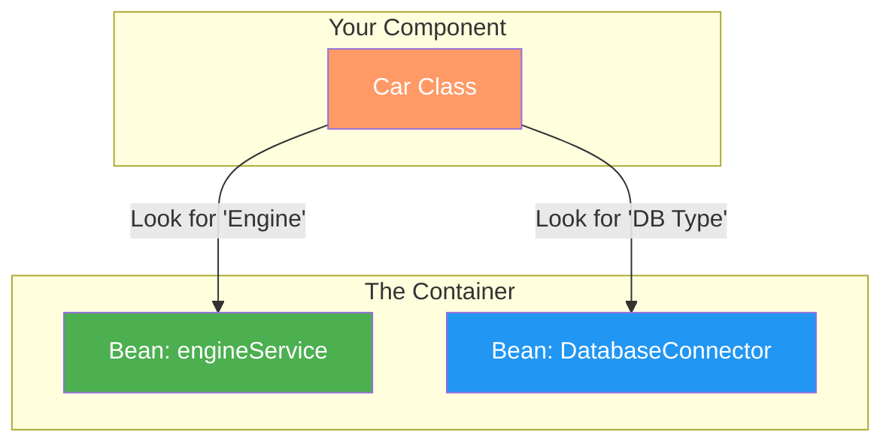

**What is Spring Framework and what are its features?**

The Spring Framework is a powerful, open-source infrastructure for Java development that prioritizes loose coupling and separation of concerns. While it is the standard for Java Enterprise Edition (EE) applications, its core benefits apply to any standalone Java project.

- **Core Concepts:**
  - **Dependency Injection (DI):** Allows objects to define their dependencies (other objects they work with) only through constructor arguments or properties. The Spring container "injects" those dependencies, resulting in decoupled, testable code.
  - **Aspect-Oriented Programming (AOP):** Enables the separation of "cross-cutting concerns" (like logging, security, or transaction management) from the main business logic.
- **Modular Architecture:** Spring isn't a single "giant" library. It consists of specialized modules like Spring MVC (for web apps), Spring JDBC (for database simplification), and Spring Security.
- **Boilerplate Reduction:** It handles repetitive tasks like opening/closing database connections or managing transactions, so you don't have to.
- **Ecosystem & Community:** Being open-source, it has a massive library of resources and a community that ensures it stays updated with modern industry standards.
- **The Core Flow:**
  ```mermaid
  graph TD
    subgraph "Core Components"
    A[Dependency Injection] --> B[Loose Coupling]
    C[AOP] --> D[Cross-Cutting Tasks: Logging/Auth]
    end

    subgraph "Specialized Modules"
    E[Spring MVC]
    F[Spring JDBC]
    G[Spring Data]
    end

    B & D --> H[Maintainable & Scalable App]
    E & F & G --> H

    style A fill:#4CAF50,color:#fff
    style C fill:#2196F3,color:#fff
    style H fill:#f96,color:#fff
  ```


<br><br>

**What are the bean scopes available in Spring?**

In Spring, Bean Scope defines the lifecycle and visibility of a bean instance within the container. It determines how many instances of a bean are created and how they are shared across the application.

Spring supports six scopes:
- **Singleton (Default):** Only one instance is created per Spring IoC container. Every time you ask for the bean, Spring returns the exact same object.
- **Prototype:** A new instance is created every single time the bean is requested from the container.
- **Request:** A new bean instance is created for each HTTP request. It is only valid within the context of that specific request.
- **Session:** The bean instance is tied to the lifecycle of an HTTP Session. The same instance is used as long as the user's session is active.
- **Application:** Scopes a single bean definition to the lifecycle of a ServletContext. (This replaced the older Global-session concept).
- **WebSocket:** Scopes a bean to the lifecycle of a particular WebSocket.
- **Scope Visualizer:**
  ```mermaid
  graph TD
    subgraph "Standard Scopes"
    S[Singleton] -->|Returns| S1[Same Instance Always]
    P[Prototype] -->|Returns| P1[New Instance Every Time]
    end

    subgraph "Web Scopes (Web-Aware Only)"
    R[Request] -->|Valid For| R1[One HTTP Request]
    SS[Session] -->|Valid For| SS1[User Session]
    A[Application] -->|Valid For| A1[ServletContext Lifecycle]
    end

    style S fill:#4CAF50,color:#fff
    style P fill:#2196F3,color:#fff
    style R1 fill:#f96,color:#fff
  ```
- **Code Snippet:** You define the scope using the `@Scope` annotation.
  ```java
    @Component
    @Scope("singleton") // Default, can be omitted
    public class MyService { }

    @Component
    @Scope("prototype") // New object every time
    public class MyTask { }

    @Component
    @Scope("session") // One per user session
    public class UserCart { }
  ```

<br><br>

**What is autowiring and name the different modes of it?**

Autowiring is Spring’s "Automatic Connector." It allows the Spring container to look at your class, see what other objects it needs to work, and provide them automatically.

- **How it works:** Spring keeps a Registry (a big list) of all the objects it has created. When it sees a class that needs a specific type of object, it searches its list for a match and "injects" it.
- **Why use it:** You don’t have to write code to connect Object A to Object B manually; Spring does the "handshake" for you.

<br>

**The 5 Autowiring Modes:**

- no: Default. No autowiring; dependencies must be linked manually.
- byName: Spring looks for a bean with the exact same name as the property being wired.
- byType: Spring looks for a bean with the same data type (Class/Interface). If multiple beans of the same type exist, it throws an error.
- constructor: Similar to byType, but applies the injection to the constructor arguments rather than setter methods.

<br>

**Visualizing the wiring process:**



In modern Spring (Annotation-based), we typically use `@Autowired`, which defaults to `byType` but can use `byName` if combined with `@Qualifier`.
```java
@Component
public class Car {
    
    @Autowired // Automatically finds a bean of type 'Engine'
    private Engine engine;

    @Autowired
    @Qualifier("mainDatabase") // Specific name matching
    private DataSource dataSource;
}
```


<br><br>

**What are the limitations of autowiring?**

While autowiring is a powerful time-saver, it isn't a "magic wand." There are specific scenarios where it fails or is intentionally disabled to maintain control over the application.

- **Explicit Overrides:** If you manually define a dependency using `<property>` or `<constructor-arg>` in XML, or use Java Config, it always overrides autowiring. Manual wiring is considered "intentional," while autowiring is "estimated."
- **Data Type Restrictions:** You cannot autowire simple properties such as primitives (`int`, `boolean`), `Strings`, or `Classes`. These must be injected manually or via the `@Value` annotation.
- **Ambiguity (Multiple Beans):** If the container finds more than one bean of the same type (e.g., two different `DataSource` beans), autowiring will fail with an error because it doesn't know which one to pick.
- **Maintenance Complexity:** In very large projects, over-using autowiring can make the "dependency graph" invisible. It becomes harder to look at a class and know exactly which implementation is being plugged in without running the app.
- **Visualizing the Limitations**
  ```mermaid
  graph TD
    subgraph "The Container"
    B1[Bean: MySQL_DB]
    B2[Bean: Oracle_DB]
    S[Property: 'Admin']
    end

    subgraph "Your Class"
    C[Service]
    end

    C -- "Needs: Database" --> Error{Ambiguity Error!}
    B1 -.-> Error
    B2 -.-> Error
    
    C -- "Needs: String" --> Fail[Cannot Autowire Primitives/Strings]
    S -.-> Fail

    style Error fill:#f66,stroke:#333,color:#fff
    style Fail fill:#f66,stroke:#333,color:#fff
  ```


<br><br>

**What do you understand by Bean Wiring?**

Bean Wiring is the process of creating associations between application components (Beans) within the Spring container. If Beans are the "bricks" of your application, Wiring is the "mortar" that holds them together to form a complete structure.

- When you have two separate objects - for example, a `UserController` and a `UserService` - they need to talk to each other. "Wiring" is the act of Spring connecting the `UserService` instance into the `UserController`.
- For wiring to happen, the Spring container must be told two things:
  - Which beans exist (The Registry - manage by `ApplicationContext`)
  - How they depend on each other (The Metadata).
- You can provide this wiring information in three ways:
  - **XML Configuration:** Using `<bean>` and `<property>` tags.
  - **Java-Based Configuration:** Using `@Configuration` and `@Bean` methods.
  - **Annotation-Based Configuration:** Using `@Component` and `@Autowired` (The most modern approach).
- **The Wiring Workflow**
  ```mermaid
  graph TD
    subgraph "1. Source of Instructions (The Metadata)"
    XML["<b>XML Config</b><br/>&lt;property ref='...' /&gt;"]
    AN["<b>Annotations</b><br/>@Component + @Autowired"]
    JV["<b>Java Config</b><br/>@Bean + Method Calls"]
    end

    subgraph "2. The IoC Container (The Brain)"
    C{Processes <br/> Instructions}
    Reg[Bean Registry]
    end

    subgraph "3. The Wired Result"
    Result["<b>Functional App</b><br/>(Linked & Ready Objects)"]
    end

    XML --> C
    AN --> C
    JV --> C
    C --> Reg
    Reg --> Result

    style C fill:#4CAF50,color:#fff
    style Result fill:#2196F3,color:#fff
    style XML fill:#f9f9f9,stroke:#333
    style AN fill:#f9f9f9,stroke:#333
    style JV fill:#f9f9f9,stroke:#333
  ```
- **Code Snippet:** In this example, we are manually wiring the Engine into the Car.
  ```java
    @Configuration
    public class AppConfig {

        @Bean
        public Engine engine() {
            return new Engine();
        }

        @Bean
        public Car car() {
            // Wiring: Passing the engine() bean into the Car constructor
            return new Car(engine()); 
        }
    }
  ```

<br><br>

**What are Spring Beans?**

Spring Beans are the fundamental building blocks of a Spring-based application. Simply put, any Java object that is initialized, assembled, and managed by the Spring IoC Container is a Bean.

- **The Backbone:** Beans are the objects that perform the actual work in your application (Services, Controllers, Repositories).
- **Managed Lifecycle:** Unlike a normal Java object (created with `new`), a Bean's entire life - from creation (instantiation) to setup (configuration) to linking with others (wiring) and finally destruction - is handled by the Container.
- **Metadata Driven:** Beans aren't created by magic; the Container uses Configuration Metadata (XML, Java Annotations, or Java Code) as a "blueprint" to know how to build them.
- **Inversion of Control:** By making an object a Bean, you give control to Spring. You no longer manage the object; Spring does.
- **Bean Journey:**
  ```mermaid
  graph TD
    subgraph "1. Definition"
    Meta[Metadata: XML / Annotations]
    end

    subgraph "2. The Factory (IoC Container)"
    Inst[Instantiate: Create Object]
    Pop[Populate: Inject Dependencies]
    Init[Initialize: Custom Setup]
    end

    subgraph "3. The Result"
    Bean[Spring Bean: Ready to Use]
    end

    Meta --> Inst
    Inst --> Pop
    Pop --> Init
    Init --> Bean

    style Inst fill:#4CAF50,color:#fff
    style Pop fill:#2196F3,color:#fff
    style Bean fill:#f96,color:#fff
  ```
- **Code Snippet:**
  ```java
    @Component // Instruction: "Hey Spring, make this a Bean!"
    public class EmailService {
        public void sendEmail(String msg) {
            System.out.println("Sending: " + msg);
        }
    }
  ```