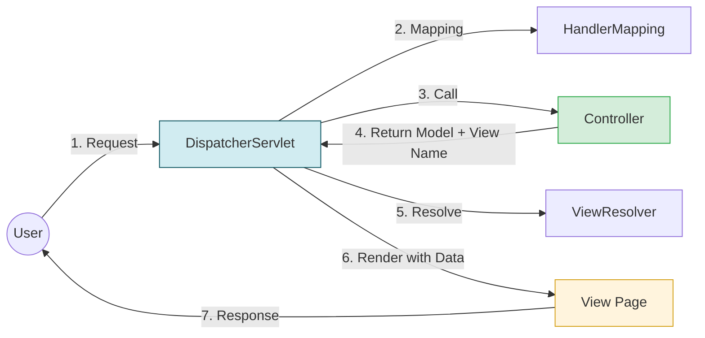

**What is Spring Framework?**

- Spring is a lightweight, open-source **"Framework of Frameworks"** that provides a comprehensive programming and configuration model for modern Java-based enterprise applications.
- It focuses on **POJO (Plain Old Java Object)** programming, which means you don't need to inherit from heavy framework classes to build your application logic.
- **Primary Goal:** To make Java EE (Enterprise Edition) development easier and more manageable by promoting Loose Coupling between components.
- **Why use Spring?**
  - **Loose Coupling:** Because Spring handles the connections between classes, you can change one part of the code without breaking the rest.
  - **Reduced Boilerplate:** You write less "plumbing" code (like manual database setup) and more "business" code.
  - **Testability:** Since dependencies are injected, it is very easy to swap real objects with "Mock" objects during testing.
  - **Huge Ecosystem:** If you have a problem, someone has likely already solved it and shared the solution online.
- **Spring Framework Core Pillars**
  ```mermaid
  graph TD
    A[Spring Framework] --> B[Dependency Injection - DI]
    A --> C[Aspect-Oriented Programming - AOP]
    A --> D[Inversion of Control - IoC]
    
    B --- B1[Promotes Loose Coupling]
    C --- C1[Handles Cross-Cutting Concerns]
    D --- D1[Container Manages Bean Lifecycle]
    
    style B fill:#d4edda,stroke:#28a745
    style C fill:#f8d7da,stroke:#dc3545
    style D fill:#d1ecf1,stroke:#0c5460
  ```
  - **Dependency Injection (DI):** A pattern where objects do not create their dependencies; instead, the Spring Container "injects" them at runtime.
  - **Aspect-Oriented Programming (AOP):** Allows you to separate "secondary" tasks (like logging, security, or transactions) from your main business logic.


<br><br>

**What are some of the important features of Spring Framework?**

The Spring Framework is designed to simplify Java enterprise development by providing a "one-stop shop" for infrastructure. Here are its most important features:

1. **Lightweight and POJO-Based**
   - Spring is "lightweight" because it doesn't require a full Java EE application server (like WebLogic).
   - It promotes POJO (Plain Old Java Object) programming - you don't have to implement complex interfaces or inherit from heavy framework classes.
2. **Inversion of Control (IoC) & Dependency Injection (DI)**
   - **IoC:** The container takes control of the object lifecycle instead of the developer.
   - **DI:** Components are kept independent. Spring "injects" dependencies at runtime, making the code easy to test and maintain.
   - **Class:** `org.springframework.context.ApplicationContext`.
3. **Aspect-Oriented Programming (AOP)**
   - Allows you to separate "Cross-Cutting Concerns" (tasks that happen in many places) from your main business logic.
   - Examples: Logging, Security, and Performance Monitoring.
4. **Spring MVC (Model-View-Controller)**
   - A powerful web framework used to build both Web Applications (returning HTML) and RESTful Web Services (returning JSON/XML).
   - It is highly configurable and integrates easily with other view technologies like Thymeleaf or FreeMarker.
5. **Transaction Management**
   - Provides a consistent interface for transaction management (Local or Global).
   - You can manage transactions declaratively using the `@org.springframework.transaction.annotation.Transactional` annotation, avoiding complex `commit/rollback` boilerplate code.
6. **Spring JDBC & Data Access**
   - Simplifies database operations by handling the opening, closing, and exception translation of SQL connections.
   - Example: **org.springframework.jdbc.core.JdbcTemplate** reduces JDBC code by nearly 60-70%.
7. **Spring Features Overview**
   ```mermaid
   graph TD
    A[Spring Framework Features] --> B[IoC & Dependency Injection]
    A --> C[AOP - Aspect Oriented]
    A --> D[MVC - Web & REST]
    A --> E[Transaction Management]
    A --> F[Lightweight / POJO]
    
    B --- B1[Decouples Components]
    C --- C1[Logging & Security]
    D --- D1[JSON/XML Support]
    E --- E1[Declarative Transactions]
   ```
   - **Modularity:** You only use the modules you need (e.g., just Core, or Core + MVC), keeping the application lightweight.
   - **Consistency:** It provides a consistent programming model across different environments (standalone, web, or cloud).


<br><br>

**What is the advantage of using Spring Framework?**

The Spring Framework is the industry standard for Java development because it solves the "complexity" problem of enterprise applications.

- **Loose Coupling via Dependency Injection (DI)**
  - **Benefit:** Reduces direct dependencies between components.
  - **How it works:** Instead of a class creating its own "Helper" object using new, `the org.springframework.context.ApplicationContext` (IoC Container) initializes and "injects" the dependency.
  - **Result:** You can change the implementation of a component without touching the code that uses it.
- **Ease of Unit Testing**
  - **Benefit:** Business logic is not tied to specific resources like databases or mail servers.
  - **How it works:** Because dependencies are injected, you can easily inject Mock Objects (using Mockito) during testing instead of real, heavy resources.
  - **Result:** Faster, more reliable test suites that don't require a database to run.
- **Significant Reduction in Boilerplate Code**
  - **Benefit:** Eliminates repetitive code for opening/closing connections and handling low-level exceptions.
  - **Example:** `org.springframework.jdbc.core.JdbcTemplate`. In standard JDBC, you write 20 lines to fetch one row (try-catch-finally, close statement, close connection). With Spring, you do it in 2 lines.
- **Modular Architecture (Lightweight)**
  - Benefit: You only pay for what you use.
  - How it works: Spring is divided into many modules (`spring-core`, `spring-web`, `spring-security`, etc.).
  - **Result:** If your app doesn't need transactions, you simply don't include the `spring-tx` library, keeping the deployment size small.
- **"Framework of Frameworks" (One-Stop Solution)**
  - **Benefit:** It integrates seamlessly with almost every technology (Hibernate, Quartz, Kafka, etc.).
  - **Future-Proof:** Spring is constantly updated to support new trends like Microservices (Spring Cloud) and Android development.
  - **Result:** You don't need to learn ten different ways to configure different libraries; Spring provides a unified way to handle everything.


<br><br>

**What are the important features of Spring 5?**

- **Support for Java 8+ and Java EE 7/8**
  - **Lambda Support:** The core framework was rewritten to utilize Java 8 features like Optional, default methods, and Lambda expressions.
  - **Servlet 4.0:** It supports the `javax.servlet.http.PushBuilder`, enabling HTTP/2 features.
- **Reactive Programming with Spring WebFlux**
  - This is a new functional web framework that runs on non-blocking servers like Netty or Undertow.
  - It uses the Project Reactor library (supporting `Flux` and `Mono` types) to handle massive numbers of concurrent connections with fewer threads.
- **Functional Programming Support**
  - **Kotlin:** Spring 5 provides dedicated support for Kotlin, allowing for concise, functional-style bean registration.
  - **Functional Web Endpoints:** Instead of using `@Controller`, you can define routes using a functional "Router and Handler" approach.
- **Improved Performance: Component Indexing**
  - **Traditional Scanning:** Usually, Spring scans the entire classpath to find `@Component` classes, which can be slow for large apps.
  - **`spring.components` Index:** Spring 5 can use an index file created at compile-time (`META-INF/spring.components`) to load beans instantly, bypassing the slow scan.
- **Logging with `spring-jcl`:**
  - Spring 5 introduced its own common logging bridge (`org.springframework.jcl.LogFactory`) to detect and use the best logging framework available (Log4j 2, SLF4J) automatically, ending the "jar hell" of previous versions.
- **File Operations via NIO 2**
  - Core file handling now uses `java.nio.file.Path` and streams. This is more efficient for high-volume file processing compared to the old `java.io.File`.
- **Reactive Code Snippet (Spring 5)**
  ```java
  package com.example.reactive;

  import reactor.core.publisher.Flux;
  import org.springframework.web.bind.annotation.GetMapping;
  import org.springframework.web.bind.annotation.RestController;

  @RestController
  public class ReactiveController {

      @GetMapping("/stream")
      public Flux<String> getStream() {
          // Returns a stream of data asynchronously
          return Flux.just("Spring", "5", "Reactive", "Example");
      }
  }
  ```


<br><br>

**What is Spring WebFlux?**

- `org.springframework.web.reactive` is a fully non-blocking, reactive web framework introduced in Spring 5 to handle massive concurrency with minimal hardware resources.
- Traditional Spring MVC uses a **"Thread-per-Request"** model. If the database is slow, the thread blocks and waits, wasting memory. WebFlux uses an **"Event-Loop"** model where threads never sit idle.
- **Execution Model:** Built on Project Reactor, it uses two main types:
  - **`Mono<T>`:** Represents 0 or 1 result.
  - **`Flux<T>`:** Represents 0 to N results (a stream of data).
- **Key Features**
  - **Non-blocking:** Threads are released immediately after making a call (e.g., to a DB), allowing them to handle other requests.
  - **Backpressure:** The consumer can tell the producer to "slow down" if it's sending data faster than it can be processed.
  - **Server Support:** While MVC runs on Servlet containers (Tomcat), WebFlux can run on Netty, Undertow, or Servlet 3.1+ containers.
  - **Functional Routing:** Supports both `@Controller` annotations and a new Functional way to define routes using RouterFunction.
- **Spring MVC vs. Spring WebFlux**
  ```mermaid
  graph TD
    subgraph Spring_MVC_Servlet_Stack
    A[Thread-per-Request] --> B[Blocking I/O]
    B --> C[Servlet API]
    C --> D[Tomcat / Jetty]
    end

    subgraph Spring_WebFlux_Reactive_Stack
    E[Event Loop] --> F[Non-blocking I/O]
    F --> G[Reactive HTTP]
    G --> H[Netty / Undertow]
    end
    
    style E fill:#d1ecf1,stroke:#0c5460
    style A fill:#f8d7da,stroke:#dc3545
  ```
  - **Blocking (MVC):** Like a restaurant where one waiter sits at your table until you finish eating.
  - **Non-blocking (WebFlux):** Like a fast-food counter where one person takes many orders and calls your number when the food is ready.
- **Code Implementation**
  - **Reactive Service (using Mono/Flux)**
    ```java
    package com.example.service;

    import reactor.core.publisher.Flux;
    import reactor.core.publisher.Mono;
    import org.springframework.stereotype.Service;

    @Service
    public class StockService {
        // Returns a single item asynchronously
        public Mono<String> getStockName(String id) {
            return Mono.just("Google");
        }

        // Returns a stream of prices over time
        public Flux<Double> getStockPriceStream() {
            return Flux.just(150.0, 151.2, 149.8);
        }
    }
    ```
  - **Reactive Controller**
    ```java
    @RestController
    public class StockController {

        @GetMapping("/prices")
        public Flux<Double> getPrices() {
            // Stream starts immediately, non-blocking
            return stockService.getStockPriceStream();
        }
    }
    ```


<br><br>

**What do you understand by Dependency Injection?**

- Dependency Injection (DI) is a design pattern where the dependency of a class is provided by an external source instead of creating it inside the class.
- It helps in removing hard-coded dependencies and makes the application loosely coupled.
- In Spring, the IoC container (`org.springframework.context.ApplicationContext`) creates objects and injects the required dependencies at runtime.
- **Without Dependency Injection (Tight Coupling)**
  - The class creates its dependency itself using `new`.
  - This makes the code hard to modify and test.
  ```java
  // Tight Coupling Example (Without DI)

  public class UserService {

      // Hard-coded dependency
      private UserRepository repository = new UserRepository();

      public void getUser() {
          repository.findUser();
      }
  }

  class UserRepository {
      public void findUser() {
          System.out.println("Fetching user from DB");
      }
  }
  ```
  - `UserService` is directly dependent on `UserRepository`.
  - Changing implementation becomes difficult.
- **With Dependency Injection (Loose Coupling)**
  - Dependency is provided by Spring container instead of creating it manually.
  ```java
  // Dependency Injection using Constructor Injection

  @org.springframework.stereotype.Service
  public class UserService {

      private final UserRepository repository;

      // Dependency injected by Spring
      public UserService(UserRepository repository) {
          this.repository = repository;
      }

      public void getUser() {
          repository.findUser();
      }
  }

  @org.springframework.stereotype.Repository
  class UserRepository {
      public void findUser() {
          System.out.println("Fetching user from DB");
      }
  }
  ```
  - Spring creates objects and injects dependencies automatically.
- **Dependency Resolution**
  - In normal code → dependency is decided at compile time.
  - With DI → dependency is resolved at runtime by Spring container.
- **Benefits of Dependency Injection**
  - **Loose Coupling** → classes are independent.
  - **Separation of Concerns** → object creation and business logic are separated.
  - **Less Boilerplate Code** → framework manages object creation.
  - **Easy Unit Testing** → dependencies can be replaced with mock objects.
  - **Configurable Components** → implementations can be changed easily without modifying business logic.


<br><br>

**How do you implement DI in Spring Framework?**

- Dependency Injection (DI) in Spring can be implemented using two main approaches:
  - XML-based configuration
  - Annotation-based configuration
- In both cases, the Spring IoC container (`org.springframework.context.ApplicationContext`) creates objects and injects dependencies.
- XML-Based Dependency Injection
  - Dependencies are configured in an XML configuration file.
  - Spring reads the XML file and injects dependencies at runtime.
  ```xml
  <!-- beans.xml configuration file -->
  <beans xmlns="http://www.springframework.org/schema/beans">

      <!-- Defining repository bean -->
      <bean id="userRepository" class="com.example.repository.UserRepository"/>

      <!-- Injecting dependency into service -->
      <bean id="userService" class="com.example.service.UserService">
          <constructor-arg ref="userRepository"/>
      </bean>

  </beans>
  ```
  ```java
  // Service class
  package com.example.service;

  public class UserService {

      private UserRepository repository;

      // Constructor for dependency injection
      public UserService(UserRepository repository) {
          this.repository = repository;
      }
  }
  ```
  ```java
  // Loading Spring container
  org.springframework.context.ApplicationContext context =
          new org.springframework.context.support.ClassPathXmlApplicationContext("beans.xml");

  UserService service = context.getBean(UserService.class);
  ```
  - XML configuration defines beans and their dependencies.
  - Spring container creates objects and injects them.
- Annotation-Based Dependency Injection
  - Dependencies are injected using annotations instead of XML.
  - This is the most commonly used approach today.
  ```java
  // Repository class
  @org.springframework.stereotype.Repository
  public class UserRepository {

      public void findUser() {
          System.out.println("Fetching user from database");
      }
  }
  ```
  ```java
  // Service class with dependency injection
  @org.springframework.stereotype.Service
  public class UserService {

      private final UserRepository repository;

      // Constructor injection
      @org.springframework.beans.factory.annotation.Autowired
      public UserService(UserRepository repository) {
          this.repository = repository;
      }
  }
  ```
  ```java
  // Configuration class
  @org.springframework.context.annotation.Configuration
  @org.springframework.context.annotation.ComponentScan(basePackages = "com.example")
  public class AppConfig {
  }
  ```
  ```java
  // Loading Spring container

  org.springframework.context.ApplicationContext context =
          new org.springframework.context.annotation.AnnotationConfigApplicationContext(AppConfig.class);

  ```
  - Annotations like `@Service`, `@Repository`, and `@Autowired` help automatically detect and inject beans.
- **Common Types of DI used in Spring**
  - **Constructor Injection** → dependency passed through constructor (recommended).
  - **Setter Injection** → dependency injected through setter method.
  - **Field Injection** → dependency injected directly into field using @Autowired.


<br><br>

**Name some of the important Spring Modules.**

- Spring Framework is divided into multiple modules, each designed for a specific purpose.
- Developers can use only the modules they need, which keeps the application lightweight and flexible.
- **Spring Core / Spring Context Module**
  - Provides Dependency Injection (DI) and IoC container.
  - Responsible for creating and managing beans.
  - `org.springframework.context.ApplicationContext`
  ```java
  // Creating Spring IoC container

  org.springframework.context.ApplicationContext context =
          new org.springframework.context.annotation.AnnotationConfigApplicationContext(AppConfig.class);
  ```
  - The container creates objects and injects dependencies automatically.
- **Spring AOP Module**
  - Provides support for Aspect-Oriented Programming.
  - Used for cross-cutting concerns like:
    - Logging
    - Security
    - Transaction management
- **Spring DAO Module**
  - Provides DAO (Data Access Object) abstraction layer.
  - Simplifies database exception handling.
  - Converts database exceptions into Spring’s consistent exception hierarchy.
  - Example:
    - `org.springframework.dao.DataAccessException`. This helps in handling database errors easily.
- **Spring JDBC Module**
  - Simplifies JDBC database operations.
  - Provides `org.springframework.jdbc.core.JdbcTemplate` to remove boilerplate code.
  ```java
  // Using JdbcTemplate for database query

  @org.springframework.beans.factory.annotation.Autowired
  private org.springframework.jdbc.core.JdbcTemplate jdbcTemplate;

  public int countUsers() {
      return jdbcTemplate.queryForObject(
          "SELECT COUNT(*) FROM users",
          Integer.class
      );
  }

  ```
  - `JdbcTemplate` removes repetitive code like opening/closing connections and exception handling.
- **Spring ORM Module**
  - Provides integration with ORM frameworks such as:
    - Hibernate
    - JPA
    - MyBatis
  - Examples:
    - `org.springframework.orm.jpa.JpaTransactionManager`. Helps manage transactions and session handling easily.
- **Spring Web Module**
  - Provides basic support for web-based applications.
  - Includes features such as:
    - File upload
    - Web application context
    - Integration with web frameworks
  - Examples:
    - `org.springframework.web.context.WebApplicationContext`
- **Spring MVC Module**
  - Provides Model-View-Controller architecture for building web applications and REST APIs.
  - Separates:
    - **Model** → business logic
    - **View** → UI
    - **Controller** → request handling
  ```mermaid
  flowchart LR
    A[Client Request] --> B[Controller]
    B --> C[Service / Model]
    C --> D[View or JSON Response]
  ```


<br><br>

**What do you understand by Aspect-Oriented Programming?**

- **Aspect-Oriented Programming (AOP)** is a programming technique used to separate cross-cutting concerns from business logic.
- Cross-cutting concerns are functionalities that are required in multiple parts of the application, such as:
  - Logging
  - Transaction management
  - Security
  - Authentication
  - Data validation
- In Object-Oriented Programming (OOP), modularity is achieved using classes.
- In AOP, modularity is achieved using Aspects.
- **Problem without AOP**
  - Cross-cutting logic (like logging) must be called manually in every class.
  - This creates tight coupling and code duplication.
  ```java
  // Without AOP (Logging inside business logic)

  public class UserService {

      public void createUser() {
          System.out.println("Logging: createUser method called"); // logging code
          System.out.println("Creating user...");
      }
  }
  ```
  - Logging code is mixed with business logic.
- **Solution with AOP**
  - Logging logic is written in a separate Aspect class.
  - Spring automatically executes it when the target method runs.
  ```mermaid
  flowchart LR
    A[Client Call] --> B[Aspect - Logging]
    B --> C[Business Method]
  ```
  - Aspect runs before or after the business method automatically.
  - Business classes remain clean and focused on logic.
- **Example of Spring AOP**
  ```java
  // Aspect class

  @org.aspectj.lang.annotation.Aspect
  @org.springframework.stereotype.Component
  public class LoggingAspect {

      // Advice executed before method
      @org.aspectj.lang.annotation.Before("execution(* com.example.service.*.*(..))")
      public void logBefore() {
          System.out.println("Logging before method execution");
      }
  }
  ```
  ```java
  // Business class

  @org.springframework.stereotype.Service
  public class UserService {

      public void createUser() {
          System.out.println("User created");
      }
  }
  ```
  - The logging method runs automatically before service methods.
- **Flow:**
  ```mermaid
  flowchart TD
    A[Client Request] --> B[Spring AOP Proxy]
    B --> C[Logging Aspect]
    C --> D[Business Method Execution]
  ```
  - Spring creates a proxy around the target object.
  - The proxy executes aspects before/after the actual method.


<br><br>

**What is Aspect, Advice, Pointcut, JointPoint and Advice Arguments in AOP?**

- **Aspect:**
  - An Aspect is a class that contains cross-cutting logic such as logging, security, or transaction management.
  - It is applied to different parts of the application without modifying business classes.
  - In Spring, a class becomes an aspect using the annotation `@org.aspectj.lang.annotation.Aspect`.
  ```java
  // Aspect class

  @org.aspectj.lang.annotation.Aspect
  @org.springframework.stereotype.Component
  public class LoggingAspect {

      // advice will be written here
  }
  ```
  - The aspect class contains advice methods that run automatically.
- **Advice**
  - Advice is the actual action executed when a joint point is reached.
  - It defines what should happen when a specific method is executed.
  - **Common advice types:**
    - **`@Before`** → runs before method execution
    - **`@After`** → runs after method execution
    - **`@AfterReturning`** → runs after successful execution
    - **`@AfterThrowing`** → runs when exception occurs
    - **`@Around`** → runs before and after method execution
  ```java
  // Advice example

  @org.aspectj.lang.annotation.Before("execution(* com.example.service.*.*(..))")
  public void logBeforeMethod() {
      System.out.println("Logging before method execution");
  }
  ```
  - This advice runs before any method in the service package.
- **Pointcut**
  - A Pointcut defines where the advice should be applied.
  - It uses AspectJ expression syntax to match specific methods.
  ```java
  // Pointcut expression

  @org.aspectj.lang.annotation.Pointcut(
      "execution(* com.example.service.*.*(..))"
  )
  public void serviceMethods() {}
  ```
  - The pointcut selects all methods inside `com.example.service` package.
- **Join Point**
  - A Join Point is a specific point in program execution.
  - Example:
    - Method execution
    - Exception handling
    - Object field modification
  - In Spring AOP, a join point is always method execution.
  ```java
  // JoinPoint object example

  @Before("execution(* com.example.service.*.*(..))")
  public void logMethod(JoinPoint joinPoint) {

      // Getting method name
      String methodName = joinPoint.getSignature().getName();

      System.out.println("Executing method: " + methodName);
  }
  ```
  - `org.aspectj.lang.JoinPoint` provides method details at runtime.
- **Advice Arguments**
  - Advice methods can receive parameters from the target method.
  - This is done using the `args()` expression in pointcut.
  ```java
  // Target class

  @Service
  public class UserService {

      public void createUser(String name) {
          System.out.println("Creating user: " + name);
      }
  }
  ```
  ```java
  // Advice receiving argument

  @Before(
      "execution(* com.example.service.UserService.createUser(..)) && args(name)"
  )
  public void logUser(String name) {
      System.out.println("User name passed: " + name);
  }

  ```
  - The `args(name)` expression captures the method argument.
- **Flow**
  ```mermaid
  flowchart LR
    A[Client Call] --> B[Join Point - Method Execution]
    B --> C[Pointcut Matches Method]
    C --> D[Advice Executes]
    D --> E[Business Method Runs]
  ```
  - **Join point** → location where method runs.
  - **Pointcut** → rule that selects the join point.
  - **Advice** → action executed at that point.


<br><br>

**What is Spring IOC Container?**

- **Spring IoC Container** is the core component of the Spring Framework responsible for creating, configuring, and managing objects (beans).
- It implements the **Inversion of Control (IoC)** principle, where:
  - Object creation and dependency management are handled by the container instead of the application code.
- The container injects dependencies into objects at runtime, making the application loosely coupled and flexible.
- **Main Responsibilities of Spring IoC Container**
  - Create and manage Spring Beans.
  - Inject dependencies between beans.
  - Manage bean lifecycle.
  - Provide configuration through XML, annotations, or Java classes.
  - Example package locations:
    - `org.springframework.beans`
    - `org.springframework.context`
- **Flow**
  ```mermaid
  flowchart LR
    A[Configuration Metadata<br>XML / Annotation / Java Config] --> B[Spring IoC Container]
    B --> C[Create Beans]
    B --> D[Inject Dependencies]
    B --> E[Manage Bean Lifecycle]
    C --> F[Application Uses Beans]
  ```
  - The container reads configuration metadata.
  - The container reads configuration metadata.
- **Common IoC Container Implementations**
  - **`org.springframework.context.annotation.AnnotationConfigApplicationContext`**
    - Used for standalone Java applications with annotation-based configuration.
    ```java
    org.springframework.context.ApplicationContext context =
        new org.springframework.context.annotation.AnnotationConfigApplicationContext(AppConfig.class);
    ```
  - **`org.springframework.context.support.ClassPathXmlApplicationContext`**
    - Used when configuration is defined in XML files located in the classpath.
    ```java
    org.springframework.context.ApplicationContext context =
        new org.springframework.context.support.ClassPathXmlApplicationContext("beans.xml");
    ```
  - **`org.springframework.context.support.FileSystemXmlApplicationContext`**
    - Similar to `ClassPathXmlApplicationContext`, but XML configuration file can be loaded from any location in the file system.
    ```java
    org.springframework.context.ApplicationContext context =
        new org.springframework.context.support.FileSystemXmlApplicationContext("config/beans.xml");
    ```
  - **Web Application Containers**
    - Used for Spring-based web applications.
    - Examples:
      - `org.springframework.web.context.support.AnnotationConfigWebApplicationContext`
      - `org.springframework.web.context.support.XmlWebApplicationContext`
      - These containers integrate Spring with web servers like Tomcat.


<br><br>

**What is a Spring Bean?**

- A Spring Bean is a normal Java object that is created and managed by the Spring IoC Container.
- When the Spring container (`org.springframework.context.ApplicationContext`) creates an object, that object is called a Spring Bean.
- Spring beans are used throughout the application and dependencies between beans are automatically injected by the container.
- **How a Spring Bean is Created**
  - Define a class.
  - Mark it with Spring annotations or configure it in XML.
  - The Spring IoC container initializes and manages it.
  ```java
  // A simple Spring Bean

  @Service
  public class UserService {

      public void getUser() {
          System.out.println("User fetched");
      }
  }

  ```
  - The UserService class becomes a Spring Bean because Spring container manages it.
- **Getting a Spring Bean from IoC Container**
  ```java
  // Creating Spring IoC container

  org.springframework.context.ApplicationContext context =
          new org.springframework.context.annotation.AnnotationConfigApplicationContext(AppConfig.class);

  // Getting bean instance
  UserService userService = context.getBean(UserService.class);

  // Calling method
  userService.getUser();

  ```
  - `getBean()` method retrieves the Spring Bean from the container.
- **Flow**
  ```mermaid
  flowchart LR
    A[Java Class] --> B[Spring IoC Container]
    B --> C[Spring Bean Created]
    C --> D[Dependency Injection]
    D --> E[Application Uses Bean]

  ```
  - Spring container creates and manages bean objects.
  - Dependencies between beans are automatically injected.


<br><br>

**What is the importance of Spring bean Configuration file?**

- Spring Bean Configuration File is used to define and configure Spring Beans that will be managed by the Spring IoC container.
- It tells the Spring container which classes to create as beans and how their dependencies should be injected.
- When the Spring container (`org.springframework.context.ApplicationContext`) starts, it reads this configuration file and initializes all beans.
- **Example: Spring Bean XML Configuration**
  ```xml
  <!-- beans.xml -->

  <beans xmlns="http://www.springframework.org/schema/beans">

      <!-- Defining repository bean -->
      <bean id="userRepository" class="com.example.repository.UserRepository"/>

      <!-- Injecting dependency into service -->
      <bean id="userService" class="com.example.service.UserService">
          <constructor-arg ref="userRepository"/>
      </bean>

  </beans>
  ```
  - `userRepository` and `userService` are Spring Beans defined in XML.
- **Loading the Configuration File**
  ```java
  // Loading Spring container using XML configuration

  org.springframework.context.ApplicationContext context =
          new org.springframework.context.support.ClassPathXmlApplicationContext("beans.xml");

  // Getting bean from container
  UserService service = context.getBean(UserService.class);

  ```
  - The container reads the XML file and creates beans automatically.
- **Flow**
  ```mermaid
  flowchart LR
    A[beans.xml Configuration] --> B[Spring ApplicationContext]
    B --> C[Create Beans]
    B --> D[Inject Dependencies]
    C --> E[Beans Ready to Use]
  ```
  - Spring reads bean definitions from XML.
  - Then it creates and manages bean objects.


<br><br>

**What are different ways to configure a class as a Spring Bean?**

1. **XML Configuration**
   - Uses the `<bean>` tag within an XML file.
   - Useful for legacy projects or when you don't have access to the library's source code to add annotations.
   - **Example:**
      ```xml
      <bean id="myService" class="com.example.services.MyServiceImpl">
          <property name="repository" ref="myRepository" />
      </bean>
      ```
2. **Java-Based Configuration**
   - Type-safe and allows for programmatic logic during bean creation (e.g., `if-else` blocks for different environments).
   - Centralizes configuration in a few Java classes rather than scattered XML files.
   - **Example:**
      ```java
      package com.example.config;

      import org.springframework.context.annotation.Bean;
      import org.springframework.context.annotation.Configuration;

      @Configuration
      public class AppConfig {
          @Bean
          public MyService myService() {
              // Programmatic instantiation
              return new MyServiceImpl();
          }
      }
      ```
3. **Annotation-Based (Component Scan)**
   - The most common modern approach; uses "Stereotypes" to mark classes as beans.
   - Requires `org.springframework.context.annotation.ComponentScan` to tell Spring where to look.
   - **Key Annotations:**
     - `@Component`: Generic bean.
     - `@Service`: Service layer (business logic).
     - `@Repository`: DAO layer (exception translation).
     - `@Controller`: Presentation layer (Web/MVC).
   - **Example:**
      ```java
      package com.example.services;

      import org.springframework.stereotype.Service;

      @Service // Spring detects this automatically via Component Scanning
      public class MyServiceImpl implements MyService {
          // Logic here
      }
      ```
4. **Bean Configuration Workflow**
   ```mermaid
   graph TD
    A[Configuration Source] --> B{Spring Container}
    B --> C[Bean Definition]
    B --> D[Dependency Injection]
    B --> E[Ready-to-use Bean]
    
    subgraph Sources
    S1[XML: bean tag]
    S2[Java: @Bean method]
    S3[Annotation: @Component]
    end
    
    S1 -.-> A
    S2 -.-> A
    S3 -.-> A
   ```
   - **Sources:** Metadata is gathered from XML files, Java classes, or scanned packages.
   - **Container:** org.springframework.context.ApplicationContext processes this metadata to manage the bean lifecycle.
      

<br><br>

**What are the different scopes on Spring Bean?**

- **`singleton` (Default):** Spring creates exactly one instance of the bean per `org.springframework.context.ApplicationContext`. All requests for that bean return the same shared instance.
- **`prototype`:** A new instance is created every single time the bean is requested from the container (e.g., via `getBean()` or injection).
- **`request`:** A new bean instance is created for each HTTP request. Only valid in web-aware Spring contexts.
- **`session`:** A bean instance is created for the lifecycle of an HTTP Session.
- **`application`:** A bean is scoped to the lifecycle of a `javax.servlet.ServletContext` (one instance per web application).
- **`websocket`:** Scoped to the lifecycle of a WebSocket session.
- **Scope Lifecycle Visualization**
  ```mermaid
  graph LR
    subgraph Singleton
    S1[Request A] --> Instance1((Bean Instance))
    S2[Request B] --> Instance1
    end

    subgraph Prototype
    P1[Request A] --> Instance2((New Bean))
    P2[Request B] --> Instance3((New Bean))
    end
    
    subgraph Web_Request
    W1[HTTP Req 1] --> Instance4((Req Bean 1))
    W2[HTTP Req 2] --> Instance5((Req Bean 2))
    end
  ```
  - **Singleton:** Shared instance; efficiency is high but state management requires thread-safety.
  - **Prototype:** Independent instances; Spring handles creation but does not call the destruction lifecycle callbacks.
  - **Request:** Short-lived; strictly tied to the individual user interaction.
- **Code Implementation:**
  ```java
  import org.springframework.context.annotation.Bean;
  import org.springframework.context.annotation.Configuration;
  import org.springframework.context.annotation.Scope;
  import org.springframework.beans.factory.config.ConfigurableBeanFactory;

  @Configuration
  public class ProjectConfig {

      @Bean
      // Using FQCN constant for singleton
      @Scope(value = ConfigurableBeanFactory.SCOPE_SINGLETON)
      public MyService myService() {
          return new MyServiceImpl();
      }

      @Bean
      @Scope(value = ConfigurableBeanFactory.SCOPE_PROTOTYPE)
      public MyTask myTask() {
          return new MyTask();
      }
  }
  ```


<br><br>

**What is the Spring Bean's life cycle?**

The Spring Bean lifecycle represents the series of steps a bean goes through from its instantiation (creation) to its destruction (cleanup) by the `org.springframework.context.ApplicationContext`.

- **Instantiation:** The container creates an instance of the bean using its constructor.
- **Populate Properties:** Spring injects all defined dependencies (via `@Autowired` or XML setters).
- **Awareness Interfaces:** If the bean implements interfaces like `org.springframework.beans.factory.BeanNameAware`, Spring injects the container's internal metadata.
- **BeanPostProcessor (Before Initialization):**`postProcessBeforeInitialization()` is called for any custom logic before the bean is officially "ready."
- **Initialization Callbacks:**
  - **`@PostConstruct`:** The modern, preferred annotation-based approach.
  - **`InitializingBean`:** Implementing the `afterPropertiesSet()` method.
  - **Custom `init-method`:** Defined in XML or `@Bean(initMethod="...")`.
- **BeanPostProcessor (After Initialization):** `postProcessAfterInitialization()` is called; this is often where AOP Proxies are created.
- **Destruction Callbacks:**
  - **`@PreDestroy`:** Annotation-based cleanup.
  - **`DisposableBean`:** Implementing the destroy() method.
  - **Custom `destroy-method`:** Defined in configuration.
- **Lifecyle Workflow diagram:**
  ```mermaid
  graph TD
    A[1. Instantiation] --> B[2. Populate Properties]
    B --> C[3. Awareness Interfaces]
    C --> D[4. BeanPostProcessor - Pre]
    D --> E[5. Custom Init Methods]
    E --> F[6. BeanPostProcessor - Post]
    F --> G[7. Bean is Ready]
    G --> H[8. Destruction Callbacks]
    
    style A fill:#f9f,stroke:#333
    style G fill:#9f9,stroke:#333
    style H fill:#f66,stroke:#333
  ```
  - **Initialization Phase:** This covers steps 1 through 6, ensuring the bean is fully configured and validated before use.
- **Destruction Phase:** Triggered when the container is closed, allowing for resource cleanup (e.g., closing DB connections).


<br><br>

**How to get `ServletContext` and `ServletConfig` object in a Spring Bean?**

There are two primary ways to access these web-container-specific objects within a Spring bean. Both methods require the application to be running in a Web-aware ApplicationContext.

1. **Using `@Autowired` (Modern Approach)**
   - The simplest and most common method in modern Spring/Spring Boot applications.
   - Spring automatically resolves these types if the bean is managed within a `WebApplicationContext`.
    ```java
    package com.example.controller;

    import org.springframework.beans.factory.annotation.Autowired;
    import org.springframework.stereotype.Component;
    import javax.servlet.ServletContext;
    import javax.servlet.ServletConfig;

    @Component
    public class WebHelperBean {

        @Autowired
        private ServletContext servletContext; // Global application context

        @Autowired(required = false)
        private ServletConfig servletConfig; // Only available in Controller/Servlet scope

        public void printInfo() {
            System.out.println("Context Path: " + servletContext.getContextPath());
        }
    }
    ```
2. **Implementing Aware Interfaces (Classic Approach)**
   - The bean implements specific interfaces to receive callbacks from the container.
   - This is "Spring-aware," meaning the class becomes explicitly coupled to Spring's API.
    ```java
    package com.example.service;

    import org.springframework.web.context.ServletContextAware;
    import org.springframework.web.context.ServletConfigAware;
    import javax.servlet.ServletContext;
    import javax.servlet.ServletConfig;

    public class LegacyWebBean implements ServletContextAware, ServletConfigAware {

        private ServletContext context;
        private ServletConfig config;

        @Override
        public void setServletContext(ServletContext servletContext) {
            this.context = servletContext; // Spring calls this during bean initialization
        }

        @Override
        public void setServletConfig(ServletConfig servletConfig) {
            this.config = servletConfig;
        }
    }
    ```
3. **Retrieval Mechanism Workflow**
   ```mermaid
   graph LR
    A[Web Container] --> B[ServletContext]
    A --> C[ServletConfig]
    B --> D{Spring Context}
    C --> D
    D --> E[Spring Bean]
    
    style E fill:#fff4dd,stroke:#d4a017
   ```
   - **ServletContext:** Shared across the entire web application (global).
   - **ServletConfig:** Specific to a single `org.springframework.web.servlet.DispatcherServlet` instance.


<br><br>

**What is Bean wiring and @Autowired annotation?**

- The process of creating associations between application components (Beans) within the Spring container. It is essentially Dependency Injection (DI) in action—telling Spring which bean needs which dependency.
- Manual wiring is done via XML `(<property ref="...">)` or Java Config. Auto-wiring allows Spring to resolve and inject collaborating beans into your bean automatically.
- **`@Autowired`:** A Spring annotation used to mark a dependency that the container should fulfill. It primarily works byType. If multiple beans of the same type exist, Spring uses byName or `@Qualifier` to resolve the conflict.
- **Wiring Mechanism Workflow**
  ```mermaid
  graph TD
    A[Bean Definition Registry] --> B{Dependency Match?}
    B -- Yes: Single Match --> C[Inject Bean]
    B -- Yes: Multiple Matches --> D{Check @Qualifier / Name}
    B -- No --> E{Is required=false?}
    D -- Match Found --> C
    D -- No Match --> F[Throw NoUniqueBeanDefinitionException]
    E -- Yes --> G[Leave as Null]
    E -- No --> H[Throw NoSuchBeanDefinitionException]
    
    style C fill:#d4edda,stroke:#28a745
    style F fill:#f8d7da,stroke:#dc3545
    style H fill:#f8d7da,stroke:#dc3545
  ```
  - **Resolution Process:** Spring first looks for a bean of the exact class/interface type.
  - **Fail-Fast:** If Spring cannot find a dependency, it fails at startup unless explicitly told otherwise.
- **Miscellneous Points:**
  - **`required` attribute:** By default, `@Autowired(required = true)`. If set to `false`, Spring will not throw an exception if the bean is missing; the field will simply remain `null`.
  - **Enabling Autowiring:**
    - **In XML:** Use `<context:annotation-config />`.
    - **In Java Config:** Using `@org.springframework.context.annotation.ComponentScan` automatically enables it.
  - **Self-Injection:** Using `@Autowired` on a field of the same class type is generally a "code smell" and can cause circular dependency issues.


<br><br>

**What are different types of Spring Bean autowiring?**

Spring provides several strategies to automatically resolve and inject dependencies. While modern development favors annotations, understanding the XML-based "modes" is crucial for interviews.

1. **`autowire="byName"`**
   - Spring looks for a bean with the exact same ID as the property name in the class.
   - **Example:** If your class has a field `private MyService myService;`, Spring looks for a bean defined with id="myService".
2. **`autowire="byType"`**
   - Spring looks for a bean that matches the Class or Interface type of the property.
   - **Constraint:** If more than one bean of the same type exists, Spring throws a `NoUniqueBeanDefinitionException`.
3. **`autowire="constructor"`**
   - Similar to `byType` but applies to constructor arguments.
   - Spring searches for beans matching the types of the parameters in the bean's constructor.
4. **`@Autowired` and `@Qualifier` (Annotation-driven)**
   - The modern standard. It uses `byType` by default.
   - **`@Qualifier`:** Used alongside `@Autowired` to specify the exact bean name when multiple beans of the same type exist (resolving ambiguity).


<br><br>

**Does Spring Bean provide thread safety?**

- Spring beans are not thread-safe by default. Because the default scope is `singleton`, every thread in your application sharing that bean accesses the same instance.
- If a singleton bean has mutable instance variables (state), multiple threads can modify them simultaneously, leading to "Race Conditions" and data inconsistency.
- Most Spring beans (like `@Service` or `@Repository`) are thread-safe only because they are stateless—they only contain logic and no shared data members.
- **How to Achieve Thread Safety**
  - **Keep Beans Stateless:** Don't use instance variables to store user-specific data. Use local variables inside methods instead.
  - Use `prototype`, `request`, or `session` scopes so threads don't share the same object.
  - Use Java's `synchronized` keyword or `java.util.concurrent.locks.ReentrantLock` (not recommended as it hurts performance).
  - Use `java.lang.ThreadLocal` to store data that is unique to the current thread.
- **Code Comparison:**
  - **Unsafe Singleton (Shared State)**
    ```java
    @org.springframework.stereotype.Service
    public class CounterService {
        private int count = 0; // DANGER: Shared across all threads

        public void increment() {
            count++; // Race condition occurs here
        }
    }
    ```
  - **Safe Singleton (No State)**
    ```java
    @org.springframework.stereotype.Service
    public class CalculationService {
        public int add(int a, int b) {
            int result = a + b; // SAFE: Local variable is on the thread stack
            return result;
        }
    }
    ```
  - **Safe Prototype (New Instance)**
    ```java
    @org.springframework.stereotype.Component
    @org.springframework.context.annotation.Scope("prototype")
    public class UserTask {
        private String status; // SAFE: Each request gets a fresh object
    }
    ```
- **Thread Access Visualization**
  ```mermaid
  graph TD
    subgraph Singleton_Scope
    T1[Thread 1] --> S((Shared Bean Instance))
    T2[Thread 2] --> S
    T3[Thread 3] --> S
    S --- State[Shared Variable: count++]
    end

    subgraph Prototype_Scope
    T4[Thread 4] --> P1((New Bean Instance A))
    T5[Thread 5] --> P2((New Bean Instance B))
    end

    style S fill:#f8d7da,stroke:#dc3545
    style P1 fill:#d4edda,stroke:#28a745
    style P2 fill:#d4edda,stroke:#28a745
  ```
  - **Singleton Risk:** Multiple threads "collide" on the same memory address of the shared variable.
  - **Prototype Safety:** Each thread gets its own isolated instance, preventing data leakage between threads.


<br><br>

**What is a Controller in Spring MVC?**

- A Controller acts as a Coordinator. It intercept incoming client requests (HTTP), processes the input, calls the business logic (Service layer), and returns a response (View or Data).
- **DispatcherServlet (Front Controller):** The "Main Entry Point." It receives every request first and delegates it to the specific Controller that matches the URL.
- **`@Controller` Annotation:** Used to mark a class as a web requester handler. Spring's `org.springframework.context.annotation.ClassPathBeanDefinitionScanner` detects these during a component scan.
- **`@RequestMapping`:** Maps a specific URL or HTTP method (GET, POST, etc.) to a specific method inside the Controller.
- **Spring MVC Request Flow**
  ```mermaid
  sequenceDiagram
    participant C as Client (Browser)
    participant DS as DispatcherServlet
    participant H as HandlerMapping
    participant CO as Controller
    participant V as ViewResolver

    C->>DS: 1. Sends HTTP Request
    DS->>H: 2. Which Controller handles this URL?
    H-->>DS: 3. Return Controller Info
    DS->>CO: 4. Execute Method
    CO-->>DS: 5. Return ModelAndView
    DS->>V: 6. Resolve View Name to Page
    V-->>DS: 7. Return JSP/Thymeleaf
    DS-->>C: 8. Return Final HTML Response
  ```
  - **DispatcherServlet:** Centralizes the logic so individual controllers don't have to handle low-level HTTP details.
  - **HandlerMapping:** The "Map" that tells the DispatcherServlet which `@Controller` owns which URL.


<br><br>

**What’s the difference between `@Component`, `@Controller`, `@Repository` & `@Service` annotations in Spring?**

- **Stereotype Annotations in Spring**
  - **`@org.springframework.stereotype.Component`:** 
    - The root/generic annotation. Any class marked with this becomes a Spring-managed bean during a component scan.
    - Generic bean; used when the class doesn't fit a specific layer (e.g., Utils).
  - **`@org.springframework.stereotype.Controller`:** 
    - A specialized version of `@Component` used in the Presentation Layer. It identifies classes that handle HTTP requests in Spring MVC.
    - Works with `HandlerMapping` to resolve web URIs.
  - **`@org.springframework.stereotype.Service`:** 
    - A specialized version of `@Component` used in the Business Layer. It identifies classes that hold business logic and coordinates calls to repositories.
    - Strictly for business logic; no extra behavior over `@Component`.
  - **`@org.springframework.stereotype.Repository`:** 
    - A specialized version of `@Component` used in the Data Access Layer (DAO). It provides an additional feature: automatic exception translation (converting low-level SQL/JPA exceptions into Spring's DataAccessException).
- **Annotation Hierarchy and Layering**
  ```mermaid
  graph TD
    A["Component (Generic Root)"] --> B["Controller - Web Layer"]
    A --> C["Service - Business Layer"]
    A --> D["Repository - Data Layer"]

    subgraph Layers
        L1["User Interface / API"] --- B
        L2["Business Logic / Processing"] --- C
        L3["Database / Persistence"] --- D
    end

    style A fill:#f9f,stroke:#333
    style B fill:#fff4dd,stroke:#d4a017
    style C fill:#d4edda,stroke:#28a745
    style D fill:#d1ecf1,stroke:#0c5460
  ```
  - **Specialization:** While all these annotations register a bean in the container, the specific names provide semantic meaning to developers and tools (like AOP logging or monitoring).
  - **Layering:** These annotations encourage the Separation of Concerns by clearly defining the role of each class in a 3-tier architecture.
- **Why use specialized annotations instead of just `@Component`?**
  - **Readability:** Developers immediately know the purpose of the class.
  - **Tooling/AOP:** You can easily target all `@Service` beans for performance monitoring or all `@Repository` beans for transaction logging using Aspect-Oriented Programming (AOP).
  - **Persistence Exception Translation:** Only `@Repository` provides the automated conversion of complex SQL errors into a readable Spring hierarchy.


<br><br>

**What is `DispatcherServlet` and `ContextLoaderListener`?**

In a Spring MVC application, these two components work together to manage the Web Application Context and handle client requests.

1. **DispatcherServlet (The Front Controller)**
   - Acts as the Central Entry Point for all incoming HTTP requests.
   - This is the "Front-End Specialist." It starts second and loads "Web" beans (Controllers, ViewResolvers) that are only needed to handle HTTP requests.
   - **Responsibilities:**
     - Receives the request and finds the right `@Controller` using HandlerMapping.
     - Dispatches the request to the controller method.
     - Resolves the view (JSP/Thymeleaf) and returns the final response to the client.
2. **ContextLoaderListener (The Root Listener)**
   - A `javax.servlet.ServletContextListener` that starts when the web container (like Tomcat) boots up.
   - This is the "Foundation." It starts first and loads the "Backend" beans (Services, Repositories, DB configs) that should be shared globally across the whole app.
   - **Responsibilities:**
     - Initializes the Root `WebApplicationContext`.
     - Manages beans that are shared across the entire application (Middle-tier Services and Data Access layers).
     - Closes the context when the application is undeployed or the server stops.
3. **Spring Web Context Hierarchy**
   ```mermaid
   graph TD
    subgraph Root_Context_Managed_by_ContextLoaderListener
    A[Services]
    B[Repositories]
    C[DataSources]
    end

    subgraph Servlet_Context_Managed_by_DispatcherServlet
    D[Controllers]
    E[ViewResolver]
    F[HandlerMapping]
    end

    D --> A
    A --> B
   ```
   - **Hierarchy:** The `DispatcherServlet` (Child Context) can access beans in the `ContextLoaderListener` (Parent Context), but not vice versa.
   - **Separation:** This allows sharing global resources (DB, Security) across multiple servlets.


<br><br>

**What is ViewResolver in Spring?**

- The `ViewResolver` acts as a Translator. It takes the logical "View Name" (a simple String like `"home"`) returned by a Controller and maps it to a physical resource (like a `.jsp` or `.html` file).
- It prevents hardcoding full file paths in your Java code. If you move your JSP files from one folder to another, you only change the configuration, not the Java code.
- **Core Interface:** `org.springframework.web.servlet.ViewResolver`.
- **View Resolution Workflow**
  ```mermaid
  graph LR
    A[Controller returns 'home'] --> B{DispatcherServlet}
    B --> C[ViewResolver]
    C --> D[Physical Path: /WEB-INF/views/home.jsp]
    D --> E[Rendered HTML to Browser]
    
    style C fill:#d1ecf1,stroke:#0c5460
  ```
  - **Decoupling:** The Controller doesn't care where the file is stored or what its extension is; it only knows the "name" of the page.
- **Code Implementation**
  
  **Java Configuration**
  ```java
  package com.example.config;

  import org.springframework.context.annotation.Bean;
  import org.springframework.context.annotation.Configuration;
  import org.springframework.web.servlet.view.InternalResourceViewResolver;

  @Configuration
  public class WebConfig {

      @Bean
      public InternalResourceViewResolver viewResolver() {
          InternalResourceViewResolver resolver = new InternalResourceViewResolver();
          // Sets the folder where JSPs are kept
          resolver.setPrefix("/WEB-INF/views/"); 
          // Sets the file extension
          resolver.setSuffix(".jsp");            
          return resolver;
      }
  }
  ```
  **Controller Interaction**
  ```java
  @Controller
  public class MyController {

      @org.springframework.web.bind.annotation.GetMapping("/welcome")
      public String showWelcomePage() {
          // Logic: Spring combines Prefix + "welcome" + Suffix
          // Result: /WEB-INF/views/welcome.jsp
          return "welcome"; 
      }
  }
  ```


<br><br>

**What is a `MultipartResolver` and when it’s used?**

- The `MultipartResolver` is a strategy interface responsible for handling HTTP POST requests that contain file uploads (multipart/form-data). It "parses" the incoming request and makes the file data available as a `org.springframework.web.multipart.MultipartFile` object.
- When a request comes in with a file, the `DispatcherServlet` checks for a bean named "multipartResolver". If found, it wraps the standard `HttpServletRequest` into a `MultipartHttpServletRequest`, allowing easy access to the uploaded files.
- **Multipart Upload Workflow**
  ```mermaid
  graph TD
    A[Browser: POST /upload] --> B{DispatcherServlet}
    B --> C{MultipartResolver Bean exists?}
    C -- Yes --> D[Parse Request & Wrap as MultipartRequest]
    C -- No --> E[Process as Regular Request]
    D --> F[Controller Method]
    F --> G[Access File via @RequestParam MultipartFile]
    
    style D fill:#d4edda,stroke:#28a745
    style G fill:#fff4dd,stroke:#d4a017
  ```
  - **StandardServletMultipartResolver:** The modern implementation (Spring 3.1+) that uses the Servlet 3.0 container's built-in file upload support.
  - **CommonsMultipartResolver:** Uses the external "Apache Commons FileUpload" library (legacy/older Spring versions).
- **Implementation:**
  - **Configuration:** To use file uploading, you must define a bean with the exact name `multipartResolver`.
    ```java
    package com.example.config;

    import org.springframework.context.annotation.Bean;
    import org.springframework.context.annotation.Configuration;
    import org.springframework.web.multipart.support.StandardServletMultipartResolver;

    @Configuration
    public class AppConfig {

        @Bean(name = "multipartResolver")
        public StandardServletMultipartResolver multipartResolver() {
            // Uses the container's built-in multipart support
            return new StandardServletMultipartResolver();
        }
    }
    ```
  - **Usage in Controller:** In the controller, you simply use the `@org.springframework.web.bind.annotation.RequestParam` annotation to capture the file.
    ```java
    @PostMapping("/upload")
    public String handleFileUpload(
        @RequestParam("file") MultipartFile file) {

        if (!file.isEmpty()) {
            String fileName = file.getOriginalFilename();
            byte[] bytes = file.getBytes(); // Logic to save the file
            return "uploadSuccess";
        }
        return "uploadFailure";
    }
    ```


<br><br>

**How to handle exceptions in Spring MVC Framework?**

Spring provides a robust, layered approach to catching and managing errors, ranging from single controllers to entire applications.

- **Exception Handling Hierarchy**
  ```mermaid
  graph TD
    A[Exception Occurs] --> B{Handled in Controller?}
    B -- Yes [@ExceptionHandler] --> C[Return Error View/Data]
    B -- No --> D{Handled Globally?}
    D -- Yes [@ControllerAdvice] --> C
    D -- No --> E[HandlerExceptionResolver]
    E --> F[Default Error Page / WhiteLabel]
    
    style B fill:#fff4dd,stroke:#d4a017
    style D fill:#d4edda,stroke:#28a745
    style E fill:#d1ecf1,stroke:#0c5460
  ```
  - **Resolution Order:** Spring first checks the local Controller, then Global Advice, and finally the Resolver implementations.
- **Controller-Based (`@ExceptionHandler`)**
  - Works only for the specific Controller where it is defined.
  - Best for handling exceptions unique to a single functional area (e.g., `UserNotFoundException` in a `UserController`).
    ```java
    @Controller
    public class UserController {

        @org.springframework.web.bind.annotation.ExceptionHandler(UserNotFoundException.class)
        public String handleUserError(Exception ex) {
            // Logic to handle error only for this controller
            return "error/userError";
        }
    }
    ```
- **Global Exception Handler (`@ControllerAdvice - org.springframework.web.bind.annotation.ControllerAdvice`)**
  - Intercepts exceptions across all Controllers in the application.
  - Centralizes error logic (Separation of Concerns). It acts as an "Interceptor" for exceptions.
    ```java
    @ControllerAdvice
    public class GlobalExceptionHandler {

        @ExceptionHandler(Exception.class)
        public ModelAndView handleGlobalError(Exception ex) {
            ModelAndView mav = new ModelAndView("error/generic");
            mav.addObject("message", ex.getMessage());
            return mav;
        }
    }
    ```
- **HandlerExceptionResolver (Low-Level)**
  - The entire application context.
  - An interface (`org.springframework.web.servlet.HandlerExceptionResolver`) used to map exceptions to specific Views.
  - `SimpleMappingExceptionResolver` is often used in XML/Java config to route specific exception classes to static error pages.
  ```java
  @Bean
  public SimpleMappingExceptionResolver exceptionResolver() {
      SimpleMappingExceptionResolver r = 
          new SimpleMappingExceptionResolver();
      
      Properties mappings = new Properties();
      mappings.setProperty("DatabaseException", "databaseError");
      r.setExceptionMappings(mappings); // Maps Exception -> View Name
      return r;
  }
  ```

<br><br>

**How to create `ApplicationContext` in a Java Program?**

- **`org.springframework.context.ApplicationContext`:** This is the central interface representing the **Spring IoC container**. It is responsible for instantiating, configuring, and assembling beans.
- While web apps use `WebApplicationContext`, standalone Java programs (like a main method) use specific implementations based on how the metadata (XML or Java) is provided.
- **Context Creation Workflow**
  ```mermaid
  graph TD
    subgraph Configuration_Sources
    XML[XML File]
    Java[Java Config Class]
    FS[File System Path]
    end

    XML -->|Load| B[ClassPathXmlApplicationContext]
    Java -->|Scan| C[AnnotationConfigApplicationContext]
    FS -->|Path| D[FileSystemXmlApplicationContext]

    B --> E((Spring Container))
    C --> E
    D --> E

    E --> F[Bean Instance 1]
    E --> G[Bean Instance 2]
  ```
  - **Source:** The implementation you choose depends entirely on where your "Rules" (Bean definitions) are stored.
  - **Lifecycle:** Once initialized, the container manages the entire lifecycle of the beans until the program exits.

1. **`AnnotationConfigApplicationContext`**
   - The modern standard for Java-based configuration (No XML).
   - It accepts classes annotated with @Configuration as input.
    ```java
    // Initialize using a Configuration class
    org.springframework.context.ApplicationContext context = 
        new org.springframework.context.annotation.AnnotationConfigApplicationContext(AppConfig.class);

    // Retrieve the bean
    MyService service = context.getBean(MyService.class);
    ```
2. **`ClassPathXmlApplicationContext`**
   - When bean definitions are stored in an XML file located within the project's resources/classpath.
   - It searches the application's build path for the specified XML filename.
    ```java
    // Looks for "beans.xml" in the src/main/resources folder
    org.springframework.context.ApplicationContext context = 
        new org.springframework.context.support.ClassPathXmlApplicationContext("beans.xml");
    ```
3. **`FileSystemXmlApplicationContext`**
   - When the XML configuration file is stored outside the project (e.g., on a specific drive or absolute path).
   - Unlike ClassPath, this requires a full or relative file system path.
    ```java
    // Loads XML from a specific location on the C: drive
    org.springframework.context.ApplicationContext context = 
        new org.springframework.context.support.FileSystemXmlApplicationContext("C:/config/app-context.xml");
    ```

<br><br>

**Can we have multiple Spring configuration files?**

Yes, you can split your Spring configuration into multiple files. This is a best practice for large applications to maintain a clean Separation of Concerns (e.g., separating Database, Security, and Web logic).

1. **Web Deployment Descriptor (`web.xml`)**
   - You can provide a comma or space-separated list of files in your `web.xml`. This works for both the Root Context and the Servlet Context.
   - **For DispatcherServlet (Web Beans):**
      ```xml
      <servlet>
          <servlet-name>appServlet</servlet-name>
          <servlet-class>org.springframework.web.servlet.DispatcherServlet</servlet-class>
          <init-param>
              <param-name>contextConfigLocation</param-name>
              <param-value>
                  /WEB-INF/spring/servlet-context.xml,
                  /WEB-INF/spring/servlet-views.xml
              </param-value>
          </init-param>
      </servlet>
      ```
   - **For ContextLoaderListener (Root Beans):**
      ```xml
      <context-param>
          <param-name>contextConfigLocation</param-name>
          <param-value>/WEB-INF/spring/root-db.xml /WEB-INF/spring/root-security.xml</param-value>
      </context-param>
      ```
2. **Using XML `<import>`**
   - Instead of listing everything in `web.xml`, you can have one "Master" file that imports others. This keeps your `web.xml` clean.
   ```xml
    <beans xmlns="http://www.springframework.org/schema/beans">
        <import resource="datasource-config.xml"/>
        <import resource="security-config.xml"/>
        
        <bean id="myBean" class="com.example.MyBean" />
    </beans>
   ```
3. **Java-Based Configuration (`@Import`)**
   - In modern Spring applications, you use the `org.springframework.context.annotation.Import` annotation to group multiple `@Configuration` classes.
    ```java
    @org.springframework.context.annotation.Configuration
    @org.springframework.context.annotation.Import({DbConfig.class, SecurityConfig.class})
    public class AppConfig {
        // This class now includes all beans from DbConfig and SecurityConfig
    }
    ```
4. **Advantages**
   - **Maintainability:** Small files are easier to read and debug.
   - **Team Collaboration:** Different developers can work on different configuration files (e.g., `jms-config.xml` vs `jpa-config.xml`) without merge conflicts.
   - **Environment Specifics:** You can easily swap one file (like `mail-test.xml`) for another (`mail-prod.xml`) based on the deployment environment.


<br><br>

> **💡What is Context?**
> 
> In the world of Spring, Context is simply the "Container" or "Brain" that manages your objects. Think of it as a Box that holds all your application's components (Beans) and handles how they talk to each other.

<br><br>

**What is `ContextLoaderListener`?**

- `org.springframework.web.context.ContextLoaderListener` is a standard `javax.servlet.ServletContextListener` that bootstraps and shuts down Spring's Root `WebApplicationContext`.
- It creates the "Parent" context that stays alive for the entire lifecycle of the web application. It is used to define beans that should be shared across multiple servlets (e.g., Database DataSources, Hibernate SessionFactories, and Service layer beans).
- Beans defined here are visible to all `DispatcherServlet` (Child) contexts, but Child beans (like Controllers) are not visible to this Root context.
- **`ContextLoaderListener` Workflow**
  ```mermaid
  graph TD
    A[Web Container Starts - e.g. Tomcat] --> B[ContextLoaderListener initialized]
    B --> C[Reads contextConfigLocation from web.xml]
    C --> D[Creates Root WebApplicationContext]
    D --> E[Loads Services, Repositories, Security]
    E --> F[Application is Ready for DispatcherServlet]
    
    style B fill:#d1ecf1,stroke:#0c5460
    style D fill:#d4edda,stroke:#28a745
  ```
  - **Trigger:** The application server (Tomcat) starts and detects the listener in `web.xml`.
  - **Creation:** It creates the Root context before any Servlets are initialized.
- **Configuration (`web.xml`)**
  ```xml
  <context-param>
      <param-name>contextConfigLocation</param-name>
      <param-value>/WEB-INF/spring/root-context.xml</param-value>
  </context-param>

  <listener>
      <listener-class>org.springframework.web.context.ContextLoaderListener</listener-class>
  </listener>
  ```
  - **`context-param`:** Used to tell the listener where the XML configuration files are located.
  - **`listener`:** Registers the class so the container knows to execute it at startup.
- **The Parent-Child Relationship**
  - In a traditional Spring MVC application, the relationship between the `ContextLoaderListener` and the `DispatcherServlet` is a one-way hierarchy.
  ```mermaid
  graph TD
    subgraph Parent_Context_Root_ContextLoaderListener
    A[Services: @Service]
    B[Repositories: @Repository]
    C[DataSources / Security]
    end

    subgraph Child_Context_1_DispatcherServlet_Web
    D[Web Controllers: @Controller]
    E[ViewResolver / HandlerMapping]
    end

    subgraph Child_Context_2_DispatcherServlet_API
    F[REST Controllers: @RestController]
    G[JSON/XML Message Converters]
    end

    D -.->|Can Access| A
    F -.->|Can Access| A
    A -.->|Cannot Access| D
  ```


<br><br>

**What are the minimum configurations needed to create a Spring MVC application?**

To create a functional Spring MVC application from scratch (non-Boot), you need a specific set of configuration components to bridge the gap between the Servlet container (like Tomcat) and the Spring IoC container.

- **Minimal Configuration Checklist**
  - **Project Dependencies (Maven/Gradle)**
    - You must include the core Spring libraries. At a minimum, you need:
      - **`spring-webmvc`:** Includes the `DispatcherServlet` and web infrastructure.
      - **`spring-context`:** For Dependency Injection and Bean management.
      - **`javax.servlet-api`:** Required to compile classes that interact with the Servlet container.
  - **Deployment Descriptor (`web.xml`)**
    - This is the entry point for the Web Container. You must register the `org.springframework.web.servlet.DispatcherServlet`.
      ```xml
      <servlet>
          <servlet-name>spring-mvc</servlet-name>
          <servlet-class>org.springframework.web.servlet.DispatcherServlet</servlet-class>
          <load-on-startup>1</load-on-startup>
      </servlet>

      <servlet-mapping>
          <servlet-name>spring-mvc</servlet-name>
          <url-pattern>/</url-pattern> </servlet-mapping>
      ```
  - **Spring Configuration (Java or XML)**
    - You need to tell Spring how to find your controllers and how to resolve your views.
      - **Component Scanning:** Use `<context:component-scan>` or `@ComponentScan` so Spring finds your `@Controller` classes.
      - **View Resolver:** Define an `InternalResourceViewResolver` to map String names to JSP/HTML files.
  - **A Controller Class**
    - Finally, you need at least one class annotated with @Controller to handle a specific URL path.
      ```java
      @org.springframework.stereotype.Controller
      public class HomeController {
          @org.springframework.web.bind.annotation.RequestMapping("/")
          public String home() {
              return "index"; // Resolves to /WEB-INF/views/index.jsp
          }
      }
      ```


<br><br>

**How would you relate Spring MVC Framework to MVC architecture?**

Spring MVC is a sophisticated implementation of the classic Model-View-Controller (MVC) design pattern. It provides a clean separation between the business logic, the data, and the user interface.

**The Mapping of Spring to MVC Components**
| MVC Component | Spring MVC Implementation | Role |
|:-|:-|:-|
| Front Controller | `DispatcherServlet` | The central entry point. It intercepts all incoming requests and manages the flow. |
| Controller | `@Controller` classes | Contains the logic. It processes the request, interacts with services, and decides which view to show. | 
| Model | `org.springframework.ui.Model` | A container (Map) that holds the data. This data is "injected" into the View for rendering. | 
| View | JSPs, Thymeleaf, HTML | The template that displays the data to the user. | 
| View Resolver | `InternalResourceViewResolver` | The "Map" that helps the Front Controller find the physical file for the View. | 

<br>

**The Spring MVC Request Lifecycle**

- **Request:** The client sends an HTTP request (e.g., `/home`).
- **Front Control:** The DispatcherServlet receives it and asks the `HandlerMapping` which Controller should handle this URL.
- `Process:` The DispatcherServlet sends the request to the specific `@Controller`.
- **Logic:** The Controller runs business logic, populates the Model with data, and returns a "Logical View Name" (e.g., `"home"`).
- **Resolve:** The DispatcherServlet asks the ViewResolver to find the actual file (e.g., `/WEB-INF/views/home.jsp`).
- **Render:** The `DispatcherServlet` takes the Model data, puts it into the View file, and sends the final HTML back to the user.

<br>

**Visualizing the Interaction**



<br><br>

**How to achieve localization in Spring MVC applications?**

Localization (i18n) in Spring MVC is the process of adapting your application to different languages and regions without changing the code. Spring achieves this by intercepting the user's "Locale" (language/country) and mapping it to specific Resource Bundle properties files.

**The Localization Workflow**


1. **Resource Bundles (`.properties` files)**
   - Create a set of files in your `src/main/resources` folder. The base name (e.g., `messages`) is followed by the language code.
     - **`messages_en.properties`:** `welcome.message=Welcome to our app!`
     - **`messages_fr.properties`:** `welcome.message=Bienvenue dans notre application!`
2. **MessageSource Bean**
   - This bean is responsible for loading the property files. `ReloadableResourceBundleMessageSource` is preferred because it allows you to update translations without restarting the server.
    ```java
    @Bean
    public MessageSource messageSource() {
        ReloadableResourceBundleMessageSource source = new ReloadableResourceBundleMessageSource();
        source.setBasename("classpath:messages"); // Points to messages_XX.properties
        source.setDefaultEncoding("UTF-8");
        return source;
    }
    ```
3. **LocaleResolver & Interceptor**
   - **LocaleResolver:** Decides how to "remember" the user's language choice.
     - **`CookieLocaleResolver`:** Saves choice in a cookie (persists after browser restart).
     - **`SessionLocaleResolver`:** Saves choice in the session (lost when browser closes).
   - **LocaleChangeInterceptor:** Looks for a specific parameter in the URL (e.g., `?lang=fr`) to trigger a language switch.
    ```java
    @Bean
    public LocaleResolver localeResolver() {
        CookieLocaleResolver resolver = new CookieLocaleResolver();
        resolver.setDefaultLocale(java.util.Locale.ENGLISH);
        resolver.setCookieName("myAppLocaleCookie");
        return resolver;
    }

    @Override
    public void addInterceptors(InterceptorRegistry registry) {
        LocaleChangeInterceptor lci = new LocaleChangeInterceptor();
        lci.setParamName("lang"); // User changes language via ?lang=fr
        registry.addInterceptor(lci);
    }
    ```
4. **Using Messages in the View (JSP/Thymeleaf)**
   - In your UI files, you no longer hardcode text. You use a "Key" that Spring replaces at runtime.
   - **JSP Example:**
      ```html
      <%@ taglib prefix="spring" uri="http://www.springframework.org/tags" %>
      <h1><spring:message code="welcome.message" /></h1>
      ```
   - **Thymeleaf Example:**
      ```html
      <h1 th:text="#{welcome.message}">Default Welcome</h1>
      ```

<br><br>

**How can we use Spring to create Restful Web Service returning JSON response?**

#### How Spring Handles JSON Serialization

The magic happens via `org.springframework.http.converter.HttpMessageConverter`. When a controller returns an object, Spring looks for an available converter (like Jackson) to turn that Java object into a JSON string.

1. **Dependencies (The Engine)**
   - To handle JSON, Spring requires the Jackson library. If you are using Maven, you must include `jackson-databind`.
    ```xml
    <dependency>
        <groupId>com.fasterxml.jackson.core</groupId>
        <artifactId>jackson-databind</artifactId>
        <version>2.15.2</version>
    </dependency>
    ```
2. **Configuration (The Translator)**
   - You need to register the `MappingJackson2HttpMessageConverter`. This tells Spring: "If the client wants JSON, use this bean to convert my POJOs."
     - **Modern Java Config:** Simply adding `@org.springframework.web.servlet.config.annotation.EnableWebMvc` automatically registers the Jackson converter if the library is on the classpath.
     - **XML Config:**
      ```xml
      <bean class="org.springframework.web.servlet.mvc.method.annotation.RequestMappingHandlerAdapter">
          <property name="messageConverters">
              <list>
                  <bean class="org.springframework.http.converter.json.MappingJackson2HttpMessageConverter"/>
              </list>
          </property>
      </bean>
      ```
3. **The Controller (The Handler)**
   - There are two ways to tell Spring to skip the `ViewResolver` and write directly to the HTTP response body:
     - **`@ResponseBody`:** Put this on every method to return data.
     - **`@RestController`:** A specialized version of `@Controller` that automatically adds `@ResponseBody` to every method in the class.
    ```java
    @RestController
    public class EmployeeRestController {

        @GetMapping("/rest/emp/{id}")
        public Employee getEmployee(@PathVariable("id") int empId) {
            // Spring automatically converts this Employee object to JSON
            return employeeApiService.getById(empId);
        }
    }
    ```
4. **Consuming the Service**
   - To test or call these services from another Java application, Spring provides the `RestTemplate` (classic) or `WebClient` (modern/reactive).
    ```java
    RestTemplate restTemplate = new RestTemplate();
    Employee emp = restTemplate.getForObject("http://localhost:8080/rest/emp/1", Employee.class);
    ```


<br><br>

**What are some of the important Spring annotations you have used?**

Here is a breakdown of these annotations categorized by their functional layer:

- **Core Container & Dependency Injection**

  These are used to define and wire your beans together.

  - **`@Component`:** The generic root annotation for any Spring-managed bean.
  - **`@Autowired`:** Used to let Spring resolve and inject collaborating beans into your class.
  - **`@Qualifier`:** Used alongside `@Autowired` when you have multiple beans of the same type (e.g., two different `PaymentGateway` implementations) to specify exactly which one to inject.
  - **`@Scope`:** Defines the lifecycle of a bean (e.g., `singleton`, `prototype`, `request`, or `session`).
- **Stereotype Annotations (Layering)**

  These provide semantic meaning to your classes, making the architecture easier to understand.

  - **`@Controller` / `@RestController`:** Marks a class as a web handler.
  - **`@Service`:** Marks a class as the holder of business logic.
  - **`@Repository`:** Marks a class as a Data Access Object (DAO) and enables automatic exception translation.
- **Spring MVC & REST**

  These manage how your Java code interacts with HTTP requests.

  - **`@RequestMapping`:** The "Grandfather" of routing. It maps URLs to specific methods. (Modern versions include `@GetMapping`, `@PostMapping`, etc.).
  - **`@PathVariable`:** Used to extract values directly from the URL (e.g., `/user/{id}`).
  - **`@RequestParam`:** Used to extract query parameters (e.g., `/user?name=John`).
  - **`@RequestBody`:** Converts an incoming JSON/XML body into a Java Object.
  - **`@ResponseBody`:** Tells Spring that the return value of a method should be written directly to the web response body (as JSON/XML) instead of looking for a HTML view.
- **Configuration & Aspect-Oriented Programming (AOP)**
  - **`@Configuration`:** Indicates that a class contains `@Bean` definition methods.
  - **`@Bean`:** Used inside a configuration class to manually define a bean (useful for 3rd party libraries).
  - **`@ComponentScan`:** Tells Spring which packages to scan for annotated classes.
  - **`@Aspect`, `@Before`, `@After`, `@Around`:** Used to implement AOP for tasks like logging or security without touching the business logic.


<br><br>

**Can we send an Object as the response of Controller handler method?**

- Yes, we absolutely can. In modern Spring development, sending an object as a response is the standard way to build RESTful APIs.
- When you return a POJO (Plain Old Java Object) or a Collection (like a List or Map) from a handler method, Spring doesn't look for a HTML page. Instead, it serializes that object into a data format like JSON or XML.
- **How it Works Internally**
  - **Annotation:** You mark the method with `@ResponseBody` (or use `@RestController` at the class level).
  - **Return Type:** Your method returns a Java Object (e.g., `User`, `Employee`, or `List<Product>`).
  - **Content Negotiation:** Spring looks at the client's Accept header (e.g., `application/json`).
  - **HttpMessageConverter:** Spring selects a converter (like Jackson for JSON) to transform the Java object into the requested format and writes it directly to the HTTP response body.
- **Code Implementation:**
  - Using @`RestController` is the most common approach because it automatically adds `@ResponseBody` to every method.
  ```java
  package com.example.controller;

  import com.example.model.Employee;
  import org.springframework.web.bind.annotation.GetMapping;
  import org.springframework.web.bind.annotation.PathVariable;
  import org.springframework.web.bind.annotation.RestController;

  @RestController // Combined @Controller + @ResponseBody
  public class EmployeeController {

      @GetMapping("/api/employee/{id}")
      public Employee getEmployee(@PathVariable int id) {
          // Returns an Object. Spring converts this to JSON automatically.
          return new Employee(id, "John Doe", "Engineering");
      }
  }
  ```
  - While returning a raw Object works, professional developers often wrap the object in a `org.springframework.http.ResponseEntity`. This allows you to send back custom HTTP Status Codes and Headers along with your object.
  ```java
  @GetMapping("/api/employee/{id}")
  public org.springframework.http.ResponseEntity<Employee> getEmployee(@PathVariable int id) {
      Employee emp = service.findById(id);
      
      if (emp == null) {
          return org.springframework.http.ResponseEntity.notFound().build(); // Sends 404
      }
      
      return org.springframework.http.ResponseEntity.ok(emp); // Sends 200 OK with JSON body
  }
  ```
- **Key Requirements**
  - **Jackson Library:** You must have the Jackson Databind library on your classpath (standard in `spring-boot-starter-web`).
  - **Getters/Setters:** The object you are returning must have standard Getter methods so the JSON serializer can read the data.


<br><br>

**What is Spring MVC Interceptor and how to use it?**

- A `org.springframework.web.servlet.HandlerInterceptor` is a powerful tool used to intercept HTTP requests before they reach your `@Controller` or after the request has been processed but before the view is rendered.
- Think of it as a Security Guard at a building entrance. They check your ID before you enter (Request), and they might log the time you leave (Response).
- While Filters are part of the standard Servlet API (outside Spring), Interceptors are part of the Spring MVC ecosystem. This means Interceptors have full access to the Spring Context and your specialized Beans.
- **The Interceptor Lifecycle**

  There are three specific "hook" points where you can add logic:

  - **`preHandle()`:** Executed before the actual handler (Controller) is executed.
    - Use Case: Authentication checks, logging request parameters, or redirecting users.
    - Note: If this returns false, the request is stopped and never reaches the Controller.
  - **`postHandle()`:** Executed after the handler is executed but before the view is rendered.
    - Use Case: Adding common attributes to the `ModelAndView` (like a "username" or "menu items").
  - **`afterCompletion()`:** Executed after the complete request has finished and the view is rendered.
    - Use Case: Performance monitoring (calculating total request time) or resource cleanup.
- **Workflow Visualization**
  ```mermaid
  graph LR
    A[Browser] --> B{DispatcherServlet}
    B --> C[preHandle]
    C -->|true| D[Controller Logic]
    D --> E[postHandle]
    E --> F[View Rendering]
    F --> G[afterCompletion]
    G --> B
    B --> H[Response to Browser]
    
    style C fill:#fff4dd,stroke:#d4a017
    style E fill:#d4edda,stroke:#28a745
    style G fill:#d1ecf1,stroke:#0c5460
  ```
- **How to Use It**
  - **Create the Interceptor Class**

    You implement the `HandlerInterceptor` interface. (Note: `HandlerInterceptorAdapter` is deprecated in newer Spring versions as the interface now uses default methods).

    ```java
    package com.example.interceptor;

    import javax.servlet.http.HttpServletRequest;
    import javax.servlet.http.HttpServletResponse;
    import org.springframework.web.servlet.HandlerInterceptor;
    import org.springframework.web.servlet.ModelAndView;

    public class MyRequestInterceptor implements HandlerInterceptor {

        @Override
        public boolean preHandle(HttpServletRequest request, HttpServletResponse response, Object handler) {
            System.out.println("1. Pre-Handle: Intercepting " + request.getRequestURI());
            return true; // Continue to Controller
        }

        @Override
        public void postHandle(HttpServletRequest request, HttpServletResponse response, Object handler, ModelAndView modelAndView) {
            System.out.println("2. Post-Handle: Logic after Controller");
        }

        @Override
        public void afterCompletion(HttpServletRequest request, HttpServletResponse response, Object handler, Exception ex) {
            System.out.println("3. After-Completion: Request Finished");
        }
    }
    ```

  - **Register the Interceptor**

    You must tell Spring which URLs this interceptor should watch.

    ```java
    @Configuration
    public class WebConfig implements WebMvcConfigurer {
        @Override
        public void addInterceptors(InterceptorRegistry registry) {
            registry.addInterceptor(new MyRequestInterceptor())
                    .addPathPatterns("/admin/**")    // Only for admin pages
                    .excludePathPatterns("/login"); // Ignore login page
        }
    }
    ```

<br><br>

**What is the Spring JdbcTemplate class and how to use it?**

- `org.springframework.jdbc.core.JdbcTemplate` is the central class in the Spring JDBC module. It simplifies the use of JDBC by handling the creation and release of resources (Connections, Statements, ResultSets) automatically.
- Standard JDBC is notorious for "Boilerplate Code." To run a simple `SELECT` query, you typically write 15–20 lines of code just to handle `try-catch-finally` blocks and resource cleanup.
- `JdbcTemplate` allows you to focus purely on the SQL and the Mapping of data to your Java objects.
- **Core Capabilities**
  - **Querying Data:** Retrieve single values, maps, or full domain objects.
  - **Updating Data:** Perform `INSERT`, `UPDATE`, and `DELETE` operations using the `update()` method.
  - **Exception Translation:** It converts complex SQL vendor-specific error codes into a meaningful Spring `DataAccessException` hierarchy (e.g., `DuplicateKeyException`).
  - **RowMapping:** It provides the `RowMapper<T>` interface to easily convert a row of a `ResultSet` into a Java POJO.
- **How to Use It**
  - **Configure the DataSource**

    First, you need a `javax.sql.DataSource` bean (like HikariCP or Apache Commons DBCP) and then inject it into the `JdbcTemplate`.

    ```java
    @Configuration
    public class DbConfig {
        @Bean
        public DataSource dataSource() {
            DriverManagerDataSource ds = new DriverManagerDataSource();
            ds.setDriverClassName("com.mysql.cj.jdbc.Driver");
            ds.setUrl("jdbc:mysql://localhost:3306/mydb");
            ds.setUsername("root");
            ds.setPassword("password");
            return ds;
        }

        @Bean
        public JdbcTemplate jdbcTemplate(DataSource dataSource) {
            return new JdbcTemplate(dataSource);
        }
    }
    ```
  - **Using it in a Repository**
    
    Inject the `JdbcTemplate` into your DAO or Repository class.

    ```java
    @Repository
    public class EmployeeRepository {

        @Autowired
        private JdbcTemplate jdbcTemplate;

        // Example 1: Query for a single object
        public String getEmployeeNameById(int id) {
            String sql = "SELECT name FROM employees WHERE id = ?";
            return jdbcTemplate.queryForObject(sql, String.class, id);
        }

        // Example 2: Query and Map to a POJO
        public List<Employee> getAllEmployees() {
            String sql = "SELECT * FROM employees";
            return jdbcTemplate.query(sql, (rs, rowNum) -> {
                Employee emp = new Employee();
                emp.setId(rs.getInt("id"));
                emp.setName(rs.getString("name"));
                return emp;
            });
        }

        // Example 3: Update/Insert data
        public int saveEmployee(Employee emp) {
            String sql = "INSERT INTO employees (id, name) VALUES (?, ?)";
            return jdbcTemplate.update(sql, emp.getId(), emp.getName());
        }
    }
    ```
- **Why use `JdbcTemplate` over Hibernate/JPA?**
  - **Performance:** There is almost zero overhead; it's as fast as raw JDBC.
  - **Control:** You have full control over the SQL. This is great for complex reports or using database-specific features.
  - **Simplicity:** For small projects or microservices that only need a few queries, setting up a full ORM like Hibernate might be overkill.


<br><br>

**How would you achieve Transaction Management in Spring?**

Transaction management is one of the most powerful features of the Spring Framework. It ensures Data Integrity by following the ACID properties (Atomicity, Consistency, Isolation, Durability).

In Spring, you have two primary ways to manage transactions: Declarative and Programmatic.

1. **Declarative Transaction Management (Recommended)**
   - This is the most popular approach because it uses **AOP (Aspect-Oriented Programming)** to separate transaction logic from business logic. You simply use the `@org.springframework.transaction.annotation.Transactional` annotation.
     - **How it works:** Spring creates a proxy around your bean. When a method marked `@Transactional` is called, the proxy starts a transaction, executes your method, and then commits (if successful) or rolls back (if an unchecked exception occurs).
     - **Benefits:** Clean code, easy to maintain, and highly configurable.
   - **Java Configuration**
      ```java
      @Configuration
      @EnableTransactionManagement
      public class AppConfig {
          
          @Bean
          public DataSourceTransactionManager transactionManager(DataSource ds) {
              return new DataSourceTransactionManager(ds);
          }
      }
      ```
   - **Usage in Service**
      ```java
      @Service
      public class BankService {

          @Transactional
          public void transferMoney(Long fromId, Long toId, Double amount) {
              accountRepo.debit(fromId, amount);
              accountRepo.credit(toId, amount);
              // If any line fails, the entire operation rolls back!
          }
      }
      ```
2. **Programmatic Transaction Management**
   - This involves writing code to explicitly manage the transaction boundaries. It is useful when you have very complex logic where a single method might need multiple small transactions.
     - **Tools:** You use `TransactionTemplate` or the platform-specific `PlatformTransactionManager`.
     - **Drawback:** It couples your business logic with transaction management code, making it harder to read and test.

**Important Note: Rollback Rules**
- By default, Spring only rolls back for Unchecked Exceptions (`RuntimeException` and `Error`). It does not roll back for Checked Exceptions (like `IOException` or `SQLException`) unless you explicitly tell it to:
`@Transactional(rollbackFor = Exception.class)`