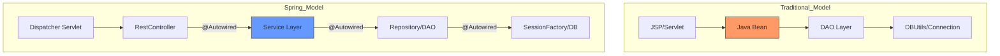
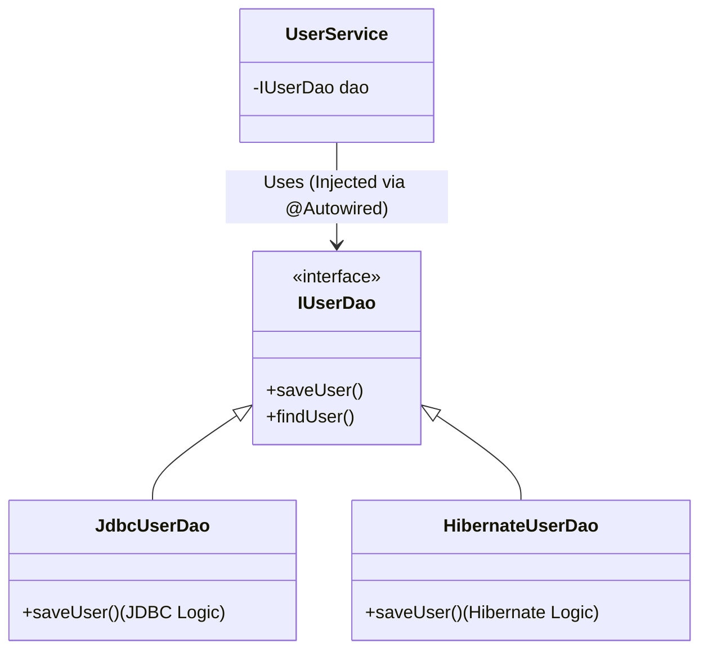

### What is Spring ?

Spring is an **open-source Java platform** designed to simplify the development of enterprise applications. It is often described as a **"Container + Framework"**:

- **As a Container**: It manages the entire **Life Cycle** of Java objects (called **Spring Beans**), such as Controllers, Services, and DAOs.
- **As a Framework**: It provides ready-made implementations of standard design patterns like **MVC, Proxy, Singleton, Factory, and ORM**, reducing "boilerplate" code.

**Analogy**: Think of Spring as a **Fully Managed Kitchen**. In a traditional kitchen (Standard Java), the chef (Developer) has to buy the ingredients, maintain the fridge, wash the dishes, and cook. In the Spring Kitchen, the "Container" provides the ingredients exactly when needed, maintains the appliances, and handles the cleanup, letting the chef focus only on the recipe (Business Logic).

  

### Why Spring? (The Problem of Tight Coupling)

In traditional Java development (JSP/Servlet/DAO), objects usually manage their own dependencies. This leads to **Tight Coupling**.

**The Problem:**

If a `UserBean` (Dependent) creates its own `JDBC_DAO` (Dependency), and you later want to switch to a `Hibernate_DAO`, you must manually modify the `UserBean` class. This makes the code difficult to maintain, test, and extend.

**The Solution: Loose Coupling**

Spring achieves **Loose Coupling** - where objects are independent of their dependencies' implementation - through two main pillars:
1. **IoC (Inversion of Control)** via **Dependency Injection (DI)**.
2. **AOP (Aspect Oriented Programming)**.

  

### Dependency Injection (DI) & IoC

**Inversion of Control (IoC)** is a design principle where the control of object creation and lifecycle is transferred from the application code to a container. **Dependency Injection** is the specific pattern used to implement IoC.

**The Hollywood Principle:** "Don't call us, we'll call you." Instead of the object "calling" for a dependency, the Spring Container "injects" the dependency into the object at runtime.

**Comparison of Architecture Layers**

Based on diagram, here is how Spring transforms the traditional flow:

  

### The Spring Bean & Container

A **Spring Bean** is simply any Java object whose life cycle is completely managed by the **Spring Container (SC)**.

**Bean Scopes**

The "Scope" defines how many instances of a bean the container creates:
| Scope | Description |
| :--- | :--- |
| **Singleton** (Default) | One single instance per Spring Container. Every request gets the same object. |
| **Prototype** | A NEW instance is created every time it is requested from the container. |
| **Request** (Web only) | One instance per HTTP request. |
| **Session** (Web only) | One instance per HTTP session. |

**Bean Life Cycle & Attributes**
1. **Instantiation:** The container creates the bean instance (usually at startup for singletons).
2. **Dependency Injection:** Spring injects the required `@Autowired` dependencies.
3. **Init-method:** A custom method called after DI is complete (e.g., to check if a database is reachable).
4. **Usage**: The application uses the bean.
5. **Destroy-method:** A custom method called before the bean is removed from the container (Singleton only).

  

### Key Advantages of Spring

- **Lightweight:** The basic version is only ~2MB.
- **Modular**: Use only the modules you need (e.g., just the Core, or just the Web MVC)
- **Transaction Management:** Provides a consistent interface for local and global transactions.
- **Exception Translation:** Automatically converts complex, technology-specific exceptions (like `SQLException`) into simple, unchecked Spring exceptions.
- **Integration**: It doesn't "reinvent the wheel"; it integrates seamlessly with existing tools like Hibernate.

  

### Class Hierarchy Example (DAO/Repository)

Spring encourages programming to Interfaces to maintain loose coupling.

*In this hierarchy, `UserService` doesn't care if it's using `JdbcUserDao` or `HibernateUserDao`; it only knows the `IUserDao` interface.*