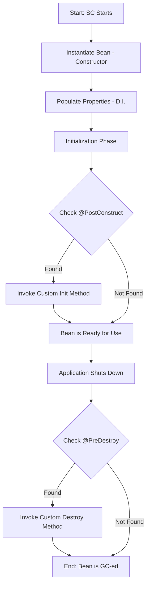
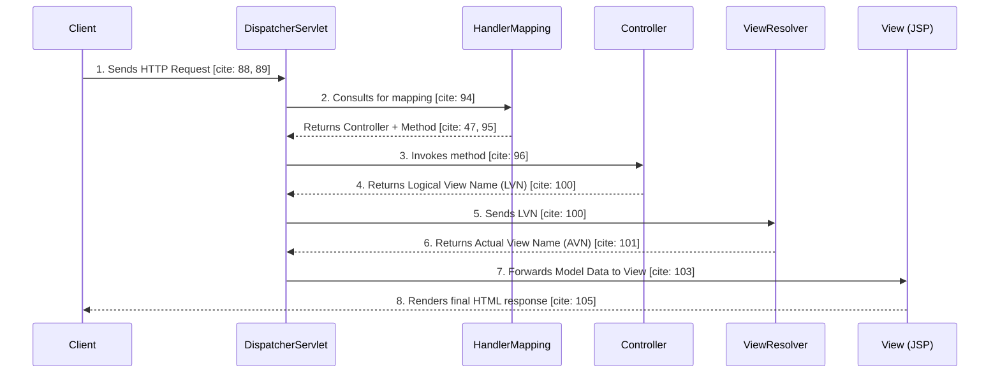
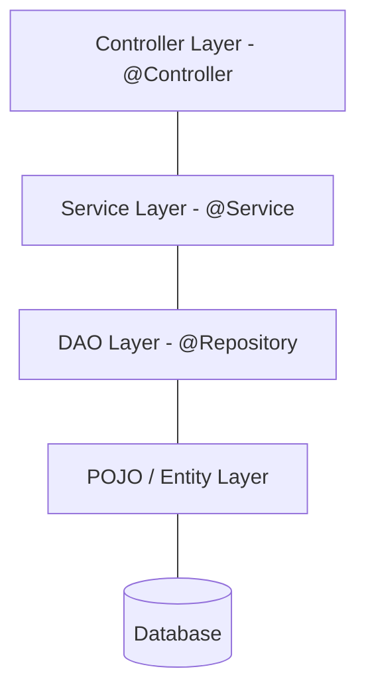

### Spring Container (SC) and Dependency Injection (DI)

**Inversion of Control (IoC)** is a principle where the Spring Container (SC) manages the lifecycle and configuration of objects (Beans). Instead of objects creating their own dependencies, the SC "injects" them at runtime, ensuring **loose coupling**.

**Metadata Configuration Modes**

The Spring Container (SC) is a manager that needs instructions on how to create and assemble objects. These instructions are called Metadata.

- **Pure XML**: 
  
  In this mode, all bean definitions are written in an XML file (usually `spring-config.xml`).
  - **Definition**: It uses the `<bean>` tag to define the ID, class, and lifecycle attributes
  - **Analogy**: Think of this as a Printed Manual. If you want to change a machine, you have to rewrite the manual page, but you don't touch the machine itself.
  ```xml
  <bean id="myBean" 
      class="beans.MyBean" 
      scope="singleton" 
      init-method="anyName" 
      [cite_start]destroy-method="anyName" /> [cite: 3, 21]
  ```
- **Hybrid Approach (XML + Annotations):** 
  
  This uses a small amount of XML to enable scanning, while the actual configuration lives inside the Java classes using annotations.
  - **Requirement**: You must include `<context:annotation-config/>` to enable internal annotations like `@Autowired` and `@PostConstruct`.
  - **Scanning**: Use `<context:component-scan base-package="com.app"/>` so the SC knows where to look for beans.
- **No XML (Java Config):** 
  
  This is the modern way where Java classes annotated with `@Configuration` replace XML files.

  - **Mechanism:** You use `@Bean` on methods to define bean instances.
  - **Bootstrapping:** Instead of an XML-based context, you use `AnnotationConfigApplicationContext`.


<br>

**The Analogy: The Automated Factory**
- **The SC** is the **Factory Floor Manager**.
- **The Metadata** is the **Instruction Manual**.
- **The Beans** are the **Machines**.
  
Instead of the "Welding Machine" having to go find its own "Screws" (Dependencies), the Manager delivers them just as the machine is about to start.


<br><br>

### Spring Bean Lifecycle & Scope

**Bean Scopes**

- **Singleton (Default):** SC creates only one instance shared by all. **Warning**: Never add client-specific state (like email/password) to a singleton bean, as it will be overwritten by multiple requests.
- **Prototype**: SC creates a new instance every time it is requested via `getBean`.


<br>

**Lifecycle Methods**

The lifecycle defines the stages a bean goes through from "birth" (instantiation) to "death" (removal from memory).




- **Instantiation & DI:** The SC creates the object and immediately injects required dependencies (like DAO into Service).
- **Initialization:** The method marked with `@PostConstruct` (or `init-method` in XML) runs to perform setup, like opening a file or database connection.
- **Destruction:** For Singleton beans, the SC calls the `@PreDestroy` method just before the bean is cleared by the Garbage Collector to release resources. Note: This is not called for Prototype beans.


<br><br>

### Autowiring and Annotations

**Autowiring Modes**

Autowiring is the process where the SC automatically injects dependencies into a bean without explicit XML `<property>` tags.

- `@Autowired`: By default, it works **byType**.
  - If exactly one match is found, it is injected.
  - If multiple matches exist, it throws `NoUniqueBeanDefinitionException`.
  - If no match is found, it throws `NoBeanDefFoundException` unless `required=false` is set.
- `@Qualifier("name")`: Forces the autowiring to work byName to resolve ambiguity when multiple beans of the same type exist.
- `@Resource(name="abc")`: A Java EE standard annotation that performs autowiring byName.

<br>

**Stereotype Annotations**

These are class-level annotations that mark a class as a Spring-managed component.


| Annotation | Layer/Purpose | Note |
| :--- | :--- | :--- |
| `@Component` | General purpose bean | Used when the bean doesn't fit a specific layer. |
| `@Repository` | DAO Layer | Encapsulates storage, retrieval, and search behavior. |
| `@Service` | Service Layer | Contains Business Logic (B.L.) and `@Transactional` logic. |
| `@Controller` | Presentation Layer | Handles web requests in a Spring MVC application. |

<br>

**Code Snippet: Layered Integration**

```java
// File: UserServiceImpl.java (Service Layer)
@Service // Marks this as a Business Logic bean 
@Transactional // Ensures database transactions are managed 
public class UserServiceImpl implements UserService {

    @Autowired // SC finds a bean of type UserDao and injects it here 
    private UserDao userDao; 

    public List<User> getAllUsers() {
        return userDao.getUsers();
    }
}
```


<br><br>

### Spring MVC (Model-View-Controller)

Spring MVC is a standard design pattern meant for Separation of Concerns.

**The Core Pattern**
- **Model**: The data or business logic (Java Beans/POJOs).
- **View**: The UI (JSP, Thymeleaf, or React).
- **Controller**: The brain that manages navigation and processes requests.


**The Flow of a Request**


**Explanation of Diagram:**

1. **Centralized Dispatcher:** The `DispatcherServlet` acts as a gatekeeper, ensuring every request is intercepted and managed centrally.
2. **Handler Mapping:** This is a lookup table where the URL is the Key and the Controller method is the Value.
3. **View Resolution:** he `ViewResolver` automatically adds a prefix (e.g., `/WEB-INF/views/`) and a suffix (e.g., `.jsp`) to the name returned by the controller.


<br><br>

### Integrating Spring MVC with Hibernate

**Layered Class Hierarchy**

To maintain "Separation of Concerns," the application is built from the bottom up:



<br>

**Integration Steps**

1. **DAO Layer:** Annotate with `@Repository` and inject the Hibernate SessionFactory using `@Autowired`.
2. **Service Layer:** Annotate with `@Service` and `@Transactional`. Inject the DAO bean.
3. **Controller Layer:** Annotate with `@Controller` and inject the Service bean. Use `@RequestMapping` to map URLs to methods.

<br>

**Key Data Sharing Tools**

- **Model/ModelMap:** A map used to pass data from the Controller to the View.
- **PRG Pattern (Post-Redirect-Get):** Use the `redirect:` prefix to prevent duplicate form submissions by making the client perform a new GET request.
- **Flash Attributes:** Temporary attributes that survive exactly one redirect (client pull).