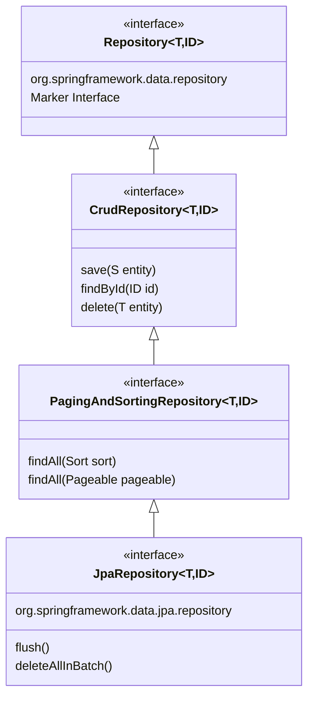
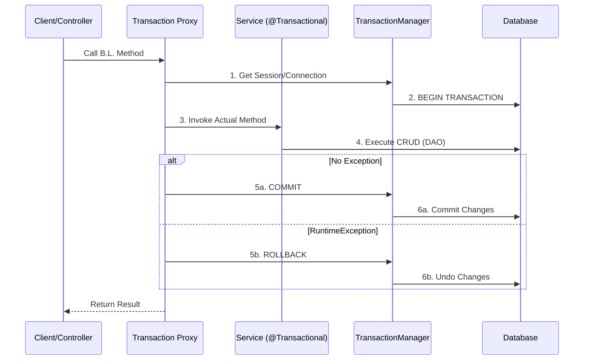

### Advanced Spring MVC: Two-Way Form Binding

In complex web applications, using `@RequestParam` for 20 different form fields is inefficient. Spring MVC provides **Form Binding** to map an entire HTML form to a Java Object (POJO) automatically.

**The Flow (View to Model)**

1. **Show Form:** The Controller sends an empty "Command Object" to the JSP.
2. **Bind Form:** The JSP uses Spring tag libraries to link HTML inputs to POJO fields.
3. **Process Form:** Upon submission, Spring calls the **Setters** of the POJO to transfer "Conversational State" from the browser to the server.

<br>

**Flow through Code Snippet**

1. **The Controller Logic (Setup and Processing)**
   
   You must provide an "empty" object to the view so the tags have something to bind to.

   ```java
    @Controller
    @RequestMapping("/players")
    public class PlayerController {

        // STEP 1: LOAD FORM
        @GetMapping("/add")
        public String showForm(Player p) { 
            // SC does: Player p = new Player(); 
            // SC adds to model: map.addAttribute("player", p); [cite: 147, 149]
            return "/player/add_form"; 
        }

        // STEP 2: PROCESS SUBMISSION
        @PostMapping("/add")
        public String processForm(Player p) { 
            // SC automatically calls p.setFirstName(), p.setLastName(), etc. [cite: 151]
            // State is transferred from View -> Controller [cite: 151]
            return "redirect:/players/list"; // PRG Pattern 
        }
    }
   ```

2. The View Logic (Spring Form Tags)
   
   The JSP `uses org.springframework.web.servlet.tags.form.FormTag` library to link path attributes to POJO properties

   ```jsp
    <%-- Import the taglib --%>
    <%@ taglib prefix="form" uri="http://www.springframework.org/tags/form" %>

    <%-- modelAttribute must match the name used in Controller --%>
    <form:form method="post" modelAttribute="player">
        Name: <form:input path="firstName" />  <%-- Binds to p.getFirstName() / p.setFirstName() --%>
        DOB:  <form:input path="dob" type="date" /> [cite: 150, 153]
        <button type="submit">Register</button>
    </form:form>
   ```

<br>

### Spring Data JPA: The Ultimate DAO Abstraction

**Spring Data JPA** is a framework that adds a significant layer of abstraction on top of JPA (Java Persistence API), which itself uses Hibernate as a default implementation. Its primary goal is to reduce the "boilerplate" code - repetitive code like opening sessions and writing basic CRUD queries - that developers traditionally had to write in the DAO layer.

<br>

**The Interface Hierarchy**

Instead of writing implementation classes, you define interfaces that extend Spring Data's built-in repository hierarchy.



**Explanation of Diagram:**
- `org.springframework.data.repository.Repository`: A core marker interface.
- `org.springframework.data.repository.CrudRepository`: Provides 11+ built-in methods like save(), existsById(), and count().
- `org.springframework.data.repository.PagingAndSortingRepository`: Adds support for `org.springframework.data.domain.Pageable` and `org.springframework.data.domain.Sort` to handle large datasets.
- `org.springframework.data.jpa.repository.JpaRepository`: The industry standard for web apps, offering JPA-specific batch operations like `deleteAllInBatch()`.


<br>

**Derived Query Methods (The Method Proxy Pattern)**

Spring Data JPA uses a **Method Proxy Pattern** where it analyzes the name of a method you declare in an interface and generates the SQL/JPQL at runtime.

- **Analogy:** It is like a Voice-Activated Smart Home. You don't need to manually flip the switch (write the SQL); you simply say the command ("findByEmail"), and the system executes the action for you.
- **Code Example:**
  ```java
  public interface PlayerRepository extends JpaRepository<Player, Long> {
        // Spring generates: select p from Player p where p.lastName = ?1
        List<Player> findByLastName(String lastName); 

        // Spring generates: select p from Player p where p.age > ?1 order by p.name asc
        List<Player> findByAgeGreaterThanOrderByNameAsc(int age); 
    }
  ```

<br>

**Transaction Management Internals**

Transaction management ensures Atomicity: either the entire business operation succeeds, or nothing changes in the database.

**How it works: The Proxy Pattern**

When you annotate a method with `@Transactional`, Spring creates a "wrapper" (proxy) around your bean.



<br>

**Key Attributes of `@Transactional`:**
- `readOnly`: Defaults to `true` in Spring Boot (optimizes performance for SELECTs).
- `rollbackFor`: By default, Spring only rolls back for `java.lang.RuntimeException`. You must specify `rollbackFor = Exception.class` for checked exceptions.