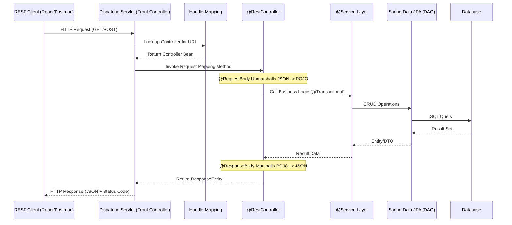

### Web Applications vs. Web Services: The Shift to Interoperability

While a **Web Application** is typically designed for direct human interaction via a browser (rendering HTML), a **Web Service** is a solution for **distributed computing**. It exports business functionality (e.g., banking, payment gateways) to remote clients over standard protocols like HTTP/S.

**Evolution of Remote Communication**

Before modern web services, we relied on technology-specific solutions:

- **Java RMI (Remote Method Invocation):** Allowed a Java client to invoke methods on a remote Java object directly, providing location transparency. However, it lacked interoperability because it was a 100% Java-to-Java solution.
- **CORBA:** Attempted technology independence but was notoriously difficult to set up and manage.
- **SOAP (JAX-WS):** A protocol-heavy approach using XML and requiring strict definitions like **WSDL** (Web Service Definition Language) and **UDDI** for discovery. It is often considered "heavy" due to large bandwidth consumption and complex setup.


<br><br>

### REST: Representational State Transfer

Introduced by Roy Fielding in 2000, REST is a **Resource-Oriented Architecture (ROA)**. It isn't a protocol but an architectural style that uses the existing HTTP infrastructure.

<br>

**The Core Concept: Resources**

In REST, every component (Employee, Order, Student) is a **Resource** identified by a unique **URI** (Uniform Resource Identifier).

- **Representation:** A resource can be represented in different formats: JSON, XML, or Text. **JSON** is currently the industry standard for its lightweight nature

<br>

**The Six Architectural Constraints**

To be truly "RESTful," a system must adhere to these constraints:

| Constraint | Technical Deep-Dive |
|:-----------| :-------------------|
| Client-Server | Separation of concerns. The client handles UI/UX, and the server handles data/logic, allowing them to evolve independently. |
| Statelessness | The server does not store client context between requests. Each request must contain all necessary data (like API keys/Tokens) to be processed. |
| Uniform Interface | Uses standard HTTP methods (GET, POST, etc.) and URIs to interact with resources, ensuring a predictable contract. |
| Layered System | Architecture can include intermediate layers (proxies, load balancers, security gateways) without the client knowing it's talking to anything but the end server. |
| Cacheability | Responses must define themselves as cacheable or not to improve performance and reduce server load. |
| Code on Demand | (Optional) Allowing the server to send executable code (like JavaScript) to the client to extend functionality. |


<br><br>

### Spring Boot Full Stack Architecture

Based on the provided architecture, a modern Spring Boot REST backend follows a clear N-tier structure.

**Request Processing Flow**



<br>

**Analysis of the Architecture**

- **DispatcherServlet:** The "Front Controller" that receives all incoming requests.
- **HandlerMapping:** A Map-based component used by the DispatcherServlet to find which specific Controller method should handle the request based on the URI.
- **Service Layer (@Service):** Contains business logic and manages transactions via `@Transactional`.
- **DAO / Spring Data JPA:** Uses interfaces extending JpaRepository to perform database operations without writing boilerplate SQL.


<br><br>

### Key Spring Boot Annotations for REST

<br>

**`@RestController` vs. `@Controller`**
- **`@Controller`:** Primarily for MVC web apps where methods return a View name (like a JSP or Thymeleaf template).
- **`@RestController`:** A specialized version that combines `@Controller` and `@ResponseBody`. It ensures that every method's return value is written directly to the HTTP response body as JSON/XML instead of looking for a view.

<br>

**Marshalling and Unmarshalling**

This is the process of converting Java Objects to JSON/XML (Marshalling/Serialization) and vice versa (Unmarshalling/Deserialization).

- **Internal Working:** Spring uses `HttpMessageConverter` interfaces. If Jackson JARs are on the classpath, Spring Boot automatically configures the `MappingJackson2HttpMessageConverter` to handle JSON.


<br>

**Practical Implementation Example**

```java
@RestController
@RequestMapping("/api/customers")
@CrossOrigin(origins = "http://localhost:3000") // Solves CORS
public class CustomerController {

    @Autowired
    private CustomerService service;

    // Use @PathVariable to capture data from the URI
    @GetMapping("/{id}")
    public Customer getCustomer(@PathVariable int id) {
        return service.findById(id); // Returns POJO, converted to JSON automatically
    }

    // Use @RequestBody to capture incoming JSON from the Request Body
    @PostMapping("/")
    public ResponseEntity<Customer> createCustomer(@RequestBody Customer customer) {
        Customer saved = service.save(customer);
        return new ResponseEntity<>(saved, HttpStatus.CREATED); // 201 Created
    }
}
```

<br><br>

### Handling CORS (Cross-Origin Resource Sharing)

<br>

**The Problem**

Browsers enforce a **Same-Origin Policy** for security. A request is "Same-Origin" if the **Domain**, **Protocol**, and **Port** are identical. If any differ, it is a **Cross-Origin** request. By default, browsers block JavaScript-based cross-origin requests to prevent AJAX attacks.

<br>

**The Solution: `@CrossOrigin`**

To allow a React frontend (on port 3000) to talk to a Spring Boot backend (on port 8080), you must enable CORS.

- **Workflow:**
  - Browser sends an `Origin` header.
  - Server responds with `Access-Control-Allow-Origin`.
  - Browser compares the two. If they match, the response is rendered; otherwise, a CORS error is thrown in the console.


<br><br>

### Production Best Practices & Common Pitfalls

<br>

**Best Practices**
- **Use Proper Status Codes:** Don't just return `200 OK`. Use `201 Created` for POST, `204 No Content` for DELETE, and `404 Not Found` when resources don't exist.
- **Standardize Responses:** Wrap your results in a consistent DTO (Data Transfer Object) to ensure the client always receives a predictable JSON structure.
- **Statelessness:** Avoid using `HTTPSession` in a REST API. Use JWT (JSON Web Tokens) for authentication to keep the API scalable.

<br>

**Common Mistakes**

- **Returning Entities Directly:** Never return JPA Entities directly to the client. This can leak database structure and cause "Infinite Recursion" issues with bi-directional relationships. Use DTOs instead.
- **Ignoring HTTP Verbs:** Don't use `GET` for operations that change data (like deleting a user). This violates the REST uniform interface and can lead to accidental data loss via web crawlers.
- **Hardcoding CORS Origins:** Avoid using `@CrossOrigin("*")` in production as it allows any domain to access your API. Always specify the exact frontend domain.